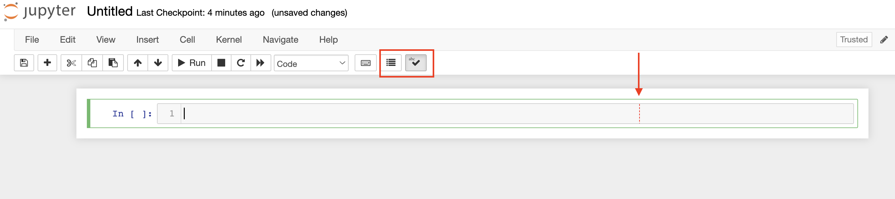
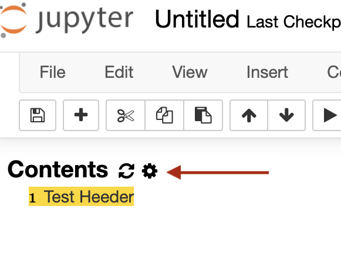
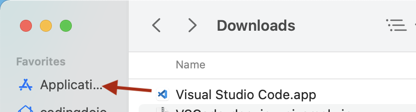

# Installing Python Locally

Please visit https://coding-dojo-data-science.github.io/dojo-env-setup-instructions/ for the complete installation instructions.
  
___

## Updating to New dojo-env


*   If you have already installed your dojo-env and wish to update to the new version, you must first remove the current dojo-env from your computer.
    *   **Note: the new version of dojo-env was released in July 2022.** If you installed your environment in July or later you already have the updated dojo-env.
*   **The benefits of upgrading to the new dojo-env:**
    *   New sklearn v1.1 with simplified column transformer feature names!
    *   Jupyter Lab added

*   New Packages and Tools Included:

*   nbdime: Version control for jupyter notebooks. 
*   Model Explainer Packages (SHAP, Lime, Yellowbrick)
*   Stack 2 & 3 Packages Previously Not Included:
    *   Tensorflow
    *   xgboost
    *   lightbgm
*   Pandas Profiling (incredibly powerful all-in-one EDA report)
*   Time Series Modeling:
    *   pmdarima
    *   prohpet
    *   sktime (though still some issues to resolve)
*   And more!

#### IMPORTANT NOTE FOR MAC USERS WITH AN APPLE CHIP (M1, M1Pro, M2, etc)!

The original v1 of dojo-env did not fully support Apple processors, but the new dojo-env does. HOWEVER, in order to do so, **Mac users with an Apple chip need to UNINSTALL ANACONDA and switch to using Miniforge**.  

Please see Step 1 - MacOS (Apple Chip) for detailed instructions on how to uninstall anaconda and install miniforge.

### Step 1: Remove Your Old dojo-env
--------------------------------

*   1.  Open your terminal/GitBash
    2.  Deactivate`dojo-env`: 
        1.  Type `conda activate base` (or source activate base if you are on older versions of windows) 
            1.  Your terminal should now say `(base)` next to your prompt instead of `(dojo-env)`.
    3.  Remove the old `dojo-env` using the command:

conda remove --name dojo-env --all

            Enter `y` to approve the removal of the environment and hit enter.  

      4. Wait for the env to be removed.

                    This will delete all of the files associated with JUST our `dojo-env`. 

                    Anaconda & GitBash will still be installed.  We will just need to re-install our `dojo-env`

  

### Step 2: Clone (or update) the dojo-env-setup repo 


1.  Navigate to the dojo-env-setup repo: [https://github.com/coding-dojo-data-science/dojo-env-setup](https://github.com/coding-dojo-data-science/dojo-env-setup)
2.  **Clone the Repository to Your Computer:**
    1.  Click the green Code button and select  "Open in GitHub Desktop. "
    2.  If you still have your previously cloned copy, GitHub Desktop should show a # and down arrow on the top right corner where it should say "Fetch Origin".
        1.  Press the button to "Fetch Origin", which will download the updated environment files. 
        2.  You may need to press it again if it changes to "Pull Origin"
    3.  If you've updated the repo successfully there should be no remaining #'s or arrows on the top right corner.
        1.  If so, click on the Repository menu > Open in Terminal (or Open in GitBash).

  

### Step 3: (Re)Create Your dojo-env using the updated repo


1.  Run the same commands from the original step "2. Setting Up Your `dojo-env` Environment" (summarized below).
    1.  If you are unsure about which version of the summary instructions below to use, please go to the original Step 2 lesson for your specific OS and follow those steps again. 
2.  **"Step 2: Setting Up Your Dojo-Env" Summary:**
    1.  Depending on your OS and processor, you will use a different environment file in the conda env create command. 
        1.  In the table below find the environment yml file name that is correct for your computer/OS.

Note: Whenever the instructions below refer to your <ENV\_FILE> below, it means the filename from the following list (without < >).

**Computer/OS Type**

**Environment File Name**

Windows 

environment\_windows.yml

MacOS with an Intel Processor

environment\_mac\_intel.yml

MacOS with an Apple Chip (m1, m1pro, m2,etc)

environment\_mac\_mchip.yml

*   Make sure you are still using a terminal inside the folder for the dojo-env-setup (pwd)
*   Run the following command (replace <ENV\_FILE> with your filename from the table above)

conda env create -f <env\_file>

*   **Wait (patiently) for the dojo-env to be created.** 
    *   Note: the new environment includes many additional tools and can take anywhere from 3-20 minutes to finish downloading and installing the packages for the new environment.
*   Once its complete, run the following "conda activate dojo-env" command:

conda activate dojo-env

*   Note for windows users:
    *    if you see a message that says "your terminal is not set up for conda activate", change the command to "source activate"

source activate dojo-env

*   You should now see "(dojo-env)" next to your prompt in your terminal (may be above the prompt, on the left, or on the right depending on your OS)

*   After confirming you now see (dojo-env) displayed next to your prompt:
    *   Run the following command to make sure Jupyter Notebook/Lab knows your new environment.

python -m ipykernel install --user --name dojo-env --display-name "Python (dojo-env)"

## Testing Your New Environment


*   From the same terminal window, **start jupyter notebook** (run `jupyter notebook` in your terminal) 
*   **Open the test notebook for your OS (windows vs mac).**
    *    EnvironmentTester-Mac.ipynb  or EnvironmentTester-Windows.ipynb 
*   **Select the Kernel Menu > Restart and Run All.** 
    *   The notebook should run all the way to the end.
        *    If it doesn't, contact your instructor for assistance.

#### Bonus: Jupyter Lab


Your new dojo-env also includes jupyter lab. It is very similar to jupyter notebook, but has a more fleshed out user interface that is more similar to Colab than jupyter notebook.

To start jupyter lab run the following command:

jupyter lab

## Cheat Sheet/Summary Steps


1\. Clone repo or Fetch & Pull: [https://github.com/coding-dojo-data-science/dojo-env-setup  
](https://github.com/coding-dojo-data-science/dojo-env-setup)

2\. Open in Terminal/GitBash.

Execute the following commands:

#### 1. Deactivate dojo-env 
`conda activate base`
- Windows users may need to use "source activate base"
#### 2. Remove dojo-env
`conda remove --name dojo-env --all`
- press y to confirm
#### 3. Create new environment
- run ONE of the following (depending on you computer)
```
conda env create -f environment\_mac\_mchip.yml
conda env create -f environment\_mac\_intel.yml
conda env create -f environment\_windows.yml
```
#### Wait patiently, once completed, activate new env
`conda activate dojo-env`
- windows users may need "source activate dojo-env"
#### Add dojo-env kernel to jupyter 
` python -m ipykernel install --user --name dojo-env --display-name "Python (dojo-env)" `
#### Boot up jupyter notebook 
`jupyter notebook `
- OR If you previously follwed  "3. Setting dojo-env as your default"
`jnb`
## Read Final step below code cell

*   **Final step:** Open and run the appropriate environment testing notebook for your OS:
    *   "EnvironmentTester-mac.ipynb"
    *   "EnvironmentTester-windows.ipynb"
*   Notify a TA or instructor if the notebook does not successfully run ALL cells.

Enjoy your new dojo-env!
------------------------


<!-- 


## UPDATING DOJO-ENV

- IF you have already installed your dojo-env and wish to update to the newer version, you must first remove the current dojo-env from your computer.

    1. open your terminal/gitbash and deactivate your `dojo-env`:
            - Type `conda activate base` or `conda deactivate` and press enter. 
            - Your terminal should now say `(base)` with your promit instead of `(dojo-env)`.
    2. Remove the old `dojo-env` using the command:
        - `conda remove --name dojo-env --all`
        - enter `y` to approve the removal of the environment and hit enter. 

    3. Wait for the env to be removed.
        - This will delete all of the files associated with JUST our `dojo-env`. So anconda will still be installed, we will just need to re-install our `dojo-env`.
        
    4. Once its completed, use this repository's environment file to set up the `dojo-env` again. 
        - Repeat the environment installation commands from the "Setting Up Your `dojo-env` Environment" section above. In brief:
            - From inside this repo run: `conda env create -f environment_mac_mchip.yml`
            - Wait for the dojo-env to be created.
        - Activate your dojo-env (`conda activate dojo-env`)
        - Run the following command to make sure Jupyter know the updated kernel
            - `python -m ipykernel install --user --name dojo-env --display-name "Python (dojo-env)"`
    5. (Optional, but recommended ) Start jupyter notebook (`jupyter notebook`) and open the EnvironmentTester notebook. 
        - Note: This will also install the recommend jupyrter mnotebook extnesions for you.
        - Once you open the notebook, click on the Kernel menu and "Restart and Run All"
        - If everything was installed correctly the notebook should run all the way to the end.


# New Installations:

## 1. Required Installations

> Before we install our python environment, we need to take care of a couple requirements. Please make sure to install all of the items listed below before attempting to follow the remaining instructions. 

1. **A Linux-based bash shell/terminal:**
   - Linux users and MacOS users have this built-in to their OS.
       - On MacOS, the shell is called Terminal and can be found in `Applications>Utilities` in Finder
       - OR you can use spotlight search and search for "Terminal".
   
   
   - [ ] **Windows users should install GitBash, instead of using the windows command prompt**
       - Otherwise, all of the commands for working with your terminal will not match the curriculum and other cloud-based platforms (like Amazon Web Services)
      - Download  the Git for Windows Installer: [Git for Windows download](https://gitforwindows.org/)
      
    - Use the default options, EXCEPT when you see the "Advanced Installation Options" window, check BOTH options, like in the screenshot below:
    

       
       

        
2. **GitHub Desktop** ([Link](https://desktop.github.com/))
    - [ ] Download the installer and log into the same GitHub account you have been using for your projects. 
    - [ ] After installing, open GitHub desktop:
        1. Open the Preferences menu
            - On Mac: Select `"GitHub Desktop"` on the menu bar and then select `Preferences`.
            - **On Windows: Click on `File` in the menu bar and then select `Options`**
        2. Select the Integrations tab.
        3. Make sure the Shell dropdown menu says Terminal (on Mac) or GitBash (on Windows).
            - If not, select it from the dropdown menu.
        4. Click Save.


### M1-Mac Miniforge Instructions
- This approach uses miniforge instead of Anaconda.
- It installs the versions of tensorflow and other packages described in the following blog post:
    - Blog Post with Starting Instructions: https://caffeinedev.medium.com/how-to-install-tensorflow-on-m1-mac-8e9b91d93706:
- The main differences between this and non-m1 environment:
    - Python 3.8 instead of 3.7
    - Matploltib (any version) vs Matplotlib 3.2.2 (currently 3.5)

#### Installing Miniforge
1. Install XCode: `xcode-select --install`
2. Install Homebrew (if not already installed):
`Install homebrew: `/bin/bash -c “$(curl -fsSL https://raw.githubusercontent.com/Homebrew/install/HEAD/install.sh)"`
3. Install miniforge: `brew install miniforge`
4. Install pkg-config (for matplotlib) `brew install pkg-config`


    
4. [Windows Users Only] **Ensuring GitBash Can Find Anaconda.**
    - Windows users may need to take an additional step to get anaconda and gitbash working together.
    - **Inside a GitBash window, type `conda` and hit enter.**
        - **If you see a list of available conda commands, great!** You are all set to move on to the "Setting Up Your `dojo-env`" step.
        - **If you see a message that says: "bash: conda: command not found", then follow the instructions below:**
        
    - **Instructions for Adding Conda to GitBash:**
        - Note: the instructions below are adapted from this [Blog Post](https://fmorenovr.medium.com/how-to-add-conda-to-git-bash-windows-21f5e5987f3d)
        1. Once you have installed anaconda, use File Explorer to Open Your **User** folder. 
            - This is the folder that contains your Desktop, Downloads, My Documents, and other user-specific files. 
            - Example: `Users/your_name/`
            
        2. In File Explorer, open the "`anaconda3`" folder (note: not the hidden folder called `.anaconda` that starts with a `.`)
            - Open the `etc` folder inside the `anaconda3` folder. 
            - Open the `profile.d` folder inside the `etc` folder. 
                - You should see a `conda.sh` file in this folder.
            - Right click somewhere in the folder and select "Git Bash Here" to open a GitBash window in this current directory. 

        3. From the GitBash window you opened from the `profile.d` folder:
            - From your GitBash window, confirm that you are in the `profile.d` folder by typing `pwd` and hit enter. 
            - If the file path displayed ends with `profile.d` then are in the right folder. 
            - Enter the following command and hitting enter.
                - `echo ". '${PWD}'/conda.sh" >> ~/.bashrc`
            
        4. Open a new GitBash window and enter `conda` again. You should no longer get the "bash: conda: command not found" error message! 
            -   You are all set to move on to "Setting Up Your `dojo-env` Environment"!

## 2. Setting Up Your `dojo-env` Environment

**We have prepared a special file for you called `environment.yml` which has a collection of all the essential packages we will need**


In order to use this file, you will first need to clone this repository to your computer. 

**1. Make sure you are logged into the same GitHub account on BOTH the github.com website and your local GitHub Desktop application.**

2. **Navigate to this repository's web page repo link**: https://github.com/coding-dojo-data-science/dojo-env-setup


3. **Click on the green `Code` button and then click `Open in GitHub desktop.`**
    - GitHub desktop should open automatically and ask you what folder you would like to store your repository in.
    - Note: GitHub Desktop will create a NEW folder INSIDE of the folder you select. 
        - It will be named the same as the repository name.
        
        
4. **Once have the repository cloned, you will need to open a terminal window in the same directory as this repository.**
    - There are 2 ways to do this. 
        1. From GitHub desktop, make sure the left side bar says "dojo-env-setup" in the top-left corner under Current Repository. 
            - Click on the Repository menu and select `Open in terminal` or `Open in gitbash`.
        2. From your terminal, use the change directory command to navigate to the folder where the repo was cloned. (Recommend using option A, as its easier).
    - **Once you have your terminal open, type `ls` to see the file contents of your current folder.**
        - You should see a file called `environment.yml`. 
        - If you do not see the folder, check if you see a `dojo-env-setup` folder instead. 
            - If so, type `cd dojo-env-setup` to navigate into the repo.
            - Type `ls` again and confirm you see `environment_mac_mchip.yml`.
    - **Once you've confirmed you are in the same folder as the `environment.yml` file, type the following command into your terminal.**
        - `conda env create -f environment_mac_mchip.yml`
        - press `enter`
    - The installation process will take several minuts. 
    - You may be asked a Y/N question at some point.
        - Say `y` and press enter to continue.
        
    - Once succesfully installed, you should see a command displayed telling you how to activate your new environment. 
   
    
    
5. **Confirm your environment was installed and activate it.**
    - Type `conda env list` to display the list of your locally installed environments. 
        - You should see 2 environments:
            - `base`
            - `dojo-env`
    - **Activate your `dojo-env` with `conda activate dojo-env`**
    - Note for Windows users: 
        - if you get an error running `conda activate dojo-env`, try `source activate dojo-env` instead.
        
        
6. **Add your new environment to Jupyter Notebook**
    - After activating your `dojo-env`, enter the following command and press enter:
    - `python -m ipykernel install --user --name dojo-env --display-name "Python (dojo-env)"`

        
7. **Test your installation of jupyter notebook.**
    - In your terminal, type `jupyter notebook`
    - Your web browser should open and display a list of files contained within the current directory.
    - Note: Your terminal window will be busy whenever it is running jupyter notebook. You will not be able to enter any additional commands in this terminal window while jupyter is running. 


8. Create a New test notebook.
    - In the top-right corner, you should see a `New` button for creating a new notebook.
    - Click `New` and select `Python (dojo env)`
     
    - Note: if you do not see this option listed:
        - Quit jupyter notebook by either using the Quit button  OR pressing Control+C in your terminal to force-quit jupyter.
        - Make sure your `dojo-env` is activated.
        - repeat step 6, adding you new environment to Jupyter Notebook

# 3. Setting `dojo-env` as your default + adding `jnb` shortcut

- This section will require you to enter several commands in your Terminal (on Mac) or GitBash (on Windows). 
    - Make sure that your terminal is not running jupyter notebook (you can press "`Cntrl`+`C`" to force quit the server from your terminal).
    - Alternatively, you can open a new terminal/GitBash. You can perform these steps from any folder.
- **Note: when the instructions say to "run" a command**, it means to type that command (or copy and paste it) into your Terminal/Git Bash and then hit `Enter`

## Mac
- On a Mac, we need to first see what shell you're running.
     - In your terminal, type `echo $SHELL.` and hit enter.
     
#### If the response ends in `bash`

1. Add the environment activation command:
    - Run `echo "conda activate dojo-env" >> ~/.bash_profile`


2. Add the alias to start "jupyter notebook" using `jnb`
    - **NOTE: it is VERY important that you do not add any spaces on either side of the `=`** sign. The command will not work correctly if you add extra spaces.
    - Run `echo 'alias jnb="jupyter notebook"' >> ~/.bash_profile`
    
    
3. Finally, activate the new settings:
    - Run `source ~/.bash_profile`.


#### If the response ends in `zsh`:

1. Add the environment activation command:
    - Run `echo "conda activate dojo-env" >> ~/.zshrc` 
    
    
2. Add the alias to start "jupyter notebook" using `jnb`
    - **NOTE: it is VERY important that you do not add any spaces on either side of the `=`** sign. The command will not work correctly if you add extra spaces.
    - Run `echo 'alias jnb="jupyter notebook"' >> ~/.zshrc`
    
    
3. Finally, activate the new settings:
     - Run `source ~/.zshrc` 

## Windows

- Make sure you have installed GitBash, per the instructions above.
- Determine which set of instructions below to follow:
    - Take note of if you were able to run `conda activate dojo-env` to activate your `dojo-env` or if you had to use `source activate dojo-env`.


####   If you were able to run `conda activate dojo-env`:


0. Make sure the profile file for GitBash has been created. 
    - Run `touch ~/.bash_profile` to create a new hidden file called ".bash_profile" in your user folder.
    
1. Add the environment activation command.
    - Run `echo "conda activate dojo-env" >> ~/.bash_profile` 

2. Add the alias to start "jupyter notebook" using `jnb`
    - **NOTE: it is VERY important that you do not add any spaces on either side of the `=`** sign. The command will not work correctly if you add extra spaces.
    - Run `echo 'alias jnb="jupyter notebook"' >> ~/.bash_profile`
   

3. Finally, activate the new settings:

    - Run `source ~/.bash_profile` to activate the changes you just made
    
#### If you had to run `source activate dojo-env`:
    
0. Make sure the profile file for GitBash has been created. 
    - Run `touch ~/.bash_profile` to create a new hidden file called ".bash_profile" in your user folder.
    
1. Add the environment activation command.
    - Run `echo "source activate dojo-env" >> ~/.bash_profile` 

2. Add the alias to start "jupyter notebook" using `jnb`
    - Run `echo 'alias jnb="jupyter notebook"' >> ~/.bash_profile`
   

3. Finally, activate the new settings:

    - Run `source ~/.bash_profile` to activate the changes you just made
    

## [Mac & Windows] Confirm `dojo-env` is your default 

- To confirm that `dojo-env` is now your default environment, open a new Terminal/GitBash window. 
    - You should see `(dojo-env)` appear next to your prompt. 
    


- To confirm that `jnb` alias worked, run the command `jnb` and it should boot up jupyter notebook.
>**If so, you are all set to move onto 4. Adding Jupyter Notebook Extensions**


# 4. Adding Jupyter Notebook Extensions


### Jupyter Notebook Extensions Resources
- [Documentation](https://jupyter-contrib-nbextensions.readthedocs.io/en/latest/install.html)
- [Official `nbextensions` Installation Instructions (also detailed below)](https://jupyter-contrib-nbextensions.readthedocs.io/en/latest/install.html)


<!-- 
#### Installation via Conda
- **The best way to install is via `conda`** (however, windows users sometimes have issues with the conda installation not working properly).
    0. Open your terminal and make sure dojo-env is activated.
        - Mac users: `conda activate dojo-env`
        - Windows users: `source activate dojo-env`
        

    1. Install the extensions via conda
    ```bash
      conda install -c conda-forge jupyter_contrib_nbextensions
      ```

    2. Activate the extension configurator
    ```bash
    jupyter nbextension enable jupyter_nbextensions_configurator
      ```
 >- Now, boot up jupyter notebook and look for a new tab called (`nbextensions`) on the jupyter file-explorer view. If its there, great! Move on to the "Turning on extensions" section below.
      
    
       
#### Installing Using Pip    
- **Below is an abbreviated version of the official instructions for Installing jupyter-contrib-nbextensions ([Documentation](https://jupyter-contrib-nbextensions.readthedocs.io/en/latest/install.html)):**
    1. Install extensions
    ```bash
    pip install jupyter_contrib_nbextensions
    ```
    2. Install additional requirements (Install javascript and css file):
    ```bash
    jupyter contrib nbextension install --user
    ```
    3. Activate the extension configurator
    ```bash
    jupyter nbextension enable jupyter_nbextensions_configurator
    ```
>- Now, boot up jupyter notebook and look for a new tab called (`nbextensions`) on the jupyter file-explorer view. If its there, great! Move on to the "Turning on extensions" section below.
      

### Turning on extensions

- **When you boot up jupyter notebook, there should be a new tab at the top called `nbextensions`.** Click on the tab to open the list of available extensions.


- This opens a menu of all of the available extensions with checkboxes to activate them; 
  - ***NOTE: If the list of available notebook extensions is grayed out:***
    - Uncheck "`disable configuration for nbextensions without explicit compatibility (they may break your notebook environment, but can be useful to show for nbextension development)`" at the top of the page next to the search box.
    
    
    
- **To enable the recommended extensions**:
  - Click on the **checkbox** next to the extensions name  
  
- **To change the settings for an extension**:
  - Click on the **name** of the extension to select it. Now, if you scroll down, you should see the list of options for the currently selected extension. 
  
- **Note: any extensions that you enable or settings that you change are *automatically* saved.**

### Recommended extensions & settings


- `Table of Contents (2)`: 
    - Clickable sidebar with markdown headers as bookmarks/links.
    - Recommended options:
        - Change `Maximum level of nested sections to display on the tables of contents` to 3.
        -  Check `Display Table of Contents as a sidebar (otherwise as a floating window)`
        - Check `Collapse/uncollapse ToC sections when the collapsible_headings nbextension is used to collapse/uncollapse sections in the notebook. For the inverse behaviour, see collapsible_headings' configuration`


- `Collapsible Headings`: Collapse sections of your notebook using markdown headers.
    - Recommended options: 
        -  Check 'Collapse/uncollapse notebook sections when the ToC2 nbextension is used to collapse/uncollapse sections in the table of contents. For the inverse behaviour, see ToC2's configuration' at towards the bottom of the options.


- `Live Markdown Preview`: Shows a preview of what the markdown cell you are editing will look like once you render it with Shift+Enter
    - Recommended options:
        - Check `Show the input & output of markdown cells side-by-side while editing them.`

- `Ruler` (not Ruler in Editor)
- `spellchecker`


- `Variable Inspector` (but warning/caveat): 
    - Lets you see details about all of the variables in your notebook.
    - HUGELY helpful for new coders.
    - Recommended options:
        - `Display window at startup` (for now while you are learning python)
 

### Confirming Extensions are Enabled

- **Go back to the Files tab and create a new notebook with the `New` button on the top-right.**
    - Select `Python(dojo-env)` for your kernel


- **Once your new Untitled notebook opens, you will notice a few new elements to the interface:**



- First, confirm that you have two new buttons on your toolbar:
    - One that looks like a list (this is your table of contents extension)
    - One that looks like a check mark (this is your spellchecker)
    
    
- Second, confirm that you see a red dashed line in your code cell. (the Ruler extension)


- Third, click on the button for the table of contents (the one that looks like a list).
    - An empty sidebar should appear on the left.
    
    
- Fourth, change your code cell to a markdown cell.
    - You can click on the dropdown menu on your toolbar that currently says "code".
        - Change this to Markdown. 
    
        - In the markdown cell, type the following text but do NOT run the cell yet.
        - `# TEST HEEDER` (misspelled on purpose).


    - **Confirm that you see a preview of your markdown text off to the right.**
        - this is your Live Markdown Preview extension.
    - **Confirm that the word "HEEDER" is highlighted in red.**
        - This is your spellchecker.


- Finally, run the cell "Shift+Enter" and confirm:
    - that the header appears in the table of contents on the left.
    - that an dropdown arrow appears to the left of the header in the notebook.


- You may notice that the ToC automatically numbered the header and added `1` next to Test Heeder.
    - If you prefer to disable this, click on the small gear icon next to the word Contents:
    
    - In the menu that appears, uncheck "Automatically number headings"
    


#### Congrats!

>- **Now you are all set! Your Jupyter Notebook interface will now have additional features added.**


# 5. Install a code editor - Visual Studio Code

<!-- - While not explicitly *necessary*, it is strongly recommend you install a text editor for code. 
    - [ ] [SublimeText](https://www.sublimetext.com/): Great lightweight text editor with some convenient features. |
        - This program will make it easier to work with code-related files that would be difficult to work with if you use your OS's default text editor. 
        - Note: if you already have something like VS Code installed, that will be sufficient
    

 

- Finally, we will install a text editor that is designed for programmers, called Visual Studio Code.
    - We will use this editor to work with some special settings files (like your terminal's `.bash_profile`). 
    - You can also use VS Code to edit your projects' README files while previewing them in real time!

## Install Visual Studio Code

- Go to https://code.visualstudio.com/
    - It should auto-recognize your OS and have a blue Download button with a version for your OS.
    - Click Download to download the installer. 
    
- For Windows Users:
    - Click on the installer to run it.
    - Select the default options. 
    
- For Mac Users:
    - Click on the installer to unzip it. 
    - Once the Application is unzipped, drag the icon for Visual Studio Code.app to your applications folder on your sidebar in Finder. 


    
    
- Once Visual Studio Code installation is completed, open it!
    - Windows Users: check your Start Menu. 
    - Mac Users: check your Applications folder in Finder.


## Install Python Extensions
- On the left sidebar, there are several icons for different menus.
- Click on the Extensions sidebar icon (5th down, looks like 4 squares).


- On the Extension sidebar, there will be several sections (INSTALLED/POPULAR/RECOMMENDED).
    - Right now you should have nothing under the INSTALLED menu.
    - You should see "Python" listed under POPULAR. 
        - If not, you can enter "Python" in the search box at the top of the sidebar
        - OR you can click on [this link to the extension ](https://marketplace.visualstudio.com/items?itemName=ms-python.python) on the extension marketplace website.
        
    - Click on the "Install" button for the Python extension.


- Note: the Python extension will also install several required extensions. When installation is complete, you should see the following under the "INSTALLED" section:
    - Python, Pylance, Jupyter Notebook renderer,Jupyter, and Jupyter Keymap


## Setting VS Code to use your `dojo-env` as the default Python installation

- We must teach the Python extension where to find our `dojo-env`'s version of Python.

- On the extension sidebar, click on the Gear icon for the Python extension and select "Extension Settings"


- You should see a new "Settings" pane open in the main window. 
    - Take note of the "Default Interpreter Path".
        - It is currently set to just "python".


- We need to change this setting to match the exact filepath for our `dojo-env`'s python.

- In your terminal or GitBash:
    - Make sure your dojo-env is activated
    - Run the command: `which python`
        - It will print out a filepath to your dojo-env.

    - Copy and paste that exact file path into the "Default Interpreter Path" field in the Python extension settings.
    
    
    


### Mac Users Only: Add the `code` command to your terminal

- We want to be able to type the word "code" in our terminal and have that open up VS Code. 
    - Windows users have this command added automatically during installation. 
    
    - Mac Users must run 1 more command from VS Code. 
    
1. Open the Command Palette: 
    - Either click on View in the menu bar and select "Command Palette"
    - OR use the keyboard shortcut (`Cmd` + `Shift` +`p`)

2. In the small pop-up window, type "install code" and you should see it auto-suggest the option for "Shell Command: Install 'code' command in PATH".
    - Click on this option. 
    

    
    
    


### Test the `code` command

- Open a new terminal or GitBash window.
- Run the command `code` to verify that VS Code opens. 

- Note: You can add a specific folder or filename to open, after the word code. 
    - To open the current folder `code .`
- If it opens, great!
    - If not, make sure you've opened a new terminal window AFTER installing the code command.

# FINAL NOTES

## Packages NOT Installed in `dojo-env`

### XGBoost
- Due to Windows vs MacOS differences, we did not include xgboost in our environment.
- For Windows Users and MacOS Users (that are NOT using a mac with a M1 Apple Chip):
    - see the official Installation instructions for Python Xgboost here: https://xgboost.readthedocs.io/en/stable/install.html#python 

- For MacOS users with a M1 Apple chip:
    - see the section below ("M1 Mac Users")

### M1 Mac Users

- There are several packages that you may have previously used on Google Colab that are not currently supported on Apple's M1 processors. 

    - These include:
        - tensorflow
        - xgboost

    
- While there are some third-party instructions for workarounds, they are rather involved and may cause issues with what we have already installed in your environment. 

- **For now, continue to use Google Colab for projects using tensorflow and xgboost.**

# APPENDIX

## What to do if your environment breaks and you need to re-install it.

- It is not uncommon to accidentally break our virtual environment by isntalling a new package or updating a pre-existing one. 
- In the event your environment stops working and it needs to be re-installed: 
	1. open your terminal/gitbash and deactivate your `dojo-env`:
		- Type `conda activate base` or `conda deactivate` and press enter. 
		- Your terminal should now say `(base)` with your promit instead of `(dojo-env)`.
	2. Remove the broken `dojo-env` using the command:
		- `conda remove --name dojo-env --all`
		- enter `y` to approve the removal of the environment and hit enter. 
	
	3. Wait for the env to be removed.
		- This will delete all of the files associated with JUST our `dojo-env`. So anconda will still be installed, we will just need to re-install our `dojo-env`.
	4. Once its completed, use this repository's environment file to set up the `dojo-env` again. 
		- Repeat the environment installation commands from the "Setting Up Your `dojo-env` Environment" section above. 

## Showing Hidden Files

- Windows Users: 
    - Turn on View Hidden Files and Folders in your File Explorer menu:
        - [Microsoft Support Article](https://support.microsoft.com/en-us/windows/view-hidden-files-and-folders-in-windows-10-97fbc472-c603-9d90-91d0-1166d1d9f4b5#:~:text=Open%20File%20Explorer%20from%20the,folders%2C%20and%20drives%20and%20OK.)
        
    - On the same settings page, also deselect "Hide extensions for known file types and click OK."
    
    
- Mac Users:
    - Use this keyboard shortcut from inside finder:
    `Cmd+Shift+.`
    - Use it again to hide hidden files.  -->
