# dojo-env-setup

- **If you are looking for the original dojo-env environment from pre-July 2022**, switch to the legacy-dojo-env-v1 branch after cloning this repository. 
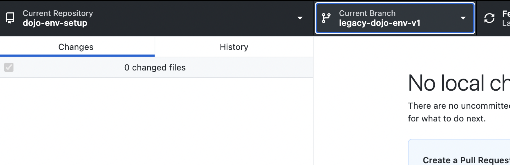

<!DOCTYPE html>
<html><body><h1>Installing Python Locally</h1> 

 

 <h1>
  Installation Overview
 </h1>
 

  So far in this program, you have been working in Google Colab which provides a cloud-based coding environment.  We will be transitioning to using a Python environment stored on your local machine.  You will be working in Jupyter Notebook, which is very common in the data industry.  In addition, these instructions will include the installation of Github Desktop and Visual Studio Code (VS Code).
 

 <ul>
  <li>
   In the Advanced Machine Learning course, you will need to submit a
   <strong>
    CORE ASSIGNMENT
   </strong>
   containing the error-free test notebook that is included within these instructions.  This will ensure that you have the tools you will need to be successful.
  </li>
 </ul>
 <ul>
  <li>
   We recommend you begin the step-by-step installation
   <strong>
    AS SOON AS POSSIBLE
   </strong>
   to ensure you have time to troubleshoot any difficulties you may encounter.
  </li>
 </ul>
 <ul>
  <li>
   If you run into issues during installation, post your questions/issues on the
   <a href="https://discord.com/channels/738494436467539968/999108307627294770" target="_blank">
    ds-python-installation
   </a>
   Discord channel, and tag your instructor in your question (e.g. @dojo_Instructor_name).
  </li>
 </ul>
 <ul>
  <li>
   <strong>
    These steps should take  ~30-90 minutes,
   </strong>
   depending on the speed of your machine and internet connection.
  </li>
 </ul>
 <ul>
  <li>
   The
   <a href="https://github.com/coding-dojo-data-science/dojo-env-setup" target="_blank">
    dojo-env-setup repository
   </a>
   , which you will clone in Step 2.1, contains a backup copy of the entire set of instructions on the README, for convenience.
  </li>
 </ul>
 

 <blockquote>
  Note: if you previously installed the dojo-env and are upgrading to the current version, please see the "Updating to New dojo-env" at the end of this chapter (after the Final Notes lesson)
 </blockquote>
 

  <strong>
   By the end of this chapter, you will:
  </strong>
 

 <ol>
  <li>
   Install GitHub Desktop,
  </li>
  <li>
   Install Python via Anaconda (or via miniforge - if on a Mac with an Apple Chip)
  </li>
  <li>
   Create a special Python environment (dojo-env)
  </li>
  <li>
   Supercharge Jupyter Notebooks with Extensions
  </li>
  <li>
   Install Visual Studio Code.
  </li>
 </ol>
 <h2>
  If you encounter an error during installation:
 </h2>
 <ul>
  <li>
   <strong>
    First, read a little further down in the instructions to make sure we do not already address
   </strong>
   the error message that you ran into.
  </li>
  <li>
   Second,
   <strong>
    please check the "Troubleshooting" chapter
   </strong>
   for a lesson about the problem you are running into.
    
   (The Troubleshooting section is the 3rd chapter in this course - see the screenshot below)
   

     
   

   <figure>
    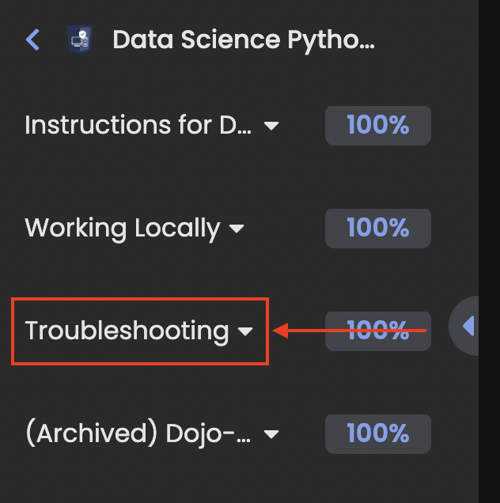
   </figure>
  </li>
  <li>
   Third, reach out on the #ds-python-installation Discord channel (
   <a href="https://discord.com/channels/738494436467539968/999108307627294770" target="_blank">
    Link
   </a>
   ) with:
   <ul>
    <li>
     What step you are on (e.g. Step 2.3 Creating the dojo-env)
    </li>
    <li>
     What OS you are using (e.g. Windows 10, Windows 11, Mac with an Apple Processor, etc)
    </li>
    <li>
     Screenshots of the error/issue you are running into, whenever possible.
    </li>
    <li>
     Finally, if you have been able to run the test notebook in Step 2.4: Testing the Env, please upload these files with your question.
    </li>
   </ul>
  </li>
  <li>
   Fourth, if you do not receive a response by the end of the day on Discord, please email your instructor.
  </li>
 </ul>
 

 <h2>
  OS-Specific Steps/Commands
 </h2>
 

  <strong>
   For several steps (e.g. Step 1), there are multiple versions of the instructions, depending on what operating system you are using.
  </strong>
 

 

  (i.e. a Windows computer, vs a Mac with an Intel processor, vs a Mac with an Apple Chip (m1/m1pro/m2/etc).)
 

 

  <dfn>
   For step 1, please make sure you are on the correct instruction page for your OS.
  </dfn>
 

 <h3>
  Currently Supported Operating Systems
 </h3>
 <ul>
  <li>
   We have prepared environment files (.yml files) for 4 different OS configurations:
   <ul>
    <li>
     Windows (10 &amp; 11)
    </li>
    <li>
     Mac (with Intel processors)*
    </li>
    <li>
     Mac (Apple Chips)*
    </li>
    <li>
     Linux**
    </li>
   </ul>
  </li>
 </ul>
 <h4>
  *Note for Mac users - if you don't know which type of Mac you have :
 </h4>
 

  <ul>
   <li>
    Check the "About this Mac" screen for your computer.
    <ul>
     <li>
      Click on the Apple symbol on the top-left corner of your screen.
     </li>
     <li>
      <strong>
       Click About This Mac.
      </strong>
     </li>
     <li>
      A window with your computer's specs will appear like the one in the screenshot below
      <ul>
       <li>
        
       </li>
      </ul>
     </li>
     <li>
      If it has a "Processor" line that says "Intel" you should follow the Instructions: Mac (Intel Processor).
     </li>
     <li>
      If it has a "Chip" line that says "Apple" then you should follow the Instructions: Mac (Apple Chip).
     </li>
    </ul>
   </li>
  </ul>
  <h4>
   **Note to Linux Users:
  </h4>
  <ul>
   <li>
    Our Linux installation instructions are still in beta. While they have successfully been installed on students' Linux machines, we currently do not have a Linux machine available for troubleshooting.
    <ul>
     <li>
      The beta Linux instructions are located
      <a href="https://login.codingdojo.com/m/213/13909/99742" target="_blank">
       here
      </a>
      and all steps are combined into 1 lesson.
     </li>
    </ul>
   </li>
  </ul>
  

    
  

  

  

   <strong>
    Regardless of OS, you will be using tools that serve the following purposes:
     
   </strong>
  

  <ul>
   <li>
    Your "Terminal"/"Shell":
    <ul>
     <li>
      The primary application you will use to execute coding-related commands.
     </li>
    </ul>
   </li>
   <li>
    A Python Distribution:
    <ul>
     <li>
      The fundamental infrastructure for installing Python.
     </li>
    </ul>
   </li>
   <li>
    GitHub Desktop:
    <ul>
     <li>
      App for working with and managing git repositories.
     </li>
    </ul>
   </li>
   <li>
    Our custom Python Environment (dojo-env)
    <ul>
     <li>
      A bundle of packages required for stacks 1-5+
     </li>
    </ul>
   </li>
   <li>
    Jupyter Notebooks / Jupyter Lab
    <ul>
     <li>
      The primary editor we will use (instead of Colab).
     </li>
    </ul>
   </li>
   <li>
    Visual Studio Code
    <ul>
     <li>
      A special text editor designed for code. It has many extensions and languages available.
     </li>
     <li>
      We will use it to edit special files, but it can also run notebooks too!
     </li>
    </ul>
   </li>
  </ul>
  

  <h2>
   Python Installation Video Recording
  </h2>
  

   <em>
    Note: the recording below is showing the steps for installing dojo-env version 1. The steps are basically the same but the video does not cover the additional steps required to install the newest version of dojo-env on a Mac with an Apple chip (m1,m2,etc)
   </em>
  

  <iframe width="560" height="315" src="https://www.youtube.com/embed/videoseries?list=PLmeeqPbYmMC38Sp2d5nsfMeATQ24Q4-x4"
	title="YouTube video player" frameborder="0"
	allow="accelerometer; autoplay; clipboard-write; encrypted-media; gyroscope; picture-in-picture"
	allowfullscreen></iframe>
  </iframe>
  

    
  

  

    
    
  

 

 

 

 <h1>
  1. Downloading and Installing Required Apps
 </h1>
 <blockquote>
  Before we install our python environment, we need to take care of a couple requirements.
 </blockquote>
 

  <strong>
   In step 1, we will install:
  </strong>
 

 <ul>
  <li>
   Your "Terminal"/"Shell":
   <ul>
    <li>
     The primary application you will use to execute coding-related commands.
    </li>
   </ul>
  </li>
  <li>
   A Python Distribution (Anaconda/miniforge):
   <ul>
    <li>
     The fundamental infrastructure that will allow us to install Python.
    </li>
   </ul>
  </li>
  <li>
   GitHub Desktop:
   <ul>
    <li>
     The way we will work with git repositories and the starting point for our local workflows.
    </li>
   </ul>
  </li>
 </ul>
 

 

 <h3>
 </h3>
 <h2>
  There are different instructions for step 1, depending on your operating system.
 </h2>
 <h2>
  <i>
   Please
  </i>
  <i>
   make sure you are on the correct version of step 1
  </i>
  <i>
   before following the instructions:
  </i>
 </h2>
 <ul>
  <li>
   Step 1 - Windows
  </li>
  <li>
   Step 1 - MacOS (Intel Processor)
  </li>
  <li>
   Step 1 - MacOS (Apple Chip)
  </li>
 </ul>
 <h3>
  Note for Mac users - if you don't know which type of Mac you have :
 </h3>
 

  <h3>
  </h3>
  <h3>
   <ul>
    <li>
     Check the "About this Mac" screen for your computer.
     <ul>
      <li>
       Click on the Apple symbol on the top-left corner of your screen.
      </li>
      <li>
       <strong>
        Click About This Mac.
       </strong>
      </li>
      <li>
       A window with your computer's specs will appear like the one in the screenshot below
       <ul>
        <li>
         
        </li>
        <li>
         If it has a "Processor" line that says "Intel" you should follow the instructions for MacOS (Intel Processor)
        </li>
        <li>
         If it has a "Chip" line that says "Apple" then follow the instructions for MacOS (Apple Chip)
        </li>
       </ul>
      </li>
     </ul>
    </li>
   </ul>
  </h3>
  

    
  

  

  

  

    
  

 

 

 

 <h1>
  Step 1 - Windows
 </h1>
 <h2>
  Overview
 </h2>
 

  In step 1, you will install 3 critical tools:
 

 <ul>
  <li>
   Tool #1: A Linux-based bash terminal (Windows Terminal + GitBash)
  </li>
  <li>
   Tool #2: GitHub Desktop
  </li>
  <li>
   Tool #3: Anaconda
  </li>
 </ul>
 

 <h1>
  Tool #1: A Linux-based bash Terminal:
 </h1>
 <ul>
  <li>
   
    Windows users will use a combination of GitBash and Windows Terminal. Windows Terminal comes pre-installed with Windows 11, but can be added to Windows 10.
   
  </li>
  <li>
   
    You should
    <strong>
     not
    </strong>
    use the
   
   windows command prompt because the commands for working with your terminal will not match the curriculum and other cloud-based platforms (like Amazon Web Services).
   <ul>
    <li>
     Note: for a list of the equivalent commands for Windows command prompt see
     <a href="https://www.geeksforgeeks.org/linux-vs-windows-commands/" target="_blank">
      this cheat sheet
     </a>
     .
    </li>
   </ul>
  </li>
 </ul>
 <h3>
  Tool 1, Step 0: (Windows 10 Only) Install Windows Terminal via the Microsoft Store
 </h3>
 

  <strong>
   NOTE: Windows 11 comes with Windows Terminal pre-installed.
  </strong>
  If you are running Windows 11, you can skip Step 0 and start with Step 1.
  <ul>
   <li>
    For Windows 10 users, open your start menu using your Windows key or clicking on the Start Menu in the bottom left corner.
   </li>
  </ul>
  <figure rel="width: 460px; height: 171px;" style="text-align: center;">
   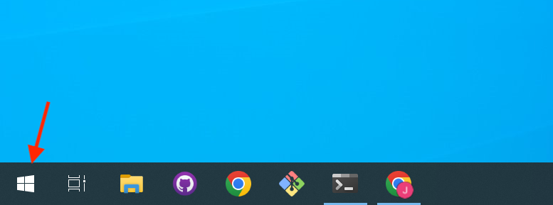
  </figure>
  <ul>
   <li>
    Type "Store" with the start menu open and it will automatically start searching. You should see "Microsoft Store" appear.
   </li>
  </ul>
  <figure rel="width: 569px; height: 464px;" style="text-align: center;">
   
  </figure>
  <ul>
   <li>
    Click on the Microsoft Store app on the left or click "Open" on the right sidebar to open the Microsoft store.
   </li>
   <li>
    Once the Microsoft store opens, click on the Search box on the top of app.
   </li>
  </ul>
  <figure rel="width: 575px; height: 453px;" style="text-align: center;">
   
  </figure>
  <ul>
   <li>
    Enter "Windows Terminal" in the search box and you should see the Windows Terminal result appear with a blue "Get" button like in the screenshot below:
   </li>
  </ul>
  <figure rel="width: 559px; height: 449px;" style="text-align: center;">
   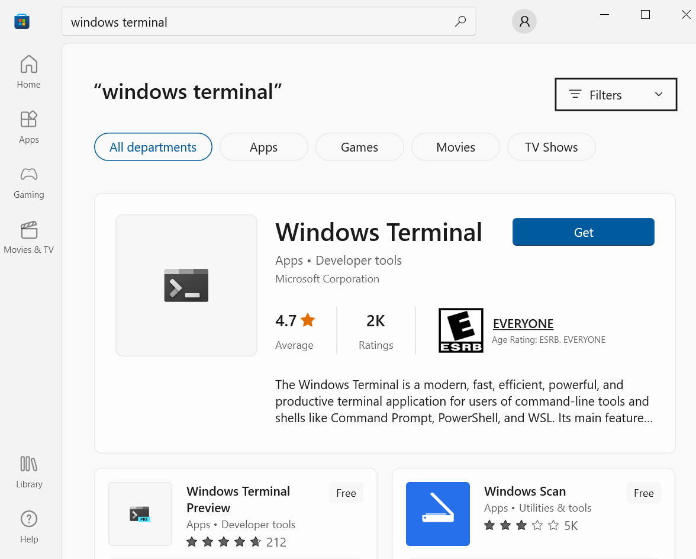
  </figure>
  <ul>
   <li>
    Click on the blue "Get" button to start downloading the app.
   </li>
  </ul>
  <figure rel="width: 612px; height: 483px;" style="text-align: center;">
   
  </figure>
  <ul>
   <li>
    Once its done downloading, the blue "Get" button will become an "Open" button. Click on "Open" to confirm that Windows Terminal is properly installed.
   </li>
   <li>
    A new "Windows Terminal" window running Powershell should appear, like in the screenshot below:
   </li>
  </ul>
  <figure rel="width: 761px; height: 420px;" style="text-align: center;">
   
  </figure>
  <ul>
   <li>
    After confirming windows terminal is installed, click on the X in the top right corner to close the app. You are all set to move on to the next step!
   </li>
  </ul>
  

  <h3>
   Tool 1, Step 1: Install Git for Windows
  </h3>
  

   <ul>
    <li>
     Download the Git for Windows installer (
     <a href="https://gitforwindows.org/" target="_blank">
      https://gitforwindows.org/
     </a>
     ) and open it.
    </li>
   </ul>
   <h4>
    Select the same options as you see in the screenshots below:
   </h4>
   <ul>
    <li>
     On the first page, make sure to UNCHECK "Only show new options" like in the screenshot below:
    </li>
   </ul>
   <figure rel="width: 432px; height: 358px;" style="text-align: center;">
    
   </figure>
   <ul>
    <li>
     <strong>
      <dfn style="color: rgb(192, 80, 77);">
       Make sure to select the option pictured below "Add Git Bash Profile to Windows Terminal"!!
      </dfn>
     </strong>
    </li>
   </ul>
   <strong>
   </strong>
   <figure rel="width: 430px; height: 356px;" style="text-align: center;">
    
   </figure>
   <ul>
    <li>
     Then select the default options for the remaining options (unless noted otherwise below):
    </li>
   </ul>
   <figure rel="width: 438px; height: 363px;" style="text-align: center;">
    
   </figure>
   <figure rel="width: 436px; height: 361px;" style="text-align: center;">
    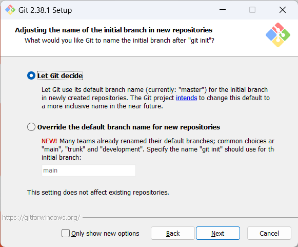
   </figure>
   <figure rel="width: 436px; height: 361px;" style="text-align: center;">
    
   </figure>
   <figure rel="width: 435px; height: 360px;" style="text-align: center;">
    
   </figure>
   <figure rel="width: 435px; height: 360px;" style="text-align: center;">
    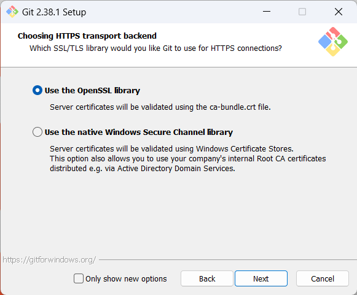
   </figure>
   <figure rel="width: 435px; height: 360px;" style="text-align: center;">
    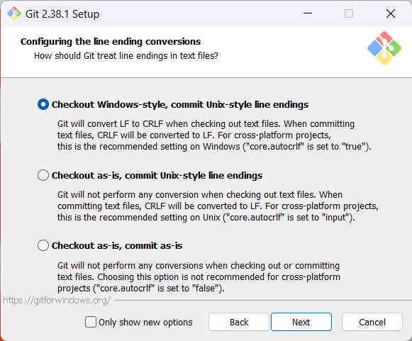
   </figure>
   <figure rel="width: 435px; height: 360px;" style="text-align: center;">
    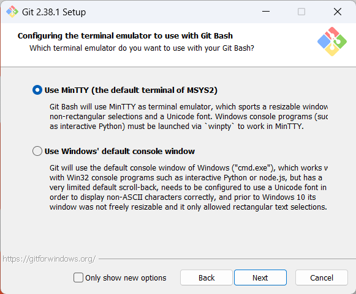
   </figure>
   <figure rel="width: 435px; height: 360px;" style="text-align: center;">
    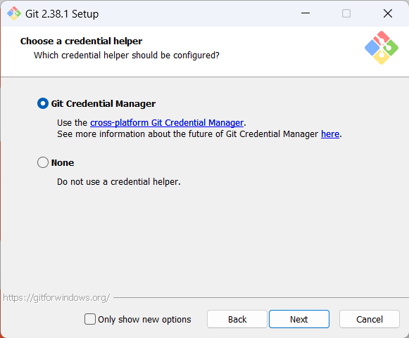
   </figure>
   <ul>
    <li>
     One non-default option that you may want to select is to "Enable symbolic links" in the screenshot below.
     <ul>
      <li>
       This option will be helpful if you ever need to access data stored on a network drive. This will
       <em>
        not
       </em>
       be required for the program.
      </li>
     </ul>
    </li>
   </ul>
   <figure rel="width: 442px; height: 366px;" style="text-align: center;">
    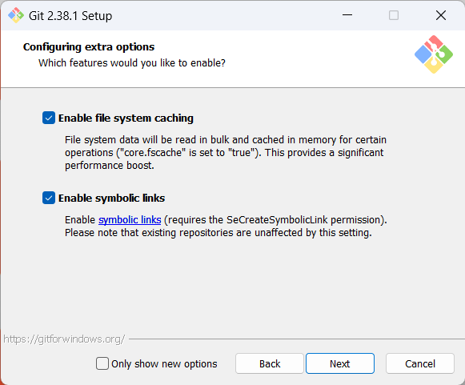
   </figure>
   <figure rel="width: 442px; height: 366px;" style="text-align: center;">
    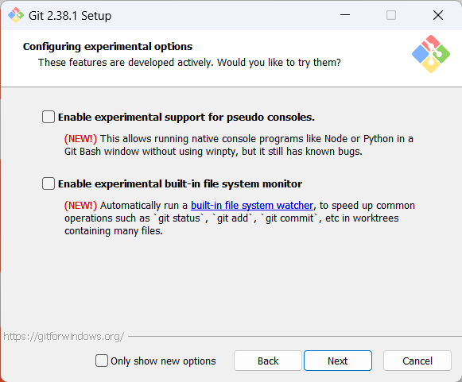
   </figure>
   <ul>
    <li>
     <strong>
      TROUBLESHOOTING NOTE:
     </strong>
     <ul>
      <li>
       If you see the following "Replacing in-use files" screen (screenshot below) about closing open instances of gitbash: close all other windows of GitBash.
      </li>
      <li>
       If it still shows items that are running that you cannot find, the easiest solution is to cancel the installation, restart your computer, and then open the installer again
       <strong>
        before
       </strong>
       opening any gitbash windows.
      </li>
     </ul>
    </li>
   </ul>
   <figure rel="width: 448px; height: 371px;" style="text-align: center;">
    
   </figure>
   <ul>
    <li>
     Click install and wait for the process to finish. Next, move on to Tool  #2: GitHub Desktop.
    </li>
   </ul>
   <h3>
    Tool 1, Step 2: Make GitBash the Default Profile in Windows Terminal
   </h3>
   <ul>
    <li>
     From your Windows Start menu, search for "Terminal" and open a new Windows Terminal window.
    </li>
    <li>
     It will open using the default shell "Powershell", pictured below:
    </li>
   </ul>
   <figure rel="cursor: pointer; max-width: 100%; height: 330px; width: 618px;" style="text-align: center;">
    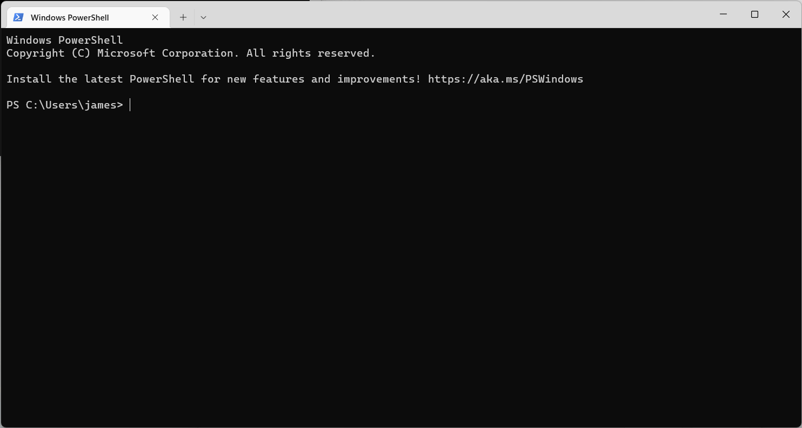
   </figure>
   <ul>
    <li>
     Click on the drop down arrow to reveal the menu.
     <ul>
      <li>
       Select Settings
      </li>
     </ul>
    </li>
   </ul>
   <figure rel="cursor: pointer; max-width: 100%; height: 329px; width: 616px;" style="text-align: center;">
    
   </figure>
   <ul>
    <li>
     The settings tab will open and should look like the screenshot below:
    </li>
   </ul>
   <figure rel="cursor: pointer; max-width: 100%; height: 338px; width: 634px;" style="text-align: center;">
    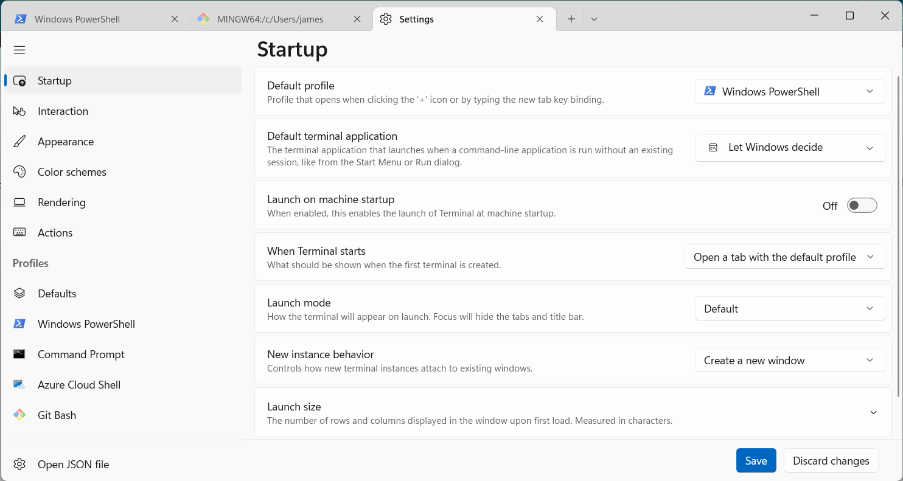
   </figure>
   <ul>
    <li>
     Click on the drop down menu for the first option "Default Profile" and select GitBash
    </li>
   </ul>
   <figure rel="cursor: pointer; max-width: 100%; height: 346px; width: 648px;" style="text-align: center;">
    
   </figure>
   <ul>
    <li>
     Click the blue Save button in the bottom right corner.
    </li>
   </ul>
   <h3>
    Tool 1, Step 3: Confirm that your default shell is set to GitBash
   </h3>
   <ul>
    <li>
     To test if the default shell is now set to GitBash, open a new Terminal window.
    </li>
    <li>
     If you see a window like the one below that has the GitBash icon (the multicolored 4-squares in the top left corner), then you are all set!
    </li>
   </ul>
   

     
   

   <figure rel="cursor: pointer; max-width: 100%; height: 307px; width: 574px;" style="text-align: center;">
    
   </figure>
   <ul>
    <li>
     You're all set up with Windows Terminal and GitBash!
    </li>
   </ul>
   

   <h1>
    Tool #2: GitHub Desktop
   </h1>
   <h3>
    Tool 2, Step 1: Install GitHub Desktop and Log Into GitHub Account
   </h3>
   <ul>
    <li>
     Download the installer from this link:
     <a href="https://desktop.github.com/" target="_blank">
      GitHub Desktop
     </a>
    </li>
    <li>
     Once installation is complete, open the application.
     <ul>
      <li>
       Log into the same GitHub account you have been using for your projects.
      </li>
     </ul>
    </li>
   </ul>
   <h3>
    Tool 2, Step 2: Make Windows Terminal the Default Shell in GitHub Desktop
   </h3>
  

  <ul>
   <li>
    Once you have logged into the app, open the Options menu.
    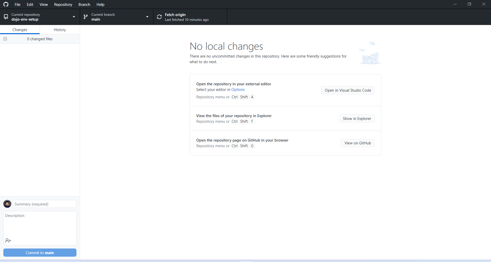
   </li>
  </ul>
  

   <ul>
    <li>
     Click on
     <code>
      File
     </code>
     in the menu bar and then select
     <code>
      Options
     </code>
    </li>
   </ul>
   <figure style="text-align: center;">
    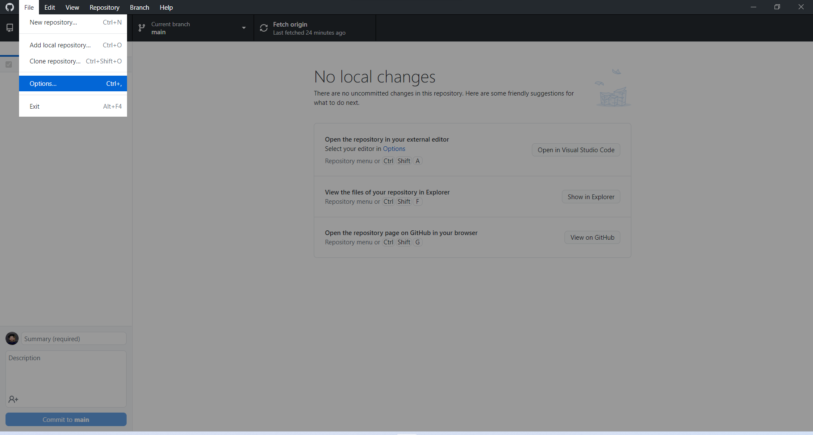
   </figure>
   <ul>
    <li>
     <strong>
      Select the "Integrations" tab on the left sidebar of the Options window.
     </strong>
    </li>
   </ul>
   <figure style="text-align: center;">
    
   </figure>
   

     
   

   

    <ul>
     <li>
      <strong>
       Click on the drop-down menu for Shell and select Windows Terminal
      </strong>
      .  (Windows 10 users, if you do not see this option, make sure you have followed Step 0 of these instructions. If you still do not see Windows Terminal as an option, please restart your computer and try again.)
     </li>
    </ul>
    <figure style="text-align: center;">
     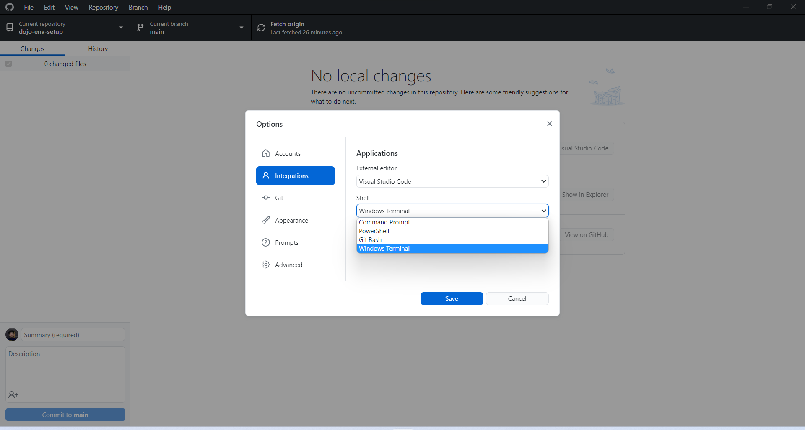
    </figure>
    <ul>
     <li>
      Click Save and the window will close.
      
     </li>
    </ul>
    <ul>
     <li>
      Click Save. You may close Github Desktop for now.
     </li>
    </ul>
   

  

  

  

  

  <h2>
  </h2>
  <h1>
   Tool #3: Python Distribution - Anaconda
  </h1>
  <ul>
   <li>
    Anaconda is a data-science-focused python distributable that comes with a convenient GUI program for working with our python environments.
   </li>
  </ul>
  <h3>
   Tool #3, Step 1: Download and Install Anaconda
  </h3>
  <ul>
   <li>
    Download and run the installer from the following link:
    <a href="https://www.anaconda.com/products/individual" target="_blank">
     Anaconda Individual Edition
    </a>
    <ul>
     <li>
      Use the default options,
      <strong>
       EXCEPT when you see the "Advanced Installation Options"
      </strong>
      window (like in the screenshot below).
     </li>
     <li>
      Select "Add Anaconda3 to my Path environment variable". Disregard the warning message will appear in red text.
      <ul>
       <li>
        BOTH options should be checked, like in the screenshot below:
       </li>
      </ul>
     </li>
    </ul>
   </li>
  </ul>
  <figure style="text-align: center;">
   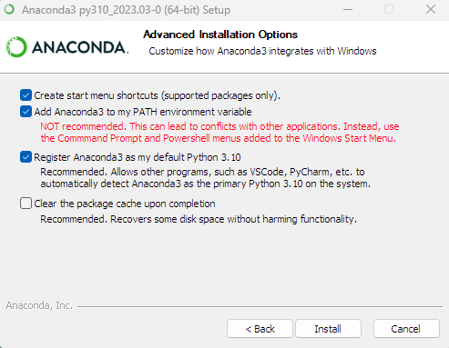
  </figure>
  <h3>
   Tool 3, Step 2: Verifying that Terminal/GitBash Knows "conda"
  </h3>
  <ol>
   <li>
    

     Windows users may need to take an additional step to get anaconda and Terminal working together.
    

   </li>
   <li>
    

     Open a
     <strong>
      new Terminal window
     </strong>
     from your start menu. It MUST be a new window
    

   </li>
   <li>
    

     Enter the command
     <code>
      conda
     </code>
     and press enter.
    

    <ol>
     <li>
      <strong>
       If you see a list of available conda commands, great!
      </strong>
      <ol>
       <li>
        You are all set to move on to Step 2: "Setting Up Your
        <code>
         dojo-env
        </code>
        "
       </li>
       <li>
        Disregard the final section below that says "Adding Conda to GitBash"
       </li>
      </ol>
     </li>
     <li>
      <strong>
       If you see a message that says: "bash: conda: command not found", then follow the instructions below under "Adding Conda to GitBash"
      </strong>
     </li>
    </ol>
   </li>
  </ol>
  <h3>
   Tool 3, Step 3 (if needed) Adding Conda to GitBash:
  </h3>
  

   If a NEW terminal window recognized the conda command in Tool 3, Step 2 then you may skip this step!
  

  

   Note: the instructions below are adapted from this
   <a href="https://fmorenovr.medium.com/how-to-add-conda-to-git-bash-windows-21f5e5987f3d" target="_blank">
    Blog Post
   </a>
  

  <ul>
   <li>
    Once you have installed anaconda,
    <strong>
     use File Explorer to Open Your User folder
    </strong>
    . (Windows key +E is shortcut for File Explorer)
    <ul>
     <li>
      This is the folder that contains your Desktop, Downloads, My Documents, and other user-specific files.
      <ul>
       <li>
        Example:
        <code>
         Users/your_name/
          
        </code>
       </li>
      </ul>
     </li>
     <li>
      If you're having trouble finding your user folder:
      <ul>
       <li>
        Go to This PC in File Explorer, and then double click on your C drive.
        <ul>
         <li>
          Then double click the Users folder and then click on the folder that corresponds to your windows username.
         </li>
        </ul>
       </li>
      </ul>
     </li>
    </ul>
   </li>
   <li>
    <strong>
     Inside your user folder, you should see a folder named "
     <code>
      anaconda3
     </code>
     " (note: not the hidden folder called
     <code>
      .anaconda
     </code>
     that starts with a
     <code>
      .
     </code>
     ). Double-click the folder to open it.
    </strong>
    <ul>
     <li>
      You should see a
      <strong>
       folder named
       <code>
        etc
       </code>
       inside the
       <code>
        anaconda3
       </code>
       folder. Open it.
      </strong>
     </li>
     <li>
      You should see a
      <strong>
       folder called
       <code>
        profile.d
       </code>
       folder inside the
       <code>
        etc
       </code>
       . Open it.
      </strong>
      <ul>
       <li>
        You
        <strong>
         should see a
         <code>
          conda.sh
         </code>
         file in this folder (
        </strong>
        it may just say conda if your File Explorer is set to not show names for known extensions).
        <ul>
         <li>
          (Note: depending on your setting in File Explorer, it may not show the .sh and may just show "conda", which is fine!)
         </li>
        </ul>
       </li>
      </ul>
     </li>
    </ul>
    <ul>
     <li>
      <strong>
       Right-click somewhere in the "profile.d" folder and select "Git Bash Here".
      </strong>
      <ul>
       <li>
        Note for Windows 11 Users: "GitBash here" is going to appear in the "Show more options" sub-menu when you right-click
         
        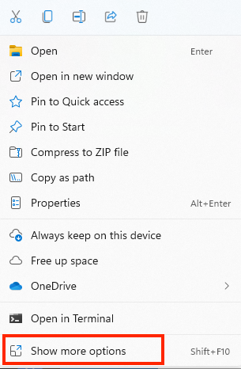
        .
        
       </li>
      </ul>
     </li>
    </ul>
   </li>
  </ul>
  

    
  

  <ul>
   <li>
    From the GitBash window that opens:
    <ul>
     <li>
      <strong>
      </strong>
      <strong>
       Enter the command
      </strong>
      <code>
       <strong>
        pwd
       </strong>
      </code>
      and hit enter and examine the file path that's displayed
      <ul>
       <li>
        If the file path displayed ends with
        <code>
         profile.d
        </code>
        then are in the right folder!
       </li>
       <li>
        If not, restart the "Adding Conda to GitBash" instructions again and make sure you can find your profile.d folder.
        <ul>
         <li>
          Reach out to your instructor or a TA if you are still having issues.
         </li>
        </ul>
       </li>
      </ul>
     </li>
     <li class="text-justify">
      <strong>
       Next, Enter the following command and hit enter
      </strong>
      :
     </li>
    </ul>
   </li>
  </ul>
  <pre data-language="ruby">echo ". '${PWD}'/conda.sh" &gt;&gt; ~/.bashrc<button class="copy_code_snippet_btn">copy</button></pre>
  <ul>
   <li>
    <strong>
     Open a new GitBash window and enter
     <code>
      conda
     </code>
     again.
    </strong>
    <ul>
     <li>
      You should no longer get the "bash: conda: command not found" error message!
      <ul>
       <li>
        Reach out to your instructor or a TA if you are still having issues.
       </li>
      </ul>
     </li>
    </ul>
   </li>
  </ul>
  

    
  

  <blockquote>
   <strong>
    You are all set to move on to the next lesson "2. Setting Up Your dojo-env Environment"
   </strong>
  </blockquote>
  

    
  

  

    
    
  

 

 

 

 <h1>
  Step 1 - MacOS (Intel Processor)
 </h1>
 <b>
  <h3>
   Tool #1: A Linux-based bash shell/terminal:
  </h3>
  <ul>
   <li>
    Linux users and MacOS users have this built-in to their OS.
    <ul>
     <li>
      On MacOS, the shell is called "Terminal" and can be found in
      <code>
       Applications&gt;Utilities
      </code>
      in Finder
     </li>
     <li>
      OR you can use spotlight search and search for "Terminal".
     </li>
    </ul>
   </li>
  </ul>
 </b>
 <h3>
  Tool #2: GitHub Desktop
 </h3>
 <ul>
  <li>
   Download the installer from this link:
   <a href="https://desktop.github.com/" target="_blank">
    GitHub Desktop
   </a>
  </li>
  <li>
   Once installation is complete, open the application.
   <ul>
    <li>
     Log into the same GitHub account you have been using for your projects.
    </li>
   </ul>
  </li>
  <li>
   Once you have logged into the app,  open the Options menu
   <ul>
    <li>
     Select
     <code>
      "GitHub Desktop"
     </code>
     on the menu bar (top of the screen) and then select
     <code>
      Preferences
     </code>
     .
    </li>
    <li>
     Select the "Integrations" tab.
    </li>
    <li>
     Make sure the Shell dropdown menu says "Terminal"
     <ul>
      <li>
       If not, select it from the dropdown menu.
      </li>
     </ul>
    </li>
    <li>
     Click Save.
    </li>
   </ul>
  </li>
 </ul>
 <h3>
  Tool #3: Python Distribution - Anaconda
 </h3>
 <ul>
  <li>
   Anaconda is a data-science-focused python distributable that comes with a convenient GUI program for working with our python environments.
  </li>
  <li>
   Download and run the installer from the following link:
   <a href="https://www.anaconda.com/products/individual" target="_blank">
    Anaconda Individual Edition
   </a>
   <ul>
    <li>
     Use the default options, EXCEPT when you see the "Advanced Installation Options" window (like in the screenshot below).
    </li>
    <li>
     Select "Add Anaconda3 to my Path environment variable". Disregard the warning message will appear in red text.
     <ul>
      <li>
       BOTH options should be checked, like in the screenshot below:
      </li>
     </ul>
    </li>
   </ul>
  </li>
 </ul>
 <figure style="text-align: center;">
  
 </figure>
 

   
 

 <blockquote>
  <strong>
   You are all set to move on to the next lesson "2. Setting Up Your dojo-env Environment"
  </strong>
 </blockquote>
 

   
 

 

   
 

 

 

 <h1>
  Step 1 - MacOS (Apple Chip)
 </h1>
 <h2>
  Preface: Good News and Bad News
 </h2>
 <ul>
  <li>
   So...you got one of those shiny new(ish) Mac computers with an Apple chip, eh? We've got some good news and bad news for you.
   <ul>
    <li>
     The good news:
     <ul>
      <li>
       Your python code will run blisteringly fast compared to a Mac with an Intel chip!
      </li>
      <li>
       Code that may take hours elsewhere will only take minutes for your computer.
      </li>
     </ul>
    </li>
   </ul>
   <ul>
    <li>
     The bad news:
     <ul>
      <li>
       Your instructions for Tool #3 below (the Python Distribution) are going to be very different than the other operating systems.
      </li>
      <li>
       Additionally, there are still packages that have not yet been updated to be compatible with your processor.
       <ul>
        <li>
         But don't worry: everything that is in the other OS's dojo-env is also in yours! Just a heads up if you try to install a new package and run into issues.
        </li>
       </ul>
      </li>
     </ul>
    </li>
   </ul>
  </li>
 </ul>
 

 <h1>
  STEP # 1 INSTRUCTIONS:
 </h1>
 

  Note: steps for Tools # 1 and 2 are the same for Mac users with an Intel processor.
 

 <h2>
  Tool #1: A Linux-based bash shell/terminal:
 </h2>
 <ul>
  <li>
   Linux users and MacOS users have this built-in to their OS.
   <ul>
    <li>
     On MacOS, the shell is called "Terminal" and can be found in
     <code>
      Applications&gt;Utilities
     </code>
     in Finder
    </li>
    <li>
     OR you can use spotlight search and search for "Terminal".
    </li>
   </ul>
  </li>
 </ul>
 <h3>
  Tool #2: GitHub Desktop
 </h3>
 <ul>
  <li>
   Download the installer from this link:
   <a href="https://desktop.github.com/" target="_blank">
    GitHub Desktop
   </a>
  </li>
  <li>
   Once installation is complete, open the application.
   <ul>
    <li>
     Log into the same GitHub account you have been using for your projects.
    </li>
   </ul>
  </li>
  <li>
   Once you have logged into the app,  open the Options menu
   <ul>
    <li>
     Select
     <code>
      "GitHub Desktop"
     </code>
     on the menu bar (top of the screen) and then select
     <code>
      Preferences
     </code>
     .
    </li>
    <li>
     Select the "Integrations" tab.
    </li>
    <li>
     Make sure the Shell dropdown menu says "Terminal"
     <ul>
      <li>
       If not, select it from the dropdown menu.
      </li>
     </ul>
    </li>
    <li>
     Click Save.
    </li>
   </ul>
  </li>
 </ul>
 

 <blockquote>
  <strong>
   Note: Here is where the instructions for Apple Chips will significantly deviate from the others.
    
  </strong>
 </blockquote>
 <ul>
  <li>
   The
   <strong>
    primary difference
   </strong>
   is that in order for us to use Apple-Chip compatible versions of packages (like TensorFlow),
   <strong>
    we CAN NOT use the standard Anaconda distribution.
   </strong>
  </li>
  <li>
   There is a l
   <strong>
    ightweight alternative to Anaconda, called miniforge
   </strong>
   , that will install much of the
   <strong>
    same foundations as Anaconda,
   </strong>
   but with access to alternative versions of packages that are optimized for Apple Chips.
   <ul>
    <li>
     <strong>
      Note/Warning: you would still be
      <em>
       able
      </em>
     </strong>
     <strong>
      to install Anaconda if you tried, but
     </strong>
     your computer will
     <strong>
      never
     </strong>
     be able to run TensorFlow if you use Anaconda. So please, take our word for it that it is worth following our alternative instructions
    </li>
   </ul>
  </li>
  <li>
   The following instructions are based on
   <a href="https://caffeinedev.medium.com/how-to-install-tensorflow-on-m1-mac-8e9b91d93706" target="_blank">
    this blog post
   </a>
   , should you wish to review it in-depth.
   
   
  </li>
 </ul>
 <h3>
  Pre-Tool #3 Verification:
 </h3>
 <ul>
  <li>
   VERIFY THAT ANACONDA IS NOT ALREADY INSTALLED ON YOUR COMPUTER.
   <ul>
    <li>
     <strong>
      Open a terminal window and run the "conda" command
     </strong>
     (without quotation marks).
     <ul>
      <li>
       <strong>
        If it says conda not found, great!
       </strong>
       <ul>
        <li>
         You're ready to install miniforge.
        </li>
       </ul>
      </li>
      <li>
       <strong>
        If it shows a list of available conda command
       </strong>
       s:
       <ul>
        <li>
         <strong>
          You MUST FOLLOW THE APPENDIX INSTRUCTIONS AT THE BOTTOM OF THIS LESSON FOR "Uninstalling Anaconda".
         </strong>
        </li>
       </ul>
      </li>
     </ul>
    </li>
   </ul>
  </li>
 </ul>
 <ul>
  <li>
   CRITICAL NOTE:
   <ul>
    <li>
     <strong>
      IF YOUR TERMINAL RECOGNIZED THE CONDA COMMAND ANACONDA MUST BE REMOVED BEFORE INSTALLING MINIFORGE.
     </strong>
    </li>
    <li>
     Failure to heed this warning will break all of your python environments and it is NOT easy to fix!!!
    </li>
   </ul>
  </li>
 </ul>
 

   
 

 <h2>
  Tool #3: Python Distribution - miniforge
 </h2>
 

  Tool # 3 will involve several steps with several verification steps along the way. Make sure to follow each Step and Verification step below to ensure you have a problem-free python installation.
 

 <h3>
  Step 1: Install XCode (a Mac-specific developer toolkit from Apple)
 </h3>
 <ul>
  <li>
   Run the command below in your Terminal.
   <ul>
    <li>
     Note: this step may take several minutes
    </li>
    <li>
     You may be asked to enter your password to approve the installation. This is your normal user password to log into your computer.
    </li>
   </ul>
  </li>
 </ul>
 <pre data-language="ruby">xcode-select --install<button class="copy_code_snippet_btn">copy</button></pre>
 <h3>
  Step 2: Install Homebrew  ( a database of downloadable apps/tools for Mac)
 </h3>
 

  Visit
  <a href="https://brew.sh/" target="_blank">
   https://brew.sh/
  </a>
  for more information about Homebrew
 

 <ul>
  <li>
   To Install homebrew, run the following command in your Terminal (and make sure to read the steps below):
  </li>
 </ul>
 <pre data-language="ruby">/bin/bash -c "$(curl -fsSL https://raw.githubusercontent.com/Homebrew/install/HEAD/install.sh)"<button class="copy_code_snippet_btn">copy</button></pre>
 <ul>
  <li>
   <strong>
    You may be asked to enter your password in your terminal.
   </strong>
   <ul>
    <li>
     This is the same password you use to log into your mac.
    </li>
    <li>
     Enter your password when prompted and hit Enter.
     <ul>
      <li>
       NOTE: You will not be able to see what keys you have typed, so just trust that it is recognizing your keystrokes and hit enter. It will notify you if the password was incorrect.
      </li>
     </ul>
    </li>
   </ul>
  </li>
  <li>
   <strong>
    The installation process will pause and ask you "Press RETURN to continue or any other key to abort".
   </strong>
   <ul>
    <li>
     When it does, press Return/Enter!
    </li>
   </ul>
  </li>
  <li>
   <strong>
    Step 2B: CRITICAL NOTE
   </strong>
   <ul>
    <li>
     When homebrew has finished installing, it may display a message telling you to run 1 or 2 commands in your Terminal.
     <ul>
      <li>
       <strong>
        It is very important that you run those commands
       </strong>
       , otherwise, your terminal will not know that homebrew has been installed.
      </li>
     </ul>
    </li>
   </ul>
  </li>
 </ul>
 <h3>
  Step 2 Verification:
 </h3>
 

  Confirm that homebrew was successfully installed:
 

 <ul>
  <li>
   <strong>
    Open a New Terminal Window (shortcut: Cmd+N or Cmd+T) and run the "brew" command
   </strong>
   .
   <ul>
    <li>
     If it lists available commands, great!
     <ul>
      <li>
       You're all set to move forward.
      </li>
     </ul>
    </li>
    <li>
     <strong>
      If it says brew not found,
     </strong>
     <ul>
      <li>
       You may have missed the commands to paste at the end of the homebrew installation.
      </li>
      <li>
       Try installing homebrew again and make sure to pay attention to the final text that's displayed and follow any additional instructions it displays.
      </li>
     </ul>
    </li>
   </ul>
  </li>
 </ul>
 <h2>
  Step 3: Install miniforge using homebrew.
 </h2>
 <h3>
  Step 3 Commands:
 </h3>
 <ul>
  <li>
   Enter the brew installation command below in your terminal:
  </li>
 </ul>
 

  <pre data-language="ruby">brew install miniforge<button class="copy_code_snippet_btn">copy</button></pre>
  <ul>
   <li>
    Once miniforge has finished installing, run the following command in your terminal (required for Matplotlib):
   </li>
  </ul>
  <pre data-language="ruby">brew install pkg-config<button class="copy_code_snippet_btn">copy</button></pre>
  <ul>
   <li>
    Enter the following command to add the "conda" command to Terminal
   </li>
  </ul>
  <pre data-language="ruby">conda init zsh<button class="copy_code_snippet_btn">copy</button></pre>
  <h3>
   Post-Step 3 Verification
  </h3>
 

 <ul>
  <li>
   <strong>
    Open a new terminal window and enter the "conda" command.
   </strong>
   <ul>
    <li>
     If it lists available commands, fantastic!!
     <ul>
      <li>
       <strong>
        You are all set to move on to the next page of instructions "2. Setting Up Your dojo-env Environment"!!
       </strong>
      </li>
     </ul>
    </li>
    <li>
     If it says conda not found, try restarting your computer and then try running the conda command again.
     <ul>
      <li>
       If it still says conda not found, reach out to your instructor or a TA for help ASAP.
      </li>
     </ul>
    </li>
   </ul>
  </li>
 </ul>
 

   
 

 

 

 <h2>
  APPENDIX: UNINSTALLING ANACONDA
 </h2>
 

  If your computer already knew the conda command during "Pre-Step 3 Verification", it is critical that you remove anaconda before continuing with the miniforge installation.
 

 

  <strong>
   Pre-Uninstallation Verification Step:
  </strong>
 

 <ul>
  <li>
   <strong>
    If you share your computer with another User who also uses Python:
   </strong>
   <ul>
    <li>
     Pause here and check with them BEFORE you uninstall anaconda.
     <strong>
      You will be removing all of their python environments too,
     </strong>
     even though they have a separate User account.
    </li>
   </ul>
  </li>
 </ul>
 <ul>
  <li>
   <strong>
    If you share your computer with someone and they have concerns about uninstalling anaconda:
   </strong>
   <ul>
    <li>
     <strong>
      Stop here (for now)
     </strong>
     .
     <ul>
      <li>
       Do not move forward with the instructions until you have spoken with your instructor.
      </li>
      <li>
       Your instructor may be able to address concerns that your fellow User has and convince them to let you install miniforge.
      </li>
     </ul>
    </li>
   </ul>
  </li>
 </ul>
 <ul>
  <li>
   <strong>
    Alternatively, you could follow the Step 1 - MacOS (Intel Processor) instructions instead but:
   </strong>
   <ul>
    <li>
     Your python code will run slower than it would with miniforge.
    </li>
    <li>
     You will not be able to import tensorflow without your kernel crashing.
    </li>
   </ul>
  </li>
 </ul>
 <ul>
  <li>
   Your instructor may be able to address concerns that your fellow User has and convince them to let you install miniforge.
  </li>
 </ul>
 <h4>
  Official Steps for Fully Uninstalling Anaconda:
 </h4>
 

  The following steps are taken directly from the
  <a href="https://docs.anaconda.com/anaconda/install/uninstall/" target="_blank">
   Official Uninstalling Anaconda documentation page
  </a>
  , specifically "Option B. Full uninstall using Anaconda-Clean and simple remove."
 

 <ul>
  <li>
   <strong>
    Install the Anaconda-Clean package from Anaconda Prompt (terminal on Linux or macOS):
   </strong>
  </li>
 </ul>
 <pre data-language="ruby">conda install anaconda-clean<button class="copy_code_snippet_btn">copy</button></pre>
 <ul>
  <li>
   In the same window, run the following command:
  </li>
 </ul>
 <pre data-language="ruby">anaconda-clean --yes<button class="copy_code_snippet_btn">copy</button></pre>
 <ul>
  <li>
   Once the process has been completed, manually delete any "anaconda3" or "anaconda2" folders that still exist.
   <ul>
    <li>
     It may be located in one of several possible folders. Run the following "ls -a" commands until you see a folder called "anconda2" or "anaconda3".
    </li>
    <li>
     <strong>
      Once you see an anaconda folder, take note of:
     </strong>
     <ul>
      <li>
       <strong>
        Which command showed the folder.
       </strong>
       <ul>
        <li>
         <strong>
          Specifically, what did the command say after "ls -a"
         </strong>
        </li>
        <li>
         We will refer to this as your "base folder" in the final step.
        </li>
       </ul>
      </li>
      <li>
       <strong>
        If the anaconda folder was "anconda2" or "anaconda3"
       </strong>
       <ul>
        <li>
         We will refer to this as your "anaconda folder" in the final step.
        </li>
       </ul>
      </li>
     </ul>
    </li>
    <li>
     <strong>
      and j
     </strong>
     ump to the very last command at the bottom of the page, with those 2 pieces of information.
    </li>
   </ul>
  </li>
 </ul>
 <pre data-language="ruby">ls -a ~/
ls -a ~/opt/
ls -a /opt/<button class="copy_code_snippet_btn">copy</button></pre>
 <ul>
  <li>
   Run the final command to remove the anaconda folder once you've identified your "base folder" and "anaconda folder".
   <ul>
    <li>
     Replace {base_folder} with the actual folder name
    </li>
   </ul>
   <ul>
    <li>
     Replace {anaconda_folder} with the actual folder name.
    </li>
   </ul>
  </li>
 </ul>
 <pre data-language="ruby">rm -rf {base_folder}{anaconda_folder}
<button class="copy_code_snippet_btn">copy</button></pre>
 

   
 

 

  Once you've replaced the placeholder folder names with your actual folder names, the command should look something like this:
 

 <pre data-language="ruby">rm -rf ~/opt/anaconda3
# or 
rm -rf ~/anaconda2
# or 
rm -rf ~/opt/anaconda3<button class="copy_code_snippet_btn">copy</button></pre>
 <h4>
 </h4>
 <h4>
  Final Verification Step:
 </h4>
 <ul>
  <li>
   <strong>
    Now, open a new terminal window and try running the "conda" command again. Your terminal should say that conda is not found.
   </strong>
   <ul>
    <li>
     <strong>
      If it says conda is not found, you are now ready to jump back up to the "Step 3 Commands"
     </strong>
     header above.
    </li>
   </ul>
   <ul>
    <li>
     <strong>
      If your computer still displays a list of conda commands
     </strong>
     :  please see the final portion of the
     <a href="https://docs.anaconda.com/anaconda/install/uninstall/#removing-anaconda-path-from-bash-profile" target="_blank">
      Official Uninstallation Instructions "Removing Anaconda from .bash_profile"
     </a>
     , which is illustrated below:
    </li>
   </ul>
  </li>
 </ul>
 <ul>
  <li>
   <strong>
    Open the two settings file for your terminal and remove anything related to anaconda:
   </strong>
   <ul>
    <li>
     <strong>
      1) Run the "open ~/.bash_profile"  (without quotation marks) command and a text editor window should open.
     </strong>
     <ul>
      <li>
       Examine the contents of this file and
       <strong>
        delete any lines that look like either of the screenshots below
       </strong>
       :
       <ul>
        <li>
          
         
        </li>
        <li>
         
        </li>
       </ul>
      </li>
      <li>
       Save the file and close it.
      </li>
     </ul>
    </li>
    <li>
     2)
     <strong>
      Now repeat the process, but use the "open ~/.zshrc"
     </strong>
     (without quotation marks) command
     <ul>
      <li>
       Delete any lines of code that look like the screenshots above.
      </li>
      <li>
       Save the file and close it.
      </li>
     </ul>
    </li>
   </ul>
  </li>
 </ul>
 

   
 

 <ul>
  <li>
   <strong>
    FInal Verification:
   </strong>
   <ul>
    <li>
     Open a New Terminal Window (the changes you made above only take effect when opening a new window)
    </li>
    <li>
     Run the "conda" command again and you should now see a message that says "conda not found"
     <ul>
      <li>
       If you are still seeing the list of conda commands instead, re-open the two files listed above and make sure you saved them after deleting the lines of code.
      </li>
      <li>
       Close your terminal window and open a new one and try the "conda" command again.
      </li>
     </ul>
    </li>
   </ul>
  </li>
 </ul>
 

   
 

 <ul>
  <li>
   <strong>
    If the conda command still displays the list of commands after the steps above:
   </strong>
   <ul>
    <li>
     <strong>
      Try restarting your computer
     </strong>
     and attempting to run the command one more time.
    </li>
    <li>
     <strong>
      If you are still seeing conda commands:
     </strong>
     <ul>
      <li>
       You should post your problem on the
       <a href="https://discord.com/channels/738494436467539968/999108307627294770" target="_blank">
        ds-python-installation
       </a>
       
       
       
       
       discord channel for a TA or instructor to assist you.
      </li>
      <li>
       You should also email your instructor about the issue.
      </li>
     </ul>
    </li>
   </ul>
  </li>
 </ul>

 

 

 <h1>
  2. Setting Up Your dojo-env Environment
 </h1>
 <h2>
  Step 2 Overview:
 </h2>
 <ul>
  <li>
   <strong>
    In Step 1, we installed the foundational tools needed for our local python installation.
   </strong>
   <ul>
    <li>
     While we did install a Python distribution with a basic copy of Python (Anaconda or miniforge), we have not installed all of the packages and tools that we need as data scientists.
    </li>
   </ul>
  </li>
  <li>
   <strong>
    In Step 2, you will be creating a custom python environment called "dojo-env".
   </strong>
   <ul>
    <li>
     <strong>
      An "environment" is a bundle of specific python packages that are used together.
     </strong>
     Importantly, an environment specifies specific version #'s of the packages to ensure that all of the versions installed are mutually compatible.
    </li>
    <li>
     <strong>
      You can install many environments
     </strong>
     on your computer and switch between them as needed for different projects.
    </li>
   </ul>
   <ul>
    <li>
     <strong>
      We have designed the dojo-env to include everything you'd need for our program
     </strong>
     , so you may not have a reason to add additional environments.
    </li>
   </ul>
  </li>
 </ul>
 <h3>
  Currently Supported Operating Systems
 </h3>
 <h3>
 </h3>
 <ul>
  <li>
   <strong>
    We have prepared environment files (.yml files) for 3 different OS configurations:
   </strong>
   <ul>
    <li>
     <strong>
      Windows (10 &amp; 11)
     </strong>
    </li>
    <li>
     <strong>
      Mac (with Intel processors)
     </strong>
    </li>
    <li>
     <strong>
      Mac (Apple Chips).
       
     </strong>
    </li>
   </ul>
  </li>
  <li>
   Reminder for mac users:
   <ul>
    <li>
     Please revisit the "1. Downloading and Installing Apps" lesson if you are not sure which type of mac you are using.
    </li>
   </ul>
  </li>
  <li>
   Note to Linux Users:
   <ul>
    <li>
     Our Linux installation instructions are still in beta. While they have successfully been installed on students' Linux machines, we currently do not have a Linux machine available for troubleshooting.
    </li>
    <li>
     The beta Linux instructions are located
     <a href="https://login.codingdojo.com/m/213/13909/99742" target="_blank">
      here
     </a>
     and all steps are combined into 1 lesson.
    </li>
    <li>
     If you run into issues during installation, post your questions/issues on the
     <a href="https://discord.com/channels/738494436467539968/999108307627294770" target="_blank">
      ds-python-installation
     </a>
     Discord channel.
    </li>
   </ul>
  </li>
 </ul>
 

   
 

 <ul>
  <li>
   <strong>
    The environment files (and a backup of these instructions) are in the dojo-env-setup repository
   </strong>
   (
   <a href="https://github.com/coding-dojo-data-science/dojo-env-setup" target="_blank">
    https://github.com/coding-dojo-data-science/dojo-env-setup
   </a>
   )
   <ul>
    <li>
     The Detailed Instructions below will guide you through how to clone and use the environment setup repository.
    </li>
   </ul>
  </li>
 </ul>
 

   
 

 <h2>
  Brief Summary of the Following Steps:
 </h2>
 <ul>
  <li>
   Step 2.1:  Clone the dojo-env-setup repository
  </li>
  <li>
   Step 2.2: Open the repo in your terminal/GitBash
  </li>
  <li>
   Step 2.3: Create the dojo-env environment
  </li>
  <li>
   Step 2.4: Setting dojo-env as your default.
  </li>
 </ul>
 <h1>
 </h1>

 

 

 <h1>
  Step 2.1 Clone the dojo-env-setup repository
 </h1>
 <ol>
  <li>
   <strong>
    Open the dojo-env-setup repository on GitHub.com:
   </strong>
   <ol>
    <li>
     <a href="https://github.com/coding-dojo-data-science/dojo-env-setup" target="_blank">
      https://github.com/coding-dojo-data-science/dojo-env-setup
     </a>
    </li>
   </ol>
  </li>
  <li>
   <strong>
    Make sure that :
   </strong>
   <ol>
    <li>
     you are
     <strong>
      logged in to your account on GitHub.com
     </strong>
    </li>
    <li>
     and you are logged into
     <strong>
      the SAME account in the GitHub Desktop
     </strong>
     app (that you installed
				in step 1.)
    </li>
   </ol>
  </li>
  <li class="text-center">
   <strong>
    Click on the green
    <code>
     Code
    </code>
    button and then click
    <code>
     Open in GitHub desktop.
      
    </code>
   </strong>
   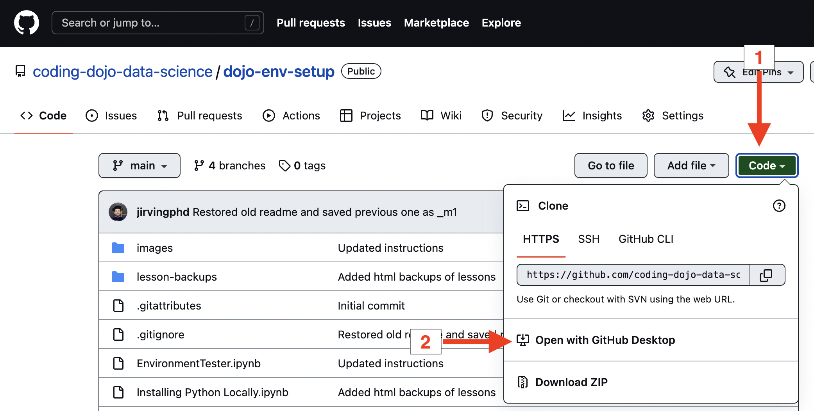
   

     
   

   

     
   

   <ol>
    <li class="text-center">
     <strong>
      GitHub desktop should open automatically
     </strong>
     and ask you what folder you would like to store your repository in.
     

       
     

     <figure>
      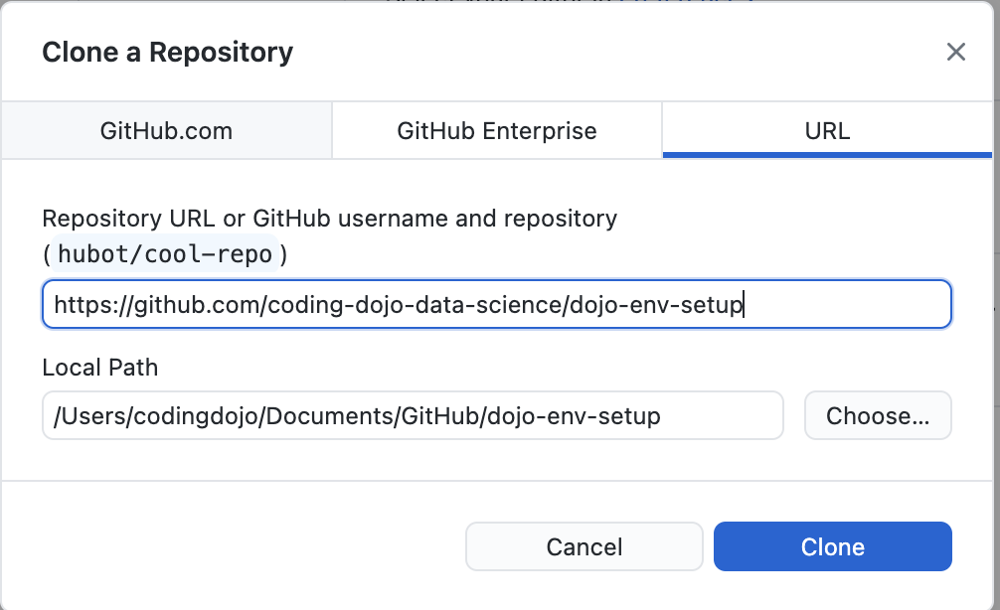
     </figure>
     

       
     

     <ol>
      <li>
       <strong>
        Troubleshooting Note: if you are brought to the Download GitHub Desktop web page
							instead:
       </strong>
       <ol>
        <li>
         It means you were not logged into the same account on GitHub.com and
								GitHub Desktop when you clicked Open in GitHub Desktop.
         <ol>
          <li>
           Make sure you see your user profile pic in the top right of GitHub.com
          </li>
          <li>
           and check your Account in GitHub Desktop's Preferences/Options menu.
          </li>
          <li>
           and then try again.
            
          </li>
         </ol>
        </li>
       </ol>
      </li>
     </ol>
    </li>
   </ol>
   <ol>
    <li class="text-center">
     By default, GitHub Desktop
     <strong>
      will use a new "GitHub" folder in your Documents
					folder
     </strong>
     <ol>
      <li class="text-center">
       GitHub Desktop will create a NEW folder with the same name as the repository
						INSIDE of whichever folder you select.
      </li>
      <li>
       <strong>
        If you use the default options, then this will create a "dojo-env-setup/" folder
							inside of "Documents/GitHub/"
       </strong>
      </li>
      <li>
       <strong>
        Note: it is strongly recommended that you use the Documents/GitHub folder for this
							repository.
       </strong>
       

         
       

       <ol>
        <li>
         But if you'd rather save the folder somewhere else:
         <ol>
          <li>
           Use the "Choose" button (the button name may be  "Browse" on Windows).
          </li>
          <li>
           A window should pop up for you to find and click on the folder where you want to
										create the "dojo-env-setup" folder.
          </li>
          <li>
           Once you have selected a new folder using the Browse button, you should see the
										full folder path displayed.
          </li>
          <li>
           <strong>
            IMPORTANT STEP: Make sure to remember the full file path of the folder
											you selected!
           </strong>
           (See the screenshot below. )
           <ol>
            <li>
             <figure>
              
             </figure>
            </li>
           </ol>
          </li>
         </ol>
        </li>
       </ol>
      </li>
     </ol>
    </li>
   </ol>
  </li>
 </ol>
 

  
    
  
 

 

 
<h1>Step 2.2: Open the Repo in Terminal/GitBash</h1>
	<h2>Open the Repo in Terminal (mac) or GitBash&nbsp;(windows)</h2>
	
Once you have cloned the repository, you will need to open a terminal/gitbash window in the same folder as the repository.

	<ul>
		<li><strong>Open a new terminal in the dojo-env-setup folder</strong>
			<ul>
				<li>First, in GitHub Desktop: make sure the left sidebar says "dojo-env-setup" in the top-left corner under
					Current Repository.</li>
			</ul>
			<ul>
				<li><strong>Click on the Repository menu and select "<code>Open in terminal</code>" or
						"<code>Open in gitbash</code>"</strong>
					<ul>
						<li>Windows Users: the menu will be at the top of GitHub&nbsp;Desktop's window.</li>
						<li>Mac Users: the menu will appear at the very top of your screen (your menu bar).</li>
					</ul>
				</li>
				<li><strong>Alternatively, you can use the keyboard shortcut to do the same thing. The command for both Mac
						and Windows is:</strong>
					<ul>
						<li><strong>Control + `</strong>&nbsp; (the key above tab that also has the tilde symbol ~)</li>
					</ul>
				</li>
			</ul>
		</li>
		<li><strong>In the terminal window that appears,&nbsp;type the "pwd" command (stands for print working directory)
				and press Enter.</strong>
			<ul>
				<li>It will display the folder name of the folder your terminal is currently located.&nbsp;<ul>
						<li>The folder path should end in "dojo-env-setup/"</li>
						<li>If you used the default GitHub folder when you cloned dojo-env, the full filepath would be
							something similar to "/Users/yourname/Documents/GitHub/dojo-env-setup/"</li>
					</ul>
				</li>
			</ul>
		</li>
	</ul>
	
 

	<h3>Troubleshooting (Windows):&nbsp;</h3>
	

		
If you are having trouble getting GitHub desktop to open&nbsp;GitBash in the correct folder there are 2 solutions for getting your gitbash window in the dojo-env-setup folder.

		<ul>
			<li>
				<strong>Solution #1: Using File Explorer +
						Right&nbsp;Click</strong>
				<ul>
					<li>If you followed the instructions in step 1 and used the default options when installing Git for
						Windows/GitBash, you should have a new option in your Right-Click menu that says "GitBash here".
					</li>
				</ul>
				<ul>
					<li>In&nbsp;GitHub Desktop <strong>click the Repository menu again and select "Show in File
							Explorer".</strong></li>
					<li>Once file explorer opens,<strong> right-click anywhere inside the folder </strong>(right-click on
						empty space, not on a file)&nbsp;<strong>and select GitBash here</strong>.<ul>
							<li>A GitBash window should open in the correct folder.</li>
						</ul>
					</li>
				</ul>
			</li>
			<li>Type pwd to confirm that you are indeed in the dojo-env-setup folder.</li>
		</ul>
		

		

		<ul>
			<li><strong>Solution #2:&nbsp;Open a new GitBash and navigate to the right folder.</strong>
				<ul>
					<li>If you do not have the option to "GitBash here", you can manually navigate there in GitBash.</li>
					<li><strong>Open the windows start menu, find and click on GitBash to open a new window. </strong>
					</li>
					<li><strong>Important Note: You must know the full file path for the repo for the next step. We will
							refer to as &lt;repo_filepath&gt; in the instructions below.</strong>
						<ul>
							<li><strong>&nbsp;if you used the suggested default folder </strong>when cloning the repo, your
								repo_filepath should be:&nbsp;<ul>
									<li>" /Users/&lt;your name&gt;/Documents/GitHub/dojo-env-setup"&nbsp;&nbsp;<ul>
											<li>But instead of&nbsp; &lt;your name&gt; it will be your actual user name for
												your computer</li>
										</ul>
										<ul>
											<li>If you are not sure what your username is, run the "whoami" command in your
												GitBash to see your user name.</li>
										</ul>
									</li>
								</ul>
							</li>
							<li><strong>If you did NOT use the suggested default folder,&nbsp;</strong>
								<ul>
									<li>Your repo_filepath will be the path displayed in the window that appeared when you
										cloned the repo.<ul>
											<li>You should have taken note of the file path you selected, as indicated in
												the screenshot.</li>
										</ul>
									</li>
								</ul>
							</li>
						</ul>
					</li>
				</ul>
				<ul>
					<li>Once you know what your repo_filepath is navigate to that folder using the&nbsp;change directory
						command (cd)<ul>
							<li>"cd&nbsp; &lt;repo_filepath&gt;".</li>
							<li>See the examples below:</li>
						</ul>
					</li>
				</ul>
			</li>
		</ul>
		<pre data-language="ruby">## Examples are assuming your username is "codingdojo"
	# Example if you used default folder:
	cd /Users/codingdojo/Documents/GitHub/dojo-env-setup/
	# Example if you used a different folder. e.g. you made a Boot&nbsp;Camp&nbsp;Stuff folder in your Documents folder.
	cd /Users/codingdojo/Documents/Boot Camp&nbsp;Stuff/<button class="copy_code_snippet_btn">copy</button></pre>
		
 

		<h3></h3>
		<h2>Verify Step 2.2</h2>
		
Run one last command to verify that you are indeed in the correct folder.&nbsp;

		
Run the "ls -a" command to see a detailed list of all files in the repo.

		<pre>ls -a</pre>
		
You should see a list of all the files in the current folder.&nbsp;

		
 

		
<strong>If you are in the right folder, you should see 3 files that start with "environment" and end with ".yml"
				like in the screenshot below.</strong>

		<figure>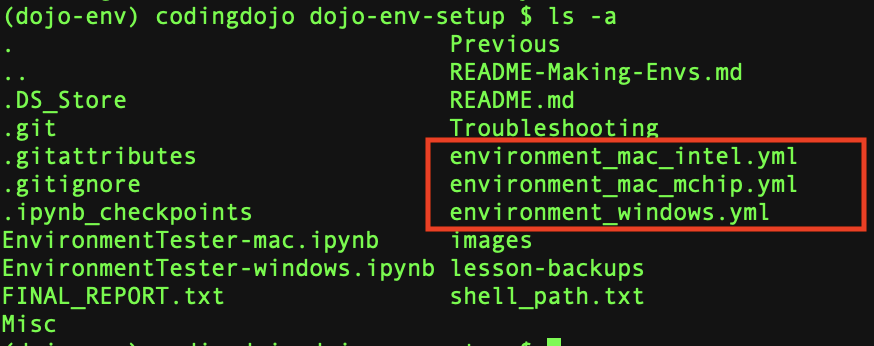</figure>
		
<strong>If so, you are all set for the next step: create the dojo-env environment!</strong>

		
 

		
 

		
			
	

	
 

 

 <h1>
  Step 2.3 Create the dojo-env environment
 </h1>
 <h3>
 </h3>
 <h3>
   
  1) Create the dojo-env using the correct "conda create" command for your OS
 </h3>
 <ul>
  <li>
   Depending on your OS and processor, you will use a different environment file name in your "conda create" command.
  </li>
  <li>
   <strong>
    Run the "conda env create -f &lt;env_file&gt;" command for your OS from section below:
   </strong>
   <ul>
    <li>
     Reminder for Mac Users: see Step 1. Downloading and Installing Required Apps to remember how to identity if you have an Intel processor or an Apple chip.
    </li>
   </ul>
  </li>
 </ul>
 <h4>
  Windows
 </h4>
 <pre>conda env create -f environment_windows.yml</pre>
 <h4 data-language="ruby">
  MacOS with an Intel Processor
 </h4>
 <pre>conda env create -f environment_mac_intel.yml</pre>
 <h4>
  MacOS with an Apple Chip
 </h4>
 <pre>conda env create -f environment_mac_mchip.yml</pre>
 

   
 

 <h3>
  Wait (patiently) for the dojo-env to be created.
 </h3>
 <ul>
  <li>
   
    It
   
   can take anywhere from 3-20 minutes to finish create the environment, depending on your computer and internet connection.
  </li>
  <li>
   You will see several progress bars during the process. Once it has been completed you should see a message that says
  </li>
 </ul>
 <pre data-language="ruby"># To activate this environment use:
 conda activate dojo-env
# To deactivate this environment use:
 conda deactivate 
# If conda deactivate doesn't work, activate the "base" env
 conda activate base<button class="copy_code_snippet_btn">copy</button></pre>
 <ul>
  <li>
   Confirm your environment was installed and activate it.
   <ul>
    <li>
     Type
     <code>
      conda env list
     </code>
     to display the list of your locally installed environments.
     <ul>
      <li>
       You should see 2 environments, including dojo-env:
       <ul>
        <li>
         <code>
          base
         </code>
        </li>
        <li>
         <code>
          dojo-env
         </code>
        </li>
       </ul>
      </li>
     </ul>
    </li>
   </ul>
  </li>
  <li>
   If you see dojo-env in the list:
   <ul>
    <li>
     Success!  dojo-env was successfully created! But we aren't using it yet just yet. We must first "activate" an environment to determine which version of python &amp; packages are currently being used.
      
    </li>
   </ul>
  </li>
 </ul>
 <h3>
  2) Activate the dojo-env
 </h3>
 <ul>
  <li>
   <strong>
    Run the conda activate command to switch to dojo-env.
   </strong>
  </li>
 </ul>
 <pre data-language="ruby">conda activate dojo-env<button class="copy_code_snippet_btn">copy</button></pre>
 <ul>
  <li>
   You should now see "(dojo-env)" next to your prompt in your terminal (may be above the prompt, on the left, or on the right depending on your OS)
  </li>
 </ul>
 

  <strong>
   Troubleshooting for Windows users:
  </strong>
 

 <ul>
  <li>
   If you see a message that says "your terminal is not set up for conda activate":
   <ul>
    <li>
     [Recommended Solution] you should navigate to the Troubleshooting section on the course sidebar and follow the instructions on the "
     <a href="https://login.codingdojo.com/m/213/13547/107855" target="_blank">
      Enable Conda Activate for GitBash
     </a>
     " page.
    </li>
    <li>
     [Alternative/Older Solution] Alternatively, you could use a slightly different command to activate your environment. Replace the word "conda" with "source"
    </li>
   </ul>
  </li>
 </ul>
 <pre data-language="ruby">source activate dojo-env<button class="copy_code_snippet_btn">copy</button></pre>
 

  
   <b>
    <strong>
      
    </strong>
   </b>
  
 

 <h3>
  
   <b>
    <strong>
     3) Add dojo-env to jupyter notebook/lab
    </strong>
   </b>
  
 </h3>
 <ul>
  <li>
   After confirming you now see (dojo-env) displayed next to your prompt:
   <ul>
    <li>
     Run the following command to make sure Jupyter Notebook/Lab knows your new environment.
    </li>
   </ul>
  </li>
 </ul>
 <pre data-language="ruby">python -m ipykernel install --user --name dojo-env --display-name "Python (dojo-env)"
<button class="copy_code_snippet_btn">copy</button></pre>
 <h2>
  The moment of truth...
 </h2>
 

  You are all set for the next step: Testing Your New Environment!
 

 

   
 

 

 

 <h1>
  Step 2.4: Setting dojo-env as the default + alias commands
 </h1>
 <ul>
  <li>
   This section will require you to enter several commands in your Terminal (on Mac) or GitBash (on Windows).
   <ul>
    <li>
     Make sure that your terminal is not running jupyter notebook (you can press "
     <code>
      Cntrl
     </code>
     +
     <code>
      C
     </code>
     " to force quit the server from your terminal).
    </li>
   </ul>
   <ul>
    <li>
     Alternatively, you can open a new terminal/GitBash. (You can perform these steps from any folder.)
    </li>
   </ul>
  </li>
 </ul>
 

 <h1>
  Part 1) Commands For Mac OS
 </h1>
 <ul>
  <li>
   All mac users should follow these instructions (regardless of if your have an Intel or Apple processor).
  </li>
  <li>
   On a Mac, we need to first see what shell terminal is using.
   <ul>
    <li>
     There are 2 possible options that your mac may be using:
     <ul>
      <li>
       zsh
      </li>
      <li>
       bash
      </li>
     </ul>
    </li>
   </ul>
  </li>
  <li>
   T
   <strong>
    he major difference between zsh and bash is which file it checks for the settings
   </strong>
   to use when you create a new terminal.
   <ul>
    <li>
     Otherwise, zsh and bash behave very similarly and you may not notice the difference if you switched.
    </li>
   </ul>
  </li>
 </ul>
 <h2>
  Determining If your Shell is Bash or Zsh
 </h2>
 <ul>
  <li>
   In your terminal, type
   <code>
    echo $SHELL
   </code>
   and hit enter.
  </li>
  <li>
   You will see a filepath displayed in the terminal, take note of the last few letters of the filepath and select the correct option (A or B) below:
  </li>
 </ul>
 

 <h3>
  1A) If the response ends in bash
 </h3>
 <ul>
  <li>
   <strong>
    Run the following commands to automatically activate dojo-env
   </strong>
  </li>
 </ul>
 <pre data-language="ruby">touch ~/.bash_profile
echo "conda activate dojo-env" &gt;&gt; ~/.bash_profile<button class="copy_code_snippet_btn">copy</button></pre>
 <ul>
  <li>
   <strong>
    Run the following 2 commands to add shortcuts for opening jupyter
   </strong>
   <ul>
    <li>
     <strong>
      NOTE: it is VERY important that you do not add any spaces on either side of the
      <code>
       =
      </code>
      sign
     </strong>
     . The command will not work correctly if you add extra spaces.
    </li>
   </ul>
  </li>
 </ul>
 <pre data-language="ruby">echo 'alias jnb="jupyter notebook"' &gt;&gt; ~/.bash_profile
echo 'alias lab="jupyter lab"' &gt;&gt; ~/.bash_profile<button class="copy_code_snippet_btn">copy</button></pre>
 <ul>
  <li>
   <strong>
    <em>
     Scroll down to the "Part 2) Final Verification Steps (Mac &amp; Windows)" step.
    </em>
   </strong>
  </li>
 </ul>
 

 <h3>
  1B) If the response ends in zsh:
 </h3>
 <ul>
  <li>
   Run the following commands to automatically activate dojo-env
  </li>
 </ul>
 <pre data-language="ruby">touch ~/.zshrc
echo "conda activate dojo-env" &gt;&gt; ~/.zshrc<button class="copy_code_snippet_btn">copy</button></pre>
 <ul>
  <li>
   Run the following 2 commands to add shortcuts for opening jupyter
   <ul>
    <li>
     NOTE: it is VERY important that you do not add any spaces on either side of the
     <code>
      =
     </code>
     sign. The command will not work correctly if you add extra spaces.
    </li>
   </ul>
  </li>
 </ul>
 <pre data-language="ruby">echo 'alias jnb="jupyter notebook"' &gt;&gt; ~/.zshrc
echo 'alias lab="jupyter lab"' &gt;&gt; ~/.zshrc<button class="copy_code_snippet_btn">copy</button></pre>
 <ul>
  <li>
   <strong>
    <em>
     Scroll down to the "Part 2) Final Verification Steps (Mac &amp; Windows)" step.
    </em>
   </strong>
  </li>
 </ul>
 

 

 <h1>
  Part 1) Commands for Windows
 </h1>
 <h3>
  Determine if your PC Can Run "conda activate" or "source activate"
 </h3>
 

  For windows computers,
  <strong>
   we need to determine if your computer uses the word "conda" or "source" to activate an environment
  </strong>
  .
 

 

  You've already run this command before, but if you don't remember which command you ran:
 

 <ul>
  <li>
   <strong>
    In a new GitBash window, enter the "conda activate base" or "conda activate dojo-env" command.
   </strong>
   <ul>
    <li>
     <strong>
      If you see a message about your shell not being set up to run conda activate,
     </strong>
     <ul>
      <li>
       You need to
       <strong>
        use the "1B) if your PC has to run source activate"
       </strong>
       section below
      </li>
     </ul>
    </li>
    <li>
     <strong>
      If the conda activate command worked,
     </strong>
     <ul>
      <li>
       Follow the
       <strong>
        "1A) If your PC ran conda activate"
       </strong>
       section below.
      </li>
     </ul>
    </li>
   </ul>
  </li>
 </ul>
 

 <h2>
  1A) If your PC can run "conda activate":
 </h2>
 <ul>
  <li>
   Run the following commands to automatically activate dojo-env
  </li>
 </ul>
 <pre data-language="ruby">touch ~/.bash_profile
echo "conda activate dojo-env" &gt;&gt; ~/.bash_profile<button class="copy_code_snippet_btn">copy</button></pre>
 <ul>
  <li>
   Run the following 2 commands to add shortcuts for opening jupyter
   <ul>
    <li>
     NOTE: it is VERY important that you do not add any spaces on either side of the
     <code>
      =
     </code>
     sign. The command will not work correctly if you add extra spaces.
    </li>
   </ul>
  </li>
 </ul>
 <pre data-language="ruby">echo 'alias jnb="jupyter notebook"' &gt;&gt; ~/.bash_profile
echo 'alias lab="jupyter lab"' &gt;&gt; ~/.bash_profile<button class="copy_code_snippet_btn">copy</button></pre>
 <ul>
  <li>
   Finally, activate the new settings:
  </li>
  <ul>
   <li>
    Run
    <code>
     source ~/.bash_profile
    </code>
    or open a new GitBash window to activate the changes you just made
   </li>
  </ul>
  <li>
   <strong>
    <em>
     Scroll down to the "Part 2) Final Verification Steps (Mac &amp; Windows)" step.
    </em>
   </strong>
  </li>
 </ul>
 

 <h2>
  1B) If your PC has to "source activate":
 </h2>
 <ul>
  <li>
   Run the following commands to automatically activate dojo-env
  </li>
 </ul>
 <pre data-language="ruby">touch ~/.bash_profile
echo "source activate dojo-env" &gt;&gt; ~/.bash_profile<button class="copy_code_snippet_btn">copy</button></pre>
 <ul>
  <li>
   Run the following 2 commands to add shortcuts for opening jupyter
   <ul>
    <li>
     NOTE: it is VERY important that you do not add any spaces on either side of the
     <code>
      =
     </code>
     sign. The command will not work correctly if you add extra spaces.
    </li>
   </ul>
  </li>
 </ul>
 <pre data-language="ruby">echo 'alias jnb="jupyter notebook"' &gt;&gt; ~/.bash_profile
echo 'alias lab="jupyter lab"' &gt;&gt; ~/.bash_profile<button class="copy_code_snippet_btn">copy</button></pre>
 <ul>
  <li>
   Finally, activate the new settings:
  </li>
  <ul>
   <li>
    Run
    <code>
     source ~/.bash_profile
    </code>
    or open a new GitBash window to activate the changes you just made
   </li>
  </ul>
  <li>
   <strong>
    <em>
     Scroll down to the "Part 2) Final Verification Steps (Mac &amp; Windows)" step.
    </em>
   </strong>
  </li>
 </ul>
 

 

 <h1>
  Part 2) Final Verification Steps (Mac &amp; Windows)
 </h1>
 <h3>
  Confirm
  <code>
   dojo-env
  </code>
  is your default
 </h3>
 <ul>
  <li>
   To confirm that
   <code>
    dojo-env
   </code>
   is now your default environment:
   <ul>
    <li>
     You should see
     <code>
      (dojo-env)
     </code>
     appear next to your prompt.
    </li>
   </ul>
  </li>
 </ul>
 <h2>
 </h2>
 <figure>
  
 </figure>
 <h2>
 </h2>
 <h3>
  Confirm the shortcut aliases work
 </h3>
 

  <ul>
   <li>
    <strong>
     Try running the command "jnb" in your terminal/kitbash.
    </strong>
    <ul>
     <li>
      If jupyter notebook launches, you're all set!
     </li>
    </ul>
    <ul>
     <li>
      If not, contact your instructor or a TA for assistance.
     </li>
    </ul>
   </li>
  </ul>
  <h2>
   Note: you can still move on to the next step even if you could not successfully complete this step.
  </h2>
  <ul>
   <li>
    These steps are for convenience and are not strictly required.
   </li>
   <li>
    You should still contact your instructor or a TA for assistance to successfully complete this step at your earliest convenience.
   </li>
  </ul>
 

 

 

 <h1>
  Step 2.5: Testing the Environment
 </h1>
 

  To test that your installation and packages are working properly. We are going to run a specific Environment Testing notebook that is also located in the "dojo-env-setup" folder.
   
 

 <h2>
  Running the environment tester notebook with jupyter notebook
 </h2>
 <ul>
  <li>
   <strong>
    Next, you will close all of your previous Terminal/GitBash windows BUT before you do:
   </strong>
   <ul>
    <li>
     if your terminal is still running jupyter notebook and you do not see the prompt waiting for a command:
     <ul>
      <li>
       You must press "Control +C" to force-quit jupyter.
      </li>
      <li>
       Make sure to reply "y" if asked for confirmation.
      </li>
     </ul>
    </li>
    <li>
     If the cursor appears waiting for a new command, you are all set.
    </li>
   </ul>
  </li>
  <li>
   <strong>
    Now, return to GitHub desktop and click on the "Open in Terminal/GitBash" to open a terminal in the dojo-env-setup folder.
   </strong>
  </li>
  <ul>
   <li>
    Type pwd to confirm it says dojo-env-setup.
   </li>
   <li>
    <strong>
     Note: if you do not see the button for Open in Terminal:
    </strong>
   </li>
   <ul>
    <li>
     Click on the menu for "Repository" at the very top of the window (if using Windows) or at the very top of your screen on your menu bar (if using a Mac).
    </li>
    <li>
     You should see the word "Repository" next to the FIle, Edit, View menus.
    </li>
    <ul>
     <li>
      From the Repository menu: click on Open in Terminal/GitBash
     </li>
    </ul>
   </ul>
  </ul>
 </ul>
 

 

 <ul>
  <li>
   <strong>
    In the new window that opens, start jupyter notebook by entering the
    <code>
     jupyter notebook
    </code>
    command in your terminal (or the "jnb" shortcut!)
   </strong>
  </li>
  <li>
   <ul>
    <li>
     A new tab should open in your web browser that shows the File view for jupyter notebook.
    </li>
    <li>
     You should see all of the files that were in the dojo-env-folder.
    </li>
   </ul>
  </li>
 </ul>
 <figure>
  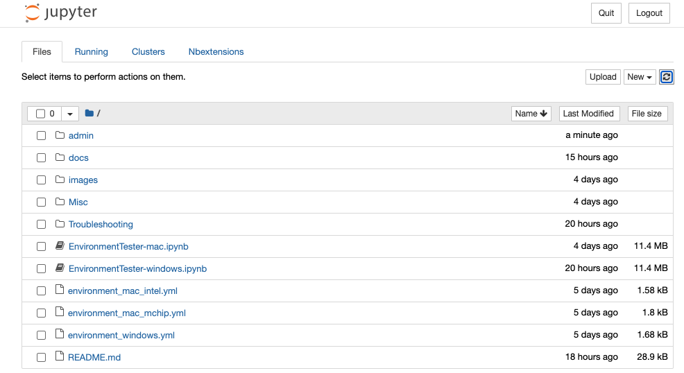
 </figure>
 <ul>
  <li>
   There are 2 "EnvironmentTester" notebooks:
   <ul>
    <li>
     "EnvironmentTester-mac.ipynb" for macs (both Intel and Apple Chip macs)
    </li>
    <li>
     "EnvironmentTester-windows.ipynb" for Windows.
    </li>
   </ul>
  </li>
 </ul>
 <ul>
  <li>
   <strong>
    Click on the test notebook for your OS to open it.
   </strong>
   <ul>
    <li>
     Once the notebook interface has loaded, you should see a toolbar with several menu choices.
    </li>
   </ul>
  </li>
 </ul>
 <figure>
  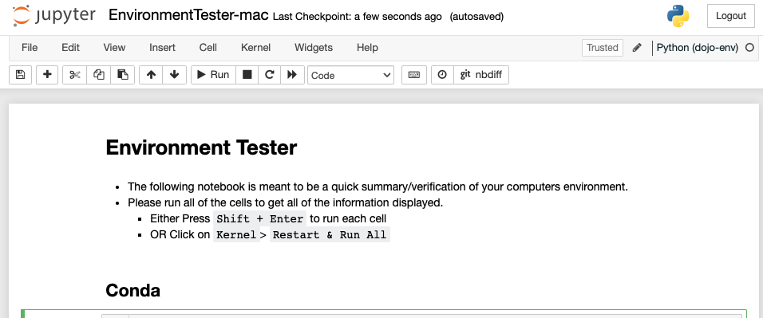
 </figure>
 

   
 

 <ul>
  <li>
   We want to run all of the cells in this notebook and confirm it can make it to the end without errors.
  </li>
 </ul>
 <ul>
  <li>
   <strong>
    To Run the Entire Notebook:
   </strong>
   <ul>
    <li>
     <strong>
      Select the "Kernel" Menu &gt; "Restart and Run All"
     </strong>
    </li>
    <li>
     <strong>
      Wait patiently.
     </strong>
     The testing notebook is going to run through several modeling and EDA steps to confirm that the packages are working correctly.
     <ul>
      <li>
       This could take anywhere from 2-10 minutes to run.
      </li>
      <li>
       You will see the web browser tab icon turn to an hourglass when the notebook is running and back to an orange notebook icon when it is done.
      </li>
     </ul>
    </li>
   </ul>
  </li>
 </ul>
 <ul>
  <li>
   <strong>
    Scroll down to the bottom of the notebook and confirm the cells have run:
   </strong>
   <ul>
    <li>
     Check if the very last cell printed the success message.
    </li>
   </ul>
  </li>
 </ul>
 <figure>
  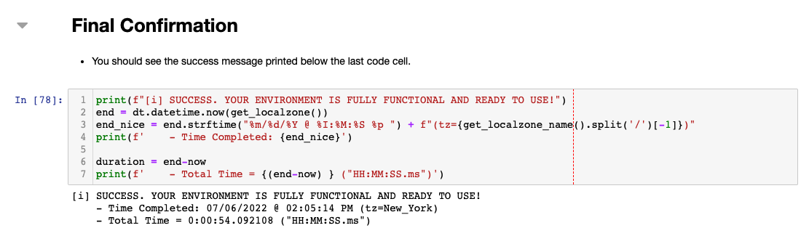
 </figure>
 

   
 

 <ul>
  <li>
   <strong>
    If the entire notebook ran successfully
   </strong>
   <ul>
    <li>
     Congrats! Your dojo-env is fully functional and you can move on to the next step/lesson!
    </li>
   </ul>
  </li>
 </ul>
 <ul>
  <li>
   I
   <strong>
    f your notebook did not run the entire notebook successfully:
   </strong>
   <ul>
    <li>
     
      Y
     
     ou need to contact your instructor or a TA for assistance.
    </li>
    <li>
     Before contacting them, please follow the instructions below to prepare the troubleshooting files to give to your instructor.
    </li>
   </ul>
  </li>
 </ul>
 <h3>
  To Get Help Troubleshooting Your Environment.
 </h3>
 

  <h3>
  </h3>
  <ul>
   <li>
    There are 2 files that you should share with your instructor/TA
    <ol>
     <li>
      A copy of your Environment Tester notebook that error'd.
     </li>
     <li>
      A copy of "FINAL_REPORT.txt" file that is in the Troubleshooting folder of the repo.
     </li>
    </ol>
   </li>
  </ul>
  <ol>
   <li>
    To share your notebook with an instructor/TA for help:
    <ul>
     <li>
      Click File &gt; Save &amp; Checkpoint.
     </li>
     <li>
      Click File &gt; Download As &gt; Notebook (.ipynb)
     </li>
     <li>
      Your web browser should save a copy of the notebook to your normal "Downloads" folder.
       
      

        
      

      <figure>
       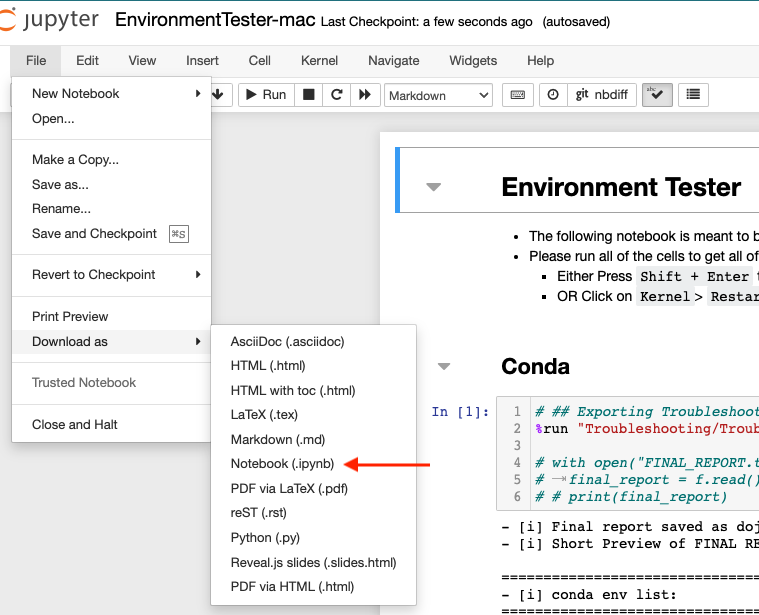
      </figure>
     </li>
    </ul>
   </li>
   <li>
    To share a copy of your FINAL_REPORT.txt:
    <ul>
     <li>
      In the first Files tab that opened when you started jupyter notebook you should see a folder called "Troubleshooting"
     </li>
     <li>
      Click on the Troubleshooting folder.
     </li>
     <li>
      Inside the folder you should have a file called "FINAL_REPORT.txt".
     </li>
     <li>
      Check the checkbox next to the file and click on the "Download" button that appears at the top of the list of files.
     </li>
     <li>
      Your web browser will also save this file to your Downloads folder.
     </li>
    </ul>
   </li>
  </ol>
  <figure>
   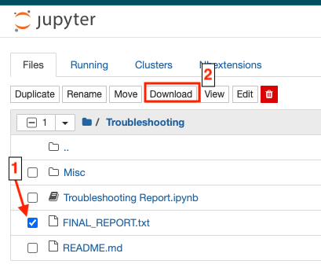
  </figure>
  

    
  

  <ul>
   <li>
    <strong>
     Send an email to your instructor
    </strong>
    <ul>
     <li>
      Attach the 2 files listed above. They are located in your Downloads folder.
     </li>
     <li>
      Add any additional details or info you think may be helpful for us to know.
      <ul>
       <li>
        For example:
        <ul>
         <li>
          "my computer is really old and I think that may be part of the problem."
         </li>
         <li>
          "I share this computer with someone else who also uses python"
         </li>
        </ul>
       </li>
      </ul>
     </li>
    </ul>
   </li>
   <li>
    <strong>
     An instructor or TA will get back to you within 1 business day with the next steps for you to try.
    </strong>
    <ul>
     <li>
      You will most likely need to set up a Zoom call and share your screen for us to help.
     </li>
    </ul>
   </li>
  </ul>
 

 

 

 <h1>
  Step 2.6 Adding nbextensions
 </h1>
 <h1>
  Jupyter Notebook Extensions Resources
 </h1>
 <ul>
  <li>
   <a href="https://jupyter-contrib-nbextensions.readthedocs.io/en/latest/install.html" target="_blank">
    Documentation
   </a>
  </li>
  <li>
   <a href="https://jupyter-contrib-nbextensions.readthedocs.io/en/latest/install.html" target="_blank">
    Official
    <code>
     nbextensions
    </code>
    Installation Instructions (also detailed below)
   </a>
  </li>
 </ul>
 <h4>
  Installing Using Pip
 </h4>
 <ul>
  <li>
   <strong>
    Below is an abbreviated version of the official instructions for Installing jupyter-contrib-nbextensions (
    <a href="https://jupyter-contrib-nbextensions.readthedocs.io/en/latest/install.html" target="_blank">
     Documentation
    </a>
    ):
   </strong>
   <ol>
    <li>
     Install extensions
    </li>
   </ol>
   <pre data-language="language-bash rainbow">pip install jupyter_contrib_nbextensions
<button class="copy_code_snippet_btn">copy</button></pre>
   <ol start="2">
    <li>
     Install additional requirements (Install javascript and css file):
    </li>
   </ol>
   <pre data-language="language-bash rainbow">jupyter contrib nbextension install --user
<button class="copy_code_snippet_btn">copy</button></pre>
   <ol start="3">
    <li>
     Activate the extension configurator
    </li>
   </ol>
   <pre data-language="language-bash rainbow">jupyter nbextension enable jupyter_nbextensions_configurator
<button class="copy_code_snippet_btn">copy</button></pre>
  </li>
 </ul>
 <blockquote>
  <ul>
   <li>
    Now, boot up jupyter notebook and look for a new tab called (
    <code>
     nbextensions
    </code>
    ) on the jupyter file-explorer view. If its there, great! Move on to the "Turning on extensions" section below.
   </li>
  </ul>
 </blockquote>
 

 

 <figure>
  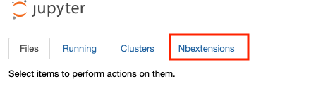
 </figure>
 

 

 <h2>
  Activating Specific Extensions:
 </h2>
 <h3>
  

  

 </h3>
 <ul>
  <li>
   

    <strong>
     When you boot up jupyter notebook, there should be a new tab at the top called
     <code>
      nbextensions
     </code>
     .
    </strong>
    Click on the tab to open the list of available extensions.
   

  </li>
  <li>
   

    This opens a menu of all of the available extensions with checkboxes to activate them;
   

   <ul>
    <li>
     <em>
      <strong>
       NOTE: If the list of available notebook extensions is grayed out like the screenshot below:
       

         
       

       <figure>
        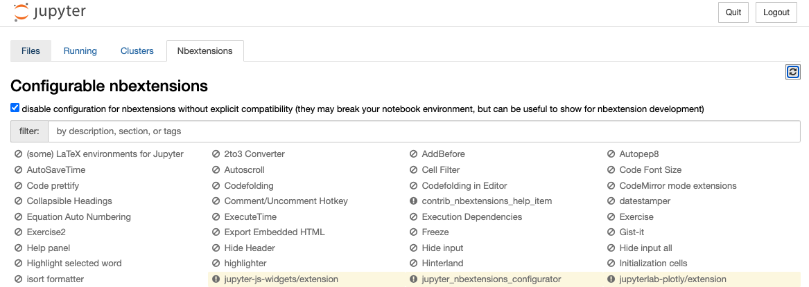
       </figure>
        
      </strong>
     </em>
     <ul>
      <li>
       Uncheck "
       <code>
        disable configuration for nbextensions without explicit compatibility (they may break your notebook environment, but can be useful to show for nbextension development)
       </code>
       " at the top of the page next to the search box.
      </li>
     </ul>
    </li>
   </ul>
  </li>
 </ul>
 <ul>
  <li>
   

    <strong>
     To enable the recommended extensions
    </strong>
    :
   

   <ul>
    <li>
     Click on the
     <strong>
      checkbox
     </strong>
     next to the extensions name to activate the extension.
    </li>
   </ul>
  </li>
 </ul>
 <ul>
  <li>
   

    <strong>
     To change the settings for an extension
    </strong>
    :
   

   <ul>
    <li>
     Click on the
     <strong>
      name
     </strong>
     of the extension to select it. Now, if you scroll down, you should see the list of options for the currently selected extension.
    </li>
   </ul>
   

     
   

   <figure>
    
   </figure>
  </li>
  <li>
   

    <strong>
     Note: any extensions that you enable or settings that you change are
     <em>
      automatically
     </em>
     saved.
    </strong>
   

  </li>
 </ul>
 

   
 

 <h2>
  Recommended Extensions &amp; Settings
 </h2>
 

  The following section will walk you through each of the recommended extensions and their recommended settings.
 

 

  Brief Summary of Extensions to Enable
 

 <ul>
  <li>
   Table of Contents (2)
  </li>
  <li>
   Collapsible Headings
  </li>
  <li>
   Live Markdown Preview
  </li>
  <li>
   Ruler
  </li>
  <li>
   spellchecker
  </li>
 </ul>
 

   
   
 

 <h3>
  1. Table of Contents (2):
 </h3>
 

  <ul>
   <li>
    

     Clickable sidebar with markdown headers as bookmarks/links.
      
    

   </li>
   <li>
    Recommended options:
    

      
    

    <ul>
     <li>
      Uncheck Automatically number notebook sections
     </li>
     <li>
      Change
      <code>
       Maximum level of nested sections to display on the tables of contents
      </code>
      to 3.
     </li>
     <li>
      Check
      <code>
       Display Table of Contents as a sidebar (otherwise as a floating window)
      </code>
     </li>
     <li>
      Check
      <code>
       Collapse/uncollapse ToC sections when the collapsible_headings nbextension is used to collapse/uncollapse sections in the notebook. For the inverse behaviour, see collapsible_headings' configuration
      </code>
     </li>
    </ul>
   </li>
  </ul>
  <figure>
   
  </figure>
  

    
  

  <h3>
   2. Collapsible Headings
  </h3>
 

 <ul>
  <li>
   Collapse sections of your notebook using markdown headers.
  </li>
  <li>
   Recommended options:
   <ul>
    <li>
     Check 'Collapse/uncollapse notebook sections when the ToC2 nbextension is used to collapse/uncollapse sections in the table of contents. For the inverse behaviour, see ToC2's configuration' at towards the bottom of the options.
    </li>
    <li>
     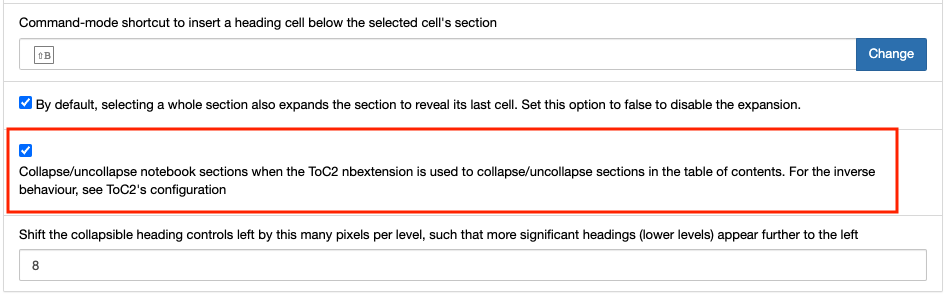
    </li>
   </ul>
  </li>
 </ul>
 

  

  

  <h3>
   3. Live Markdown Preview
  </h3>
 

 

  Shows a preview of what the markdown cell you are editing will look like once you render it with Shift+Enter
  <ul>
   <li>
    <ul>
     <li>
      Recommended options:
      <ul>
       <li>
        Check
        <code>
         Show the input &amp; output of markdown cells side-by-side while editing them.
        </code>
       </li>
      </ul>
     </li>
    </ul>
   </li>
  </ul>
  <figure>
   
  </figure>
  

  

  

   
    <b>
     4. Ruler (not Ruler in Editor)
    </b>
   
  

  <ul>
   <li>
    Adds a vertical red line in code cells at 80 characters. Python code should not cross this line (to match Python's style guide)
   </li>
   <li>
    Settings:
    <ul>
     <li>
      No settings to change.
     </li>
    </ul>
   </li>
  </ul>
  <h3>
   5. spellchecker
  </h3>
 

 

  <b>
   <strong>
   </strong>
   <strong>
   </strong>
   <strong>
    Checks markdown cells for spelling and highlights words in red that are misspelled. Note: it cannot correct misspelled words, only highlight them.
   </strong>
  </b>
 

 

  <h3>
   
   
  </h3>
  <h3>
  </h3>
  <h2>
   Confirming Extensions are Enabled
  </h2>
  <h2>
  </h2>
  <ul>
   <li>
    <strong>
     Go back to the Files tab and create a new notebook with the
     <code>
      New
     </code>
     button on the top-right.
    </strong>
    <ul>
     <li>
      Select
      <code>
       Python(dojo-env)
      </code>
      for your kernel
      

        
       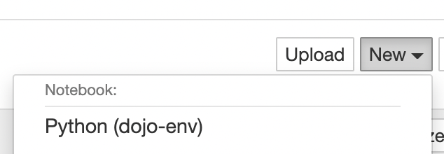
        
        
      

      

        
      

      <figure>
      </figure>
     </li>
    </ul>
   </li>
   <li>
    <strong>
     Once your new Untitled notebook opens, you will notice a few new elements to the interface
    </strong>
    :
    

      
     
    

    

      
    

    <figure>
    </figure>
   </li>
   <li>
    <strong>
     First, confirm that you have two new buttons on your toolbar
    </strong>
    :
    <ul>
     <li>
      One that looks like a list (this is your table of contents extension)
     </li>
     <li>
      One that looks like a checkmark (this is your spellchecker)
     </li>
    </ul>
   </li>
   <li>
    <strong>
     Second, confirm that you see a red dashed line in your code cell. (the Ruler extension)
    </strong>
   </li>
   <li>
    <strong>
     Third, click on the button for the table of contents (the one that looks like a list).
    </strong>
    <ul>
     <li>
      An empty sidebar should appear on the left.
     </li>
    </ul>
   </li>
   <li>
    <strong>
     Fourth, change your code cell to a markdown cell
    </strong>
    .
    <ul>
     <li>
      You can click on the dropdown menu on your toolbar that currently says "code".
      <ul>
       <li>
        Change this to Markdown.
       </li>
       <li>
        In the markdown cell, type the following text but do NOT run the cell yet.
       </li>
       <li>
        <code>
         # TEST HEEDER
        </code>
        (misspelled on purpose).
       </li>
      </ul>
     </li>
    </ul>
   </li>
  </ul>
  <figure>
   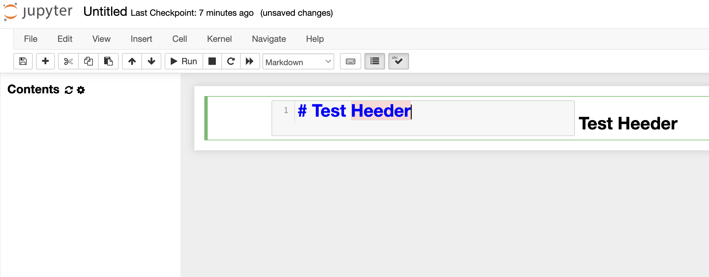
  </figure>
  

  

  <ul>
   <li>
    <strong>
     Confirm that you see a preview of your markdown text off to the right.
    </strong>
    <ul>
     <li>
      this is your Live Markdown Preview extension.
     </li>
    </ul>
   </li>
   <li>
    <strong>
     Confirm that the word "HEEDER" is highlighted in red.
    </strong>
    <ul>
     <li>
      This is your spellchecker.
     </li>
    </ul>
   </li>
   <li>
    <strong>
     Finally, run the cell "Shift+Enter" and confirm
    </strong>
    :
    <ul>
     <li>
      that the header appears in the table of contents on the left.
     </li>
     <li>
      that a dropdown arrow appears to the left of the header in the notebook.
      

        
      

      

        
      

      <figure>
       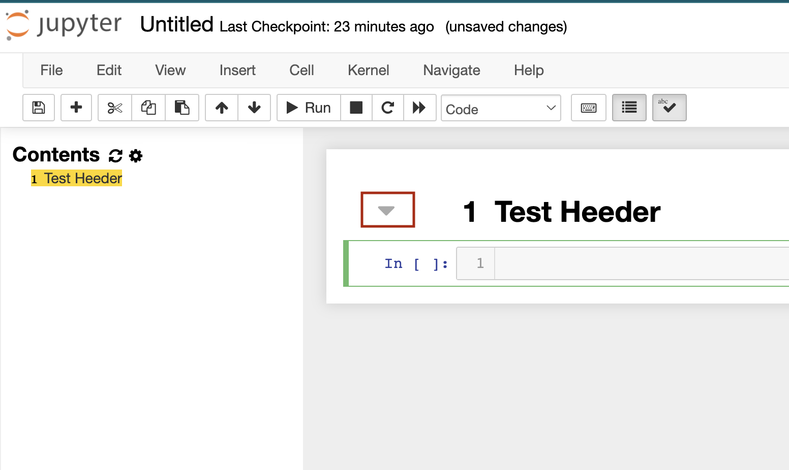
      </figure>
     </li>
    </ul>
   </li>
   <li>
    You may notice that the ToC automatically numbered the header and added
    <code>
     1
    </code>
    next to Test Heeder.
    <ul>
     <li>
      If you prefer to disable this, click on the small gear icon next to the word Contents:
      

        
      

      

        
      

      <figure>
       
      </figure>
     </li>
     <li>
      In the menu that appears, uncheck "Automatically number headings"
      

        
      

      

        
      

      <figure>
       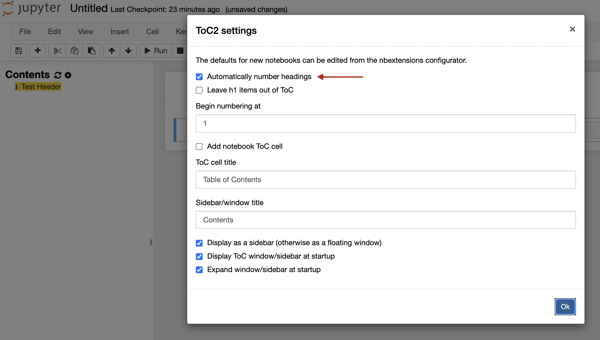
      </figure>
     </li>
    </ul>
   </li>
  </ul>
  <h4>
  </h4>
  <blockquote>
   <strong>
    Now you are all set with your Jupyter Notebook extensions! Onto the final step 5. Install a Code Editor - VS Code.
   </strong>
  </blockquote>
  

    
    
    
    
    
  

  

    
    
  

 

 

 

 <h1>
  Step 3: Install a Code Text Editor
 </h1>
 <h2>
  Visual Studio Code
 </h2>
 <ul>
  <li>
   The final tool to install is a text editor that is designed for programmers.
   <ul>
    <li>
     There are several text editors available, but we will be using Visual Studio Code.
      
    </li>
   </ul>
  </li>
  <li>
   <strong>
    Visual Studio Code (A.K.A  "VS Code")
   </strong>
   is a free editor that is highly customizable and supports many languages.
   <ul>
    <li>
     It is maintained by Microsoft and has a robust community of extensions and add-ons.
    </li>
    <li>
     It is very popular and is used by many companies (e.g. Facebook/Meta)
    </li>
   </ul>
  </li>
 </ul>
 

 

 <ul>
  <li>
   <strong>
    How will we use VS Code?
   </strong>
   <ul>
    <li>
     
      <strong>
       We could technically run all of our jupyter notebooks using VS Code, but this is not recommended
      </strong>
      at this point in your education
     
     .
     <ul>
      <li>
       While VS Code is convenient for quickly opening and working with a repository or viewing a notebook, it has some limitations in how notebooks look and some quirks to the interface for notebooks.
      </li>
     </ul>
     <ul>
      <li>
       Instead, we will focus on using
       <strong>
        jupyter notebook or jupyter lab in the lessons and live class.
       </strong>
       <ul>
        <li>
         You are welcome to try VS Code for notebooks, but it is recommended you become comfortable with jupyter first.
          
        </li>
       </ul>
      </li>
     </ul>
    </li>
   </ul>
  </li>
  <li>
   <strong>
    We will use VS Code for editing simple code files or hidden files.
   </strong>
    
   <ul>
    <li>
     We can open and edit the settings file for your terminal  (e.g.:  "
     <code>
      ~/.bash_profile"
     </code>
     .or "~/.zshrc"
    </li>
   </ul>
   <ul>
    <li>
     We will use it to create and store credentials for APIs (Stack 4)
    </li>
    <li>
     We can use VS Code to edit your projects' README files while previewing them in real time!
    </li>
    <li>
     Finally, while beyond the scope of the standard curriculum, we can also use VS Code to store functions in external files that we can use just like pandas, matplotlib,
    </li>
   </ul>
  </li>
 </ul>
 

   
 

 <ul>
 </ul>
 <h2>
  Install Visual Studio Code
 </h2>
 <ul>
  <li>
   

    Go to
    <a href="https://code.visualstudio.com/" target="_blank">
     https://code.visualstudio.com/
    </a>
   

   <ul>
    <li>
     It should auto-recognize your OS and have a blue Download button with a version for your OS.
    </li>
    <li>
     Click Download to download the installer.
    </li>
   </ul>
  </li>
  <li>
   

    For Windows Users:
   

   <ul>
    <li>
     Click on the installer to run it.
    </li>
    <li>
     Select the default options.
    </li>
   </ul>
  </li>
  <li>
   

    For Mac Users:
   

   <ul>
    <li>
     Click on the installer to unzip it.
    </li>
    <li>
     Once the Application is unzipped, drag the icon for Visual Studio Code.app to your applications folder on your sidebar in Finder.
      
      
     
    </li>
   </ul>
  </li>
 </ul>
 <ul>
  <li>
   

    Once Visual Studio Code installation is completed, open it!
   

   <ul>
    <li>
     Windows Users: check your Start Menu.
    </li>
    <li>
     Mac Users: check your Applications folder in Finder.
    </li>
   </ul>
  </li>
 </ul>
 

  
 

 <h2>
  Install Python Extensions
 </h2>
 <ul>
  <li>
   On the left sidebar, there are several icons for different menus.
  </li>
  <li>
   Click on the Extensions sidebar icon (5th down, looks like 4 squares).
  </li>
 </ul>
 

  
 

 <ul>
  <li>
   

    On the Extension sidebar, there will be several sections (INSTALLED/POPULAR/RECOMMENDED).
   

   <ul>
    <li>
     

      Right now you should have nothing under the INSTALLED menu.
     

    </li>
    <li>
     

      You should see "Python" listed under POPULAR.
     

     <ul>
      <li>
       If not, you can enter "Python" in the search box at the top of the sidebar
      </li>
      <li>
       OR you can click on
       <a href="https://marketplace.visualstudio.com/items?itemName=ms-python.python" target="_blank">
        this link to the extension
       </a>
       on the extension marketplace website.
      </li>
     </ul>
    </li>
    <li>
     

      Click on the "Install" button for the Python extension.
       
      
     

    </li>
   </ul>
  </li>
  <li>
   

    Note: the Python extension will also install several required extensions. When installation is complete, you should see the following under the "INSTALLED" section:
   

   <ul>
    <li>
     Python, Pylance, Jupyter Notebook renderer, Jupyter, and Jupyter Keymap
    </li>
   </ul>
  </li>
 </ul>
 

  
 

 <h2>
  Setting VS Code to use your
  <code>
   dojo-env
  </code>
  as the default Python installation
 </h2>
 <ul>
  <li>
   

    We must teach the Python extension where to find our
    <code>
     dojo-env
    </code>
    's version of Python.
   

  </li>
  <li>
   

    On the extension sidebar, click on the Gear icon for the Python extension and select "Extension Settings"
    
   

  </li>
  <li>
   

    You should see a new "Settings" pane open in the main window.
   

   <ul>
    <li>
     Take note of the "Default Interpreter Path".
     <ul>
      <li>
       It is currently set to just "python".
        
       
      </li>
     </ul>
    </li>
   </ul>
  </li>
  <li>
   

    We need to change this setting to match the exact filepath for our
    <code>
     dojo-env
    </code>
    's python.
   

  </li>
  <li>
   

    In your terminal or GitBash:
   

   <ul>
    <li>
     Make sure your dojo-env is activated
    </li>
    <li>
     Run the command:
     <code>
      which python
     </code>
     <ul>
      <li>
       It will print out a filepath to your dojo-env.
        
       
      </li>
     </ul>
    </li>
    <li>
     Copy and paste that exact file path into the "Default Interpreter Path" field in the Python extension settings.
    </li>
   </ul>
  </li>
 </ul>
 

  
 

 <h3>
  Mac Users Only: Add the
  <code>
   code
  </code>
  command to your terminal
 </h3>
 <ul>
  <li>
   We want to be able to type the word "code" in our terminal and have that open up VS Code.
   <ul>
    <li>
     

      Windows users have this command added automatically during installation.
     

    </li>
    <li>
     

      Mac Users must run 1 more command from VS Code.
     

    </li>
   </ul>
  </li>
 </ul>
 <ol>
  <li>
   

    Open the Command Palette:
   

   <ul>
    <li>
     Either click on View in the menu bar and select "Command Palette"
    </li>
    <li>
     OR use the keyboard shortcut (
     <code>
      Cmd
     </code>
     +
     <code>
      Shift
     </code>
     +
     <code>
      p
     </code>
     )
    </li>
   </ul>
  </li>
  <li>
   

    In the small pop-up window, type "install code" and you should see it auto-suggest the option for "Shell Command: Install 'code' command in PATH".
   

   <ul>
    <li>
     Click on this option.
    </li>
   </ul>
  </li>
 </ol>
 

  
 

 <h3>
  Test the
  <code>
   code
  </code>
  command
 </h3>
 <ul>
  <li>
   

    Open a new terminal or GitBash window.
   

  </li>
  <li>
   

    Run the command
    <code>
     code
    </code>
    to verify that VS Code opens.
   

  </li>
  <li>
   

    Note: You can add a specific folder or filename to open, after the word code.
   

   <ul>
    <li>
     To open the current folder
     <code>
      code .
     </code>
    </li>
   </ul>
  </li>
  <li>
   

    If it opens, great!
   

   <ul>
    <li>
     If not, make sure you've opened a new terminal window AFTER installing the code command.
    </li>
   </ul>
  </li>
 </ul>
 <blockquote>
  <strong>
   Congratulations! You are all set up with your local python environment!
    
  </strong>
  You may want to read the Final Notes + Appendix lesson so that you are aware of the contents, in case you need them.
  <strong>
  </strong>
 </blockquote>
 

   
   
   
 

 

   
   
 

 

 

 <h1>
  Final Notes
 </h1>
 <h2>
 </h2>
 

  <strong>
   Congrats! You've got a fully functional professional data science environment on your local machine!
  </strong>
 

 <ul>
  <li>
   <strong>
    Please see the next chapter "Working Locally" for:
   </strong>
   <ul>
    <li>
     a walkthrough of how to use your new local installation and tools together
    </li>
    <li>
     a summary of terminal commands
    </li>
    <li>
     jupyter notebook chgeat sheets
    </li>
    <li>
     how to install additional packages
    </li>
    <li>
     &amp; more!
    </li>
   </ul>
  </li>
 </ul>
 <ul>
  <li>
   <strong>
    Please see the "Troubleshooting" chapter for commonly encountered errors and any known solutions. including:
   </strong>
   <ul>
    <li>
     Reinstalling your dojo-env
    </li>
    <li>
     "code" command not working
    </li>
    <li>
     GitBash "Could not fork child process" error
    </li>
   </ul>
  </li>
 </ul>

 

 

	
Updating
			to New dojo-env 

	<ul>
		<li>If you have already installed your dojo-env and wish to update to the new version, you must first remove the
			current dojo-env from your computer.<ul>
				<li><strong>Note: the new version of dojo-env was released in July 2022. </strong>If you installed your
					environment in July or later you already have the updated dojo-env.</li>
			</ul>
		</li>
		<li><strong>The benefits of upgrading to the new dojo-env:</strong>
			<ul>
				<li>New sklearn v1.1 with simplified column transformer feature names!</li>
				<li>Jupyter Lab added</li>
			</ul>
		</li>
		<ul>
			<li>New Packages and Tools Included:</li>
			<ul>
				<li>nbdime: Version control for jupyter notebooks. </li>
				<li>Model Explainer Packages (SHAP, Lime, Yellowbrick)</li>
				<li>Stack 2 &amp; 3 Packages Previously Not Included:<ul>
						<li>Tensorflow</li>
						<li>xgboost</li>
						<li>lightbgm</li>
					</ul>
				</li>
				<li>Pandas Profiling (incredibly powerful all-in-one EDA report)</li>
				<li>Time Series Modeling:<ul>
						<li>pmdarima</li>
						<li>prohpet</li>
						<li>sktime (though still some issues to resolve)</li>
					</ul>
				</li>
				<li>And more!</li>
			</ul>
		</ul>
	</ul>
	<h4>IMPORTANT NOTE FOR MAC USERS WITH AN APPLE CHIP (M1, M1Pro, M2, etc)!</h4>
	
The original v1 of dojo-env did not fully support Apple processors, but the new dojo-env does. HOWEVER, in order
		to do so, <strong>Mac users with an Apple chip need to UNINSTALL ANACONDA and switch to using
			Miniforge</strong>. 

	
<dfn style="color: rgb(192, 80, 77);"><strong>Please see "Step 1 - MacOS (Apple Chip)" and scroll to the bottom
				for the UNINSTALLING ANACONDA instructions.  </strong>IT IS CRITICAL THAT YOU DO THIS OR IT MAY
			PERMANENTLY BREAK YOUR ENVIRONMENT!</dfn>

	

	<blockquote><strong>NOTE: there is an abbreviated summary of commands for this process at the bottom of this page
			for convenience.</strong></blockquote>
	<h2>Step 1: Remove Your Old dojo-env</h2>
	<ul>
		<li>
			<ol>
				<li>Open your terminal/GitBash</li>
				<li>Deactivate<code>dojo-env</code>: <ol>
						<li>Type <code>conda activate base</code> (or source activate base if you are on older versions
							of windows) <ol>
								<li>Your terminal should now say <code>(base)</code> next to your prompt instead of
									<code>(dojo-env)</code>.</li>
							</ol>
						</li>
					</ol>
				</li>
				<li>Remove the old <code>dojo-env</code> using the command:</li>
			</ol>
		</li>
	</ul>
	<pre data-language="ruby">conda remove --name dojo-env --all
	<button class="copy_code_snippet_btn">copy</button></pre>
	
 Enter <code>y</code> to approve the removal of the environment and hit enter. 

	
 4. Wait for the env to be removed.

	
 This will delete all of the files associated with JUST our <code>dojo-env</code>. 

	
 Anaconda &amp; GitBash will still be installed. We will just need to re-install our <code>dojo-env</code>

	
 

	<h2>Step 2: Clone the updated dojo-env-setup repo </h2>
	<ol>
		<li>To avoid merge conflicts when pulling the updated repository, <strong>you should remove your old clone of
				the dojo-env-setup repo </strong>and then clone it again.<ol>
				<li>In GitHubDesktop, switch to the dojo-env-setup repository in the Current Repo drop down menu (top
					left). Once you're in dojo-env-setup, click on the "Repository" menu and select "Remove" &gt; check
					Move to Trash/Recycle Bin.</li>
			</ol>
		</li>
		<li>Navigate to the dojo-env-setup repo: <a href="https://github.com/coding-dojo-data-science/dojo-env-setup"
				target="_blank">https://github.com/coding-dojo-data-science/dojo-env-setup</a></li>
		<li><strong>Clone the Repository to Your Computer:</strong>
			<ol>
				<li>Click the green Code button and select "Open in GitHub Desktop. "</li>
				<li>If you still have your previously cloned copy, GitHub Desktop should show a # and down arrow on the
					top right corner where it should say "Fetch Origin".<ol>
						<li>Press the button to "Fetch Origin", which will download the updated environment files. </li>
						<li>You may need to press it again if it changes to "Pull Origin"</li>
					</ol>
				</li>
				<li>If you've updated the repo successfully there should be no remaining #'s or arrows on the top right
					corner.<ol>
						<li>If so, click on the Repository menu &gt; Open in Terminal (or Open in GitBash).</li>
					</ol>
				</li>
			</ol>
		</li>
	</ol>
	
 

	<h2>Step 3: (Re)Create Your dojo-env using the updated repo</h2>
	<ol>
		<li>Run the same commands from the original step "2. Setting Up Your <code>dojo-env</code> Environment"
			(summarized below).<ol>
				<li>If you are unsure about which version of the summary instructions below to use, please go to the
					original Step 2 lesson for your specific OS and follow those steps again. </li>
			</ol>
		</li>
		<li><strong>"Step 2: Setting Up Your Dojo-Env" Summary:</strong>
			<ol>
				<li>Depending on your OS and processor, you will use a different environment file in the conda env
					create command. <ol>
						<li>In the table below find the environment yml file name that is correct for your computer/OS.
						</li>
					</ol>
				</li>
			</ol>
		</li>
	</ol>
	
Note: Whenever the instructions below refer to your &lt;ENV_FILE&gt; below, it means the filename from the
		following list (without &lt; &gt;).

	<table>
		<tbody>
			<tr>
				<td><strong>Computer/OS Type</strong></td>
				<td><strong>Environment File Name</strong></td>
			</tr>
			<tr>
				<td>Windows </td>
				<td>environment_windows.yml</td>
			</tr>
			<tr>
				<td>MacOS with an Intel Processor</td>
				<td>environment_mac_intel.yml</td>
			</tr>
			<tr>
				<td>MacOS with an Apple Chip (m1, m1pro, m2,etc)</td>
				<td>environment_mac_mchip.yml</td>
			</tr>
		</tbody>
	</table>
	<ul>
		<li>Make sure you are still using a terminal inside the folder for the dojo-env-setup (pwd)</li>
		<li>Run the following command (replace &lt;ENV_FILE&gt; with your filename from the table above)</li>
	</ul>
	<pre
		data-language="ruby">conda env create -f &lt;env_file&gt;
	## Env Creation Commands by OS
	# Windows 
	conda env create -f environment_windows.yml
	# Mac - Intel Processor 
	conda env create -f environment_mac_intel.yml
	# Mac - Apple Chip 
	conda env create -f environment_mac_mchip.yml<button class="copy_code_snippet_btn">copy</button></pre>
	<ul>
		<li><strong>Wait (patiently) for the dojo-env to be created. </strong>
			<ul>
				<li>Note: the new environment includes many additional tools and can take anywhere from 3-20 minutes to
					finish downloading and installing the packages for the new environment.</li>
			</ul>
		</li>
		<li><strong>Once its complete, run the following "conda activate dojo-env" command:</strong></li>
	</ul>
	<pre
		data-language="ruby">conda activate dojo-env<button class="copy_code_snippet_btn">copy</button></pre>
	<ul>
		<li><strong>Note for Windows users:</strong>
			<ul>
				<li> if you see a message that says "your terminal is not set up for conda activate", change the command
					to "source activate"</li>
			</ul>
		</li>
	</ul>
	<pre
		data-language="ruby">source activate dojo-env<button class="copy_code_snippet_btn">copy</button></pre>
	<ul>
		<li><strong>You should now see "(dojo-env)" next to your prompt in your terminal </strong>(may be above the
			prompt, on the left, or on the right depending on your OS) </li>
	</ul>
	<ul>
		<li>After confirming you now see (dojo-env) displayed next to your prompt:<ul>
				<li>Run the following command to make sure Jupyter Notebook/Lab knows your new environment.</li>
			</ul>
		</li>
	</ul>
	<pre data-language="ruby">python -m ipykernel install --user --name dojo-env --display-name "Python (dojo-env)"
	<button class="copy_code_snippet_btn">copy</button></pre>
	<h2></h2>
	<h2>Testing Your New Environment</h2>
	<ul>
		<li>From the same terminal window, <strong>start jupyter notebook</strong> (run <code>jupyter notebook</code> in
			your terminal) </li>
		<li><strong>Open the test notebook for your OS (windows vs mac).</strong>
			<ul>
				<li> EnvironmentTester-Mac.ipynb or EnvironmentTester-Windows.ipynb </li>
			</ul>
		</li>
		<li><strong>Select the Kernel Menu &gt; Restart and Run All. </strong>
			<ul>
				<li>The notebook should run all the way to the end.<ul>
						<li> If it doesn't, contact your instructor for assistance.</li>
					</ul>
				</li>
			</ul>
		</li>
	</ul>
	<h2>Bonus: Jupyter Lab</h2>
	
Your new dojo-env also includes jupyter lab. It is very similar to jupyter notebook, but has a more fleshed out
		user interface that is more similar to Colab than jupyter notebook.

	
To start jupyter lab run the following command:

	<pre data-language="ruby">jupyter lab<button class="copy_code_snippet_btn">copy</button></pre>
	<h1></h1>
	<h1>Cheat Sheet/Summary Steps</h1>
	
1. Clone repo or Fetch &amp; Pull: <a href="https://github.com/coding-dojo-data-science/dojo-env-setup"
			target="_blank">https://github.com/coding-dojo-data-science/dojo-env-setup </a>

	
2. Open in Terminal/GitBash.

	
Execute the following commands:

	<pre data-language="ruby">## 1. Deactivate dojo-env 
	conda activate base
	# Windows users may need to use "source activate base"
	## 2. Remove dojo-env
	conda remove --name dojo-env --all
	# press y to confirm
	## 3. Create new environment
	# run ONE of the following (depending on you computer)
	conda env create -f environment_mac_mchip.yml
	conda env create -f environment_mac_intel.yml
	conda env create -f environment_windows.yml
	## Wait patiently, once completed, activate new env
	conda activate dojo-env
	# windows users may need "source activate dojo-env"
	## Add dojo-env kernel to jupyter 
	python -m ipykernel install --user --name dojo-env --display-name "Python (dojo-env)"
	## Boot up jupyter notebook 
	jupyter notebook 
	# OR If you previously follwed  "3. Setting dojo-env as your default"
	jnb
	## Read Final step below code cell
	<button class="copy_code_snippet_btn">copy</button></pre>
	<ul>
		<li><strong>Final step: </strong>Open and run the appropriate environment testing notebook for your OS:<ul>
				<li>"EnvironmentTester-mac.ipynb"</li>
				<li>"EnvironmentTester-windows.ipynb"</li>
			</ul>
		</li>
		<li>Notify a TA or instructor if the notebook does not successfully run ALL cells.</li>
	</ul>
	<h2>Enjoy your new dojo-env!</h2>
	<h1>
		

	</h1>
	
   

 </body></html>