# Mac (Intel) Installation Overview

___

- [Click here](https://hackmd.io/@jirvingphd/dojo-env-mac-intel) for a web version of these instructions, with a table of contents sidebar.
- [Click here](https://hackmd.io/@jirvingphd/dojo-env-overview) for the web version of the Installation Overview.

___

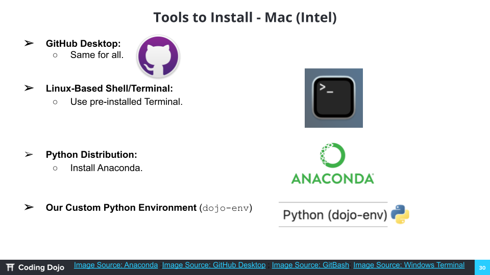

## Table of Contents

**Step 1) Download and install required applications**

- Step 1.1) Install Tool #1: Terminal 
- Step 1.2) Install Tool #2: GitHub Desktop
- Step 1.3) Install a Python distribution (Anaconda)

**Step 2) Setting Up Your dojo-env Environment**

- Step 2.1) Clone the dojo-env-setup repository
- Step 2.2) Open the repo's folder in your Terminal
- Step 2.3) Create the dojo-env environment from file
    - Step 2.3.1) Run the correct "conda env create" command for your OS
    - Step 2.3.2) Wait for the dojo-env to be created
    - Step 2.3.3 Confirm your environment was installed.
- Step 2.4) Activate dojo-env and set it as your default environment.
    - Step 2.4.1) Activate dojo-env
    - Step 2.4.2) Determine Which Shell your Terminal is Using: bash or zsh?
    - Step 2.4.3) Add automatic activation of dojo-env 
    - Step 2.4.4) Confirm dojo-env is the default & "jnb" alias works.
    - Step 2.4.5) Shut Down Jupyter (properly)
- Step 2.5) Test the environment.

    - Step 2.5.1) Open the environment tester notebook 
    - Step 2.5.2) Change the notebook's kernel to dojo-env
    - Step 2.5.3) Run the environment test notebook from start to finish.
- **Step 3) Jupyter Notebook Preferences**
- **Step 4) Install a Text Editor - VS Code**

___


## Step 0) Determine Which Type of Mac You Have

### If you don't know which type of Mac you have :

**Check the "About this Mac" screen for your computer:**

- Click on the Apple symbol in the top-left corner of your screen >  Click "About This Mac".

- A window with your computer's specs will appear like the one in the screenshots below, depending on how which version of macOS you have installed. 

<left>
</left>
<right>
</right>


- **If it has a "Processor" line that says "Intel"** you should follow the Instructions: Mac (Intel Processor).

- **If it has a "Chip" line that says "Apple"** then you should follow the Instructions: Mac (Apple Chip).


------

# Step 1) Downloading and Installing Required Apps

> Before we install our python environment, we need to take care of a couple requirements. 

In step 1, we will install:

- Your "Terminal"/"Shell": 
    - The primary application you will use to execute coding-related commands.
- A Python Distribution (miniforge):
    - The fundamental infrastructure that will allow us to install Python.
- GitHub Desktop:
    - The way we will work with git repositories and the starting point for our local workflows.


Note: steps for Tools # 1 and 2 are the same for Mac users with an Intel processor.

## Step 1.1) Tool #1: A Linux-based bash shell/terminal:

- Linux users and MacOS users have this built-in to their OS!
    - On MacOS, the shell is called "Terminal" and can be found in `Applications>Utilities` in Finder
    - OR you can use spotlight search and search for "Terminal".

## Step 1.2) Install Tool #2: GitHub Desktop

- Download the installer from this link: [GitHub Desktop](https://desktop.github.com/)
- Once installation is complete, open the application.
    - Log into the same GitHub account you have been using for your projects.
- Once you have logged into the app, open the Options menu
    - Select `"GitHub Desktop"` on the menu bar (top of the screen) and then select `Preferences`.
    - Select the "Integrations" tab.
    - Make sure the Shell dropdown menu says "Terminal"
        - If not, select it from the dropdown menu.
    - Click Save.


## **Step 1.3) Install a Python Distribution - Anaconda**

- Anaconda is a data-science-focused python distributable that comes with a convenient GUI program for working with our python environments.

### Step 1.3.1) Download and Install Anaconda

- Download and run the installer from the following link:  [Anaconda Individual Edition](https://www.anaconda.com/download)

- Use the default options**, EXCEPT if you see an "Advanced Installation Options" window (like in the screenshot below).**
    
    - **If you see these options,** select "Add Anaconda3 to my Path environment variable". Disregard the warning message will appear in red text.
        - BOTH options should be checked, like in the screenshot above:
    
    - **Note: if you do not see these options**, it is ok! 
        - You will confirm/fix this missing option in the following step!
    


### Step 1.3.2) Verify that Terminal Knows “conda”

You may need to take another step to get anaconda and Terminal working together.

- Open **a new Terminal window**. **It MUST be a new window!** There are several ways to find your Terminal application:
    - Use  your Spotlight Search feature (Cmd + Space is the default shortcut ) and search for "Terminal".
    - or use the Launchpad app in your dock and look/search for Terminal
    - or open your Applications folder in Finder and locate Terminal within the Utilities sub-folder.
- **Type the command `conda` and press enter.**
- **If you see a list of available conda commands, great!**
    - **You are all set to move on to Step 2!** Disregard the final section below that says “Adding Conda to Terminal”
- **If you see a message that says: “conda: command not found”**:
    - Follow the instructions below under “Adding Conda to Terminal”

### Step 1.3.3) (if needed) Adding Conda to Terminal:

**If a NEW Terminal window recognized the conda command in the previous step, then skip this step!**

**If your Terminal did not recognize the conda command, perform the following steps:**

- **Check which shell you are using: zsh or bash.**

    - Look at the top of your Terminal window. In the middle of window Title, you should see either `zsh` or `bash`, like in the screenshot below:

        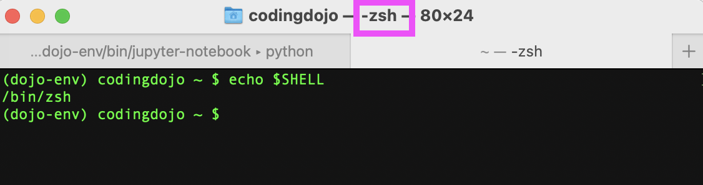

#### If the Terminal window says "bash":

- Run the following commands to automatically activate dojo-env and to add shortcuts for Jupyter:

```bash
touch ~/.bash_profile
echo "export PATH=~/anaconda3/bin:$PATH" >> ~/.bash_profile
echo 'export PATH="/anaconda3/bin:$PATH"' >> ~/.bash_profile
source ~/.bash_profile

```

```
export PATH=~/anaconda3/bin:$PATH
export PATH="/anaconda3/bin:$PATH"
```

#### If the Terminal window says "zsh":

- Run the following commands to automatically activate dojo-env and to add shortcuts for Jupyter:

```bash
touch ~/.zshrc
echo "export PATH=~/anaconda3/bin:$PATH" >> ~/.zshrc
echo 'export PATH="/anaconda3/bin:$PATH"' >> ~/.zshrc
source ~/.zshrc

```

#### Confirm it worked:

- **Type the command `conda` and press enter.**
    - **If you see a list of available conda commands, great!**
    - If not, you should ask for help! (Review the How to Ask for Help section in the Installation Overview)

# **Step 2) Setting Up the dojo-env Environment**

### Table of Contents - Step 2

- Step 2  Overview
- Step 2.1: Clone the dojo-env-setup repository
- Step 2.2: Open the repo in your Terminal
- Step 2.3: Create the dojo-env environment
- Step 2.4: Set `dojo-env` as the default environment.
- Step 2.5: Testing the Environment

## Step 2 Overview:

- In Step 1, we installed the foundational tools needed for our local python installation. 

    - While we did install a Python distribution with a basic copy of Python (Anaconda or miniforge), we have not installed all of the packages and tools that we need as data scientists.
- In Step 2, you will be creating a custom python environment called "dojo-env". 

    - An "environment" is a bundle of specific python packages that are used together. Importantly, an environment specifies specific version #'s of the packages to ensure that all of the versions installed are mutually compatible.
    - You can install many environments on your computer and switch between them as needed for different projects.

    - We have designed the dojo-env to include everything you'd need for our program, so you may not have a reason to add additional environments. 
- The environment files (and a backup of these instructions) are in the [dojo-env-setup repository](https://github.com/coding-dojo-data-science/dojo-env-setup)
    - The Detailed Instructions below will guide you through how to clone and use the environment setup repository.

## Step 2.1) Clone the dojo-env-setup repository

- **Open the dojo-env-setup repository on GitHub.com:** https://github.com/coding-dojo-data-science/dojo-env-setup

- **Before the next step, make sure that :**
    - you are logged in to your account on GitHub.com 
    - you are logged into the SAME account in the GitHub Desktop app

- **Click on the green `Code` button and then click `Open in GitHub desktop.`**
- GitHub desktop should open automatically and ask you what folder you would like to store your repository in.
    


- **Troubleshooting Note: if you are brought to the Download GitHub Desktop web page instead:**

    - It means you were not logged into the same account on GitHub.com and GitHub Desktop when you clicked Open in GitHub Desktop. 
        - Make sure you see your user profile pic in the top right of GitHub.com 
        - and check your Account in GitHub Desktop's Preferences/Options menu.
        - and then try again.

- **Decide where to save the repo:**

    - By default, GitHub Desktop will use a new "GitHub" folder in your Documents folder.
        - GitHub Desktop will create a NEW folder with the same name as the repository INSIDE of whichever folder you select.
        - If you use the default options, then this will create a "dojo-env-setup/" folder inside of "Documents/GitHub/"
    - **Note: it is strongly recommended that you use the Documents/GitHub folder for this repository.**
        - But if you'd rather save the folder somewhere else: 
            - Use the "Choose" button (the button name may be "Browse" on Windows).
            - A window should pop up for you to find and click on the folder where you want to create the "dojo-env-setup" folder.
            - Once you have selected a new folder using the Browse button, you should see the full folder path displayed.

- **Once you've decided where you will clone the repository:**

    - Remember the full file path of the folder you selected!  **(See the screenshot below. )**
        

        

- **Click Clone**

GitHub Desktop will download a copy of the repository into a new folder on your computer.Step 2.2: Open the Repo in Terminal.

## Step 2.2) Open the Repo in Terminal

## Step 2.2.1) Open the dojo-env repository in Terminal

Once you have cloned the repository, **you must open a Terminal window in the same folder as the repository.** The easiest way to do so is from within GitHub Desktop.

- **In GitHub Desktop: make sure the left sidebar says "dojo-env-setup" i**n the top-left corner under Current Repository.

- **Click on the Repository menu and select "`Open in terminal`"** 
    - **The repository menu will appear at the very top of your screen (your menu bar)**. If you are using the app in full-screen mode you will need to hover your mouse at the top of your screen to reveal the Menu bar.
- **Alternatively, you can use the keyboard shortcut.** 
    - **Control + `** (the key above tab that also has the tilde symbol ~)


### Step 2.2.2) Confirm you are in the correct folder.

- First, in the terminal window that appears, **type the "pwd" command** (which stands for print working directory) and press Enter.

    ```bash
    pwd
    ```

    - **It will display the folder name of the folder your terminal is currently located.** 
        - The **folder path should end in "dojo-env-setup/**"
        - If you used the default GitHub folder when you cloned dojo-env, the full filepath would be something similar to "/Users/yourname/Documents/GitHub/dojo-env-setup/"

- **Second, run the command to list all of the files contained in the current fol**de ( the command "ls -a" will display a detailed list of all files in the repo.

```
ls -a
```

- **You should see a list of all the files in the current folder,** similar to the screenshot below. 
    - You should see 3 files that start with "environment-ds_" and end with ".yml" similar in the screenshot below. Note: the exact names of the environment files may be slightly different than the screenshot below.


**If so, you are all set for step 2.3: create the dojo-env environment!**

## Step 2.3 Create the dojo-env environment

### Step 2.3.0) *(Optional, but Recommended)* Speed Up Your Environment Creation By Switching to libmamba

The following step, "2.3.1) Run the conda env create command", can take anywhere from 10 - 90 minutes, depending on your computer and internet connection.  

You can speed up the process by changing the default tool that checks that the packages in the new environment are compatible, called the solver. 

- Make sure conda is up to date (it should be if this is the first time you've installed miniforge)

    ```bash
    conda update -n base conda
    ```

- Run the following 2 commands to install libmamba and to make it the default solver for conda:

    ```bash
    conda install -n base conda-libmamba-solver
    conda config --set solver libmamba
    ```

    - **Note: if you run into issues with this optional step, you can skip it and move on** to step 2.3.1) Run the conda env create command 

- See [A Faster Solver for Conda: Libmamba](https://www.anaconda.com/blog/a-faster-conda-for-a-growing-community) if you'd like to learn more.

###  Step 2.3.1) Create the dojo-env using the correct "conda create" command for your OS

- Run the  conda env create command below in your Terminal

```
conda env create -f environment-ds_mac_intel.yml
```


### Step 2.3.2) Wait (patiently) for the dojo-env to be created. 

- **You will see several progress bars during the process as Anaconda checks the list of packages requested for compatibility** with your machine. 
    - It will then download and install the final versions that it determined would work best for your machine.
    - **It can take anywhere from 10-90 minutes to finish create the environment,** depending on your computer and internet connection, and if you switched to the faster solver in optional step 2.3.0.
- **Once it has been completed you should see a message that says**

```bash
# To activate this environment use:
 conda activate dojo-env
# To deactivate this environment use:
 conda deactivate 
# If conda deactivate doesn't work, activate the "base" env
 conda activate base
```

### Step 2.3.3) Confirm your environment was installed

- Enter the following command to display the list of your locally installed environments.

    ```bash
    conda env list
    ```

- **You should see 2 environments, including dojo-env**:

    - `base`
    - `dojo-env`

- **If you see dojo-env in the list:**

    - **Success! dojo-env was successfully created! But we aren't using it yet just yet**. 
    - We must first "activate" an environment to determine which version of Python & packages are currently being used.

- **If you do not see dojo-env**:

    - Something went wrong during your installation. **You should reach out for assistance on the discord channel.**

### Step 2.3.4) Activate the dojo-env and Install the dojo-env kernel in Jupyter

- Run the following 2 commands in your Terminal:**

```python
conda activate dojo-env
python -m ipykernel install --user --name dojo-env --display-name "Python (dojo-env)"
```

- The first line in the code block above will switch to dojo-env environment.
- The second line will install dojo-env as an option in Jupyter Notebook.


## Step 2.4: Setting `dojo-env` as the default environment

The next steps will ensure that the dojo-env is automatically activated for you. 

### Step 2.4.1) Make sure you've activated dojo-env in the previous step. 

- Make sure that you've followed the previous step and activated dojo-env.
- You should see (dojo-env) in parentheses either above or next to your Terminal prompt.

### Step 2.4.2) Determine Which Shell your Terminal is Using: bash or zsh?

- Before we can set the default environment, you need to confirm which type of shell your terminal is using. 
    - There are 2 possible options that your mac may be using: `zsh` or `bash`. 

    - You most likely have `zsh` if you have an Apple chip.

- In your terminal, type the following command and press enter.

```bash
echo $SHELL
```

- You will see a file path displayed in the terminal (e.g. /bin/zsh ). 
- Take note of the last few letters of the file path and select the correct option (A or B) below:

------

 ### Step 2.4.3) Add automatic activation of dojo-env

Depending on the filepath displayed in step 2.4.2, select the correct section below for the code to copy and paste into your Terminal.

#### Step 2.4.3-A) If the response ends in bash:

- Run the following commands to automatically activate dojo-env and to add shortcuts for Jupyter:

```bash
touch ~/.bash_profile
echo "conda activate dojo-env" >> ~/.bash_profile
echo 'alias jnb="jupyter notebook"' >> ~/.bash_profile
echo 'alias lab="jupyter lab"' >> ~/.bash_profile

```

------

### Step 2.4.3-B) If the response ends in zsh:

- Run the following commands to automatically activate dojo-env and to add shortcuts for Jupyter:

```bash
touch ~/.zshrc
echo "conda activate dojo-env" >> ~/.zshrc
echo 'alias jnb="jupyter notebook"' >> ~/.zshrc
echo 'alias lab="jupyter lab"' >> ~/.zshrc

```

### Step 2.4.4) Confirm `dojo-env` is the default & "jnb" alias works

##### Confirm `dojo-env` is your default env

- To confirm that dojo-env is now your default environment:
    - **Open a new terminal window.**
    - **You should see `(dojo-env)` appear next to, or above, your prompt.**

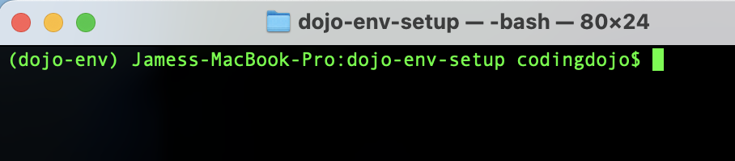


##### Confirm the shortcut aliases work

- **Try running the command "`jnb`" in your terminal.**

    - You should see a lot of messages printed in the terminal and then your web browser should open  jupyter automatically .

    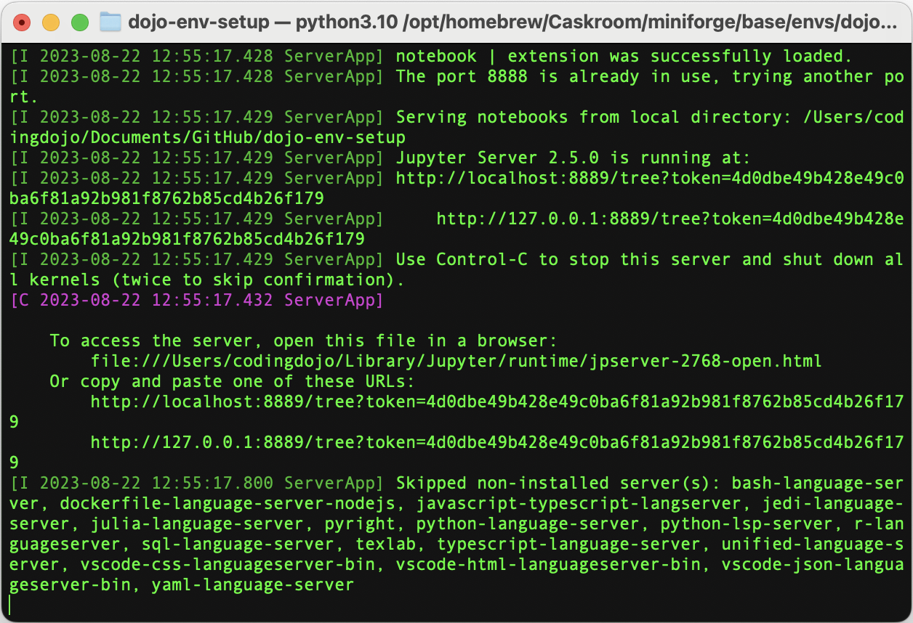

    - **If jupyter notebook launches, you're all set!**

    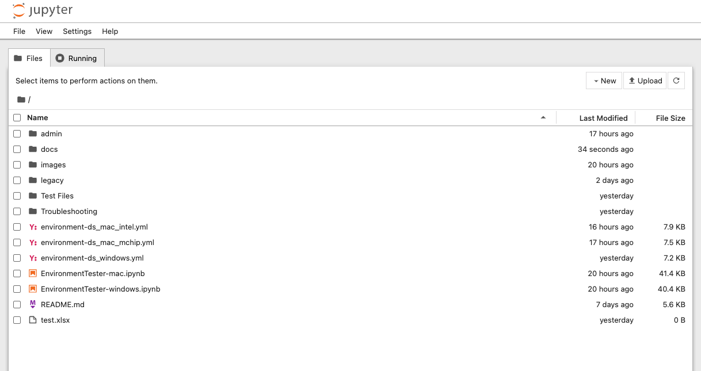

    - **If not, follow the instructions on How to Ask for Help from the Installation Overview** 

### 2.4.5) Shut down Jupyter (Properly)

It is very important that you shut down Jupyter Notebook in the correct way. 

- Closing the web browser tabs for Jupyter Notebook **does not shut down the jupyter notebook!** The notebook is still running in the jupyter server that was launched in your Terminal window. 
- **Do not force-close the Terminal window by closing it if it is running Jupyter!** If you simply X out of Terminal while Jupyter server was running, it can lead to issues with Windows Terminal, such as the "could not fork child process" error in the screenshot below:

#### Option A) Shut Down Jupyter From  Jupyter Notebook

- The best way to shut down Jupyter Notebook is from Jupyer's File menu.

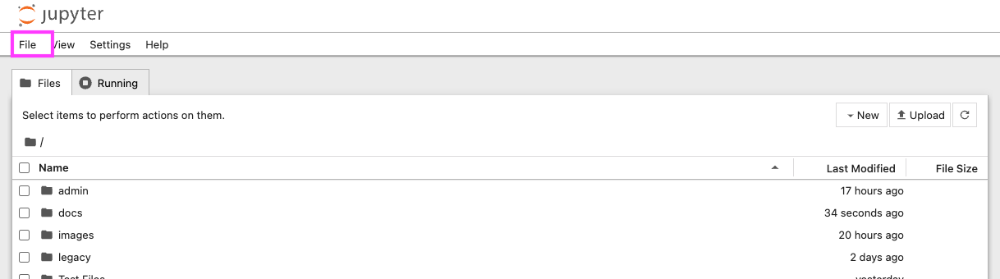


- **Click on File > Shut Down**

    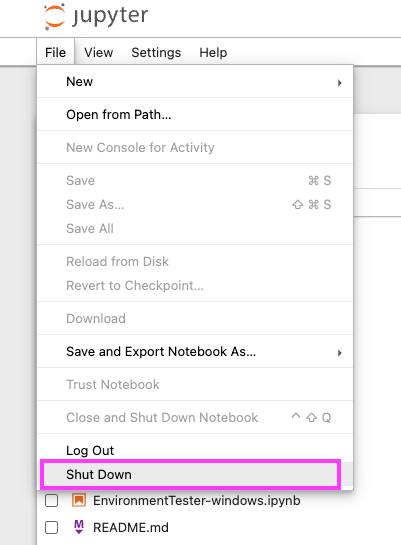

- If a confirmation window appears, click on Shut Down:

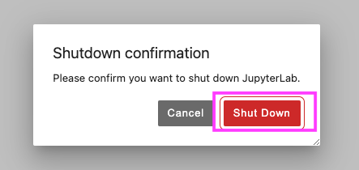

- The terminal running Jupyter should stop running the server and return to an empty prompt, waiting for input.

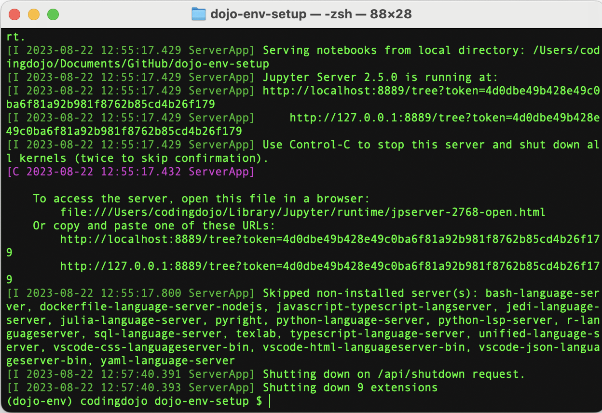

#### Option B) Shut down jupyter from the terminal

- Return to the Terminal window that you used to start jupyter.
- Press "Control+C" to shut down the server. 
    - The jupyter server should shut down and the prompt should reappear, ready for new commands:
- If you're asked to confirm, respond "y" and press enter.
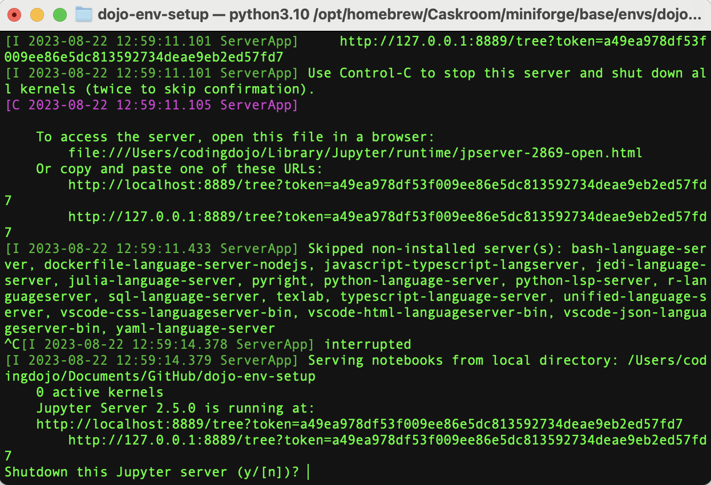

- The terminal should stop running the server and return to an empty prompt, waiting for input.

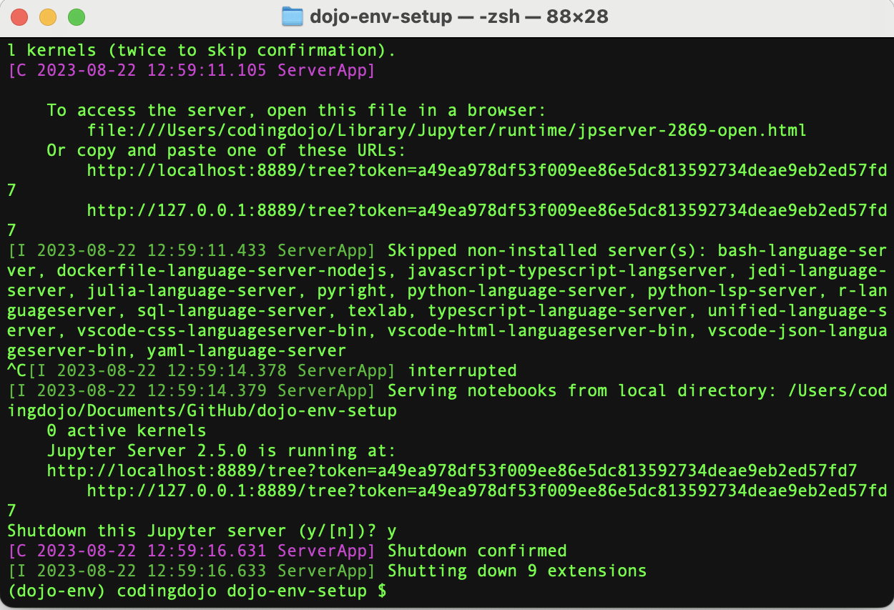


## The moment of truth... 

You are all set for the next step: Testing Your New Environment!

## Step 2.5: Testing the Environment

To test that your installation and packages are working properly. We are going to run a specific Environment Testing notebook that is also located in the "dojo-env-setup" folder.

## Step 2.5) Testing the Environment

To test that your installation and packages are working correctly, You are going to run a specific Environment Testing notebook that is also located in the "dojo-env-setup" folder.

### Step 2.5.1) Open the environment tester notebook with jupyter notebook

- **Make sure Jupyter Notebook is not running in any Terminal windows.**
    - Check any open terminals and make sure that they are not running the notebook server. 
    - If you see a lot of text in your terminal window and the final line is not an empty command prompt, like in the screenshot below:
    - 

- **Next, you will close all of your previous Terminal windows.**

- **Now, return to GitHub Desktop and click on the "Open in Terminal"** option in the Repository menu to open a terminal in the dojo-env-setup folder.

- **Type pwd to confirm it says dojo-env-setup.**


- **In the new window that opens, start jupyter notebook** by entering either the full `jupyter notebook` command, or the `jnb` shortcut.

A new tab should open in your web browser that shows the File view for jupyter notebook.

You should see all of the files that were in the dojo-env-folder.

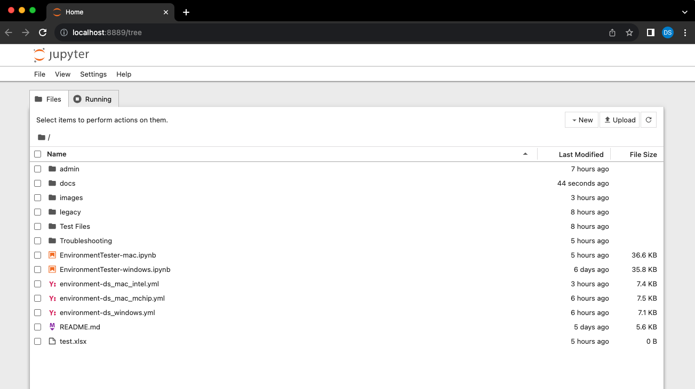

- There are 2 "EnvironmentTester" notebooks:
    - "EnvironmentTester-mac.ipynb" for macs (both Intel and Apple Chip macs)
    - "EnvironmentTester-windows.ipynb" for Windows.

- **Click on the "EnvironmentTester-mac" notebook to open it.** 

Once the notebook interface has loaded, you should see a toolbar with several menu choices.

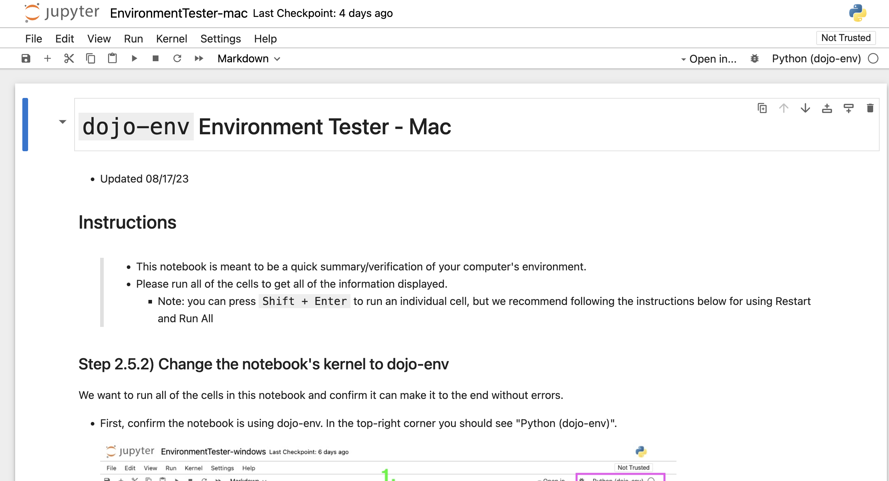


### Step 2.5.2) Change the notebook's kernel to dojo-env

We want to run all of the cells in this notebook and confirm it can make it to the end without errors.

- First, confirm the notebook is using dojo-env. In the top-right corner you should see "Python (dojo-env)". 

    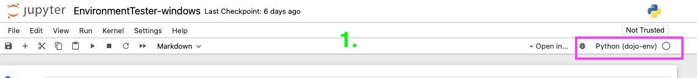

- If you do not see Python(dojo-env), click on the name of the kernel displayed to open the Change Kernel menu.

    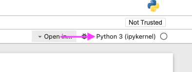

- Select Python(dojo-env) from the dropdown menu:

    

    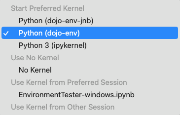

    

### Step 2.5.3) Run the environment tester notebook from start to finish.

- **Run the Entire Notebook:**

    - **Select the "Kernel" Menu > "Restart and Run All Cells"**

        - You can also use the toolbar button, which resembles a fast-forward symbol >>.

        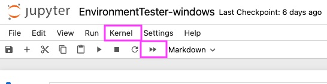

- **Wait patiently.** 

    The testing notebook is going to run through several modeling and EDA steps to confirm that the packages are working correctly.

    - This could take anywhere from 2-20 minutes to run.
    - You will see the web browser tab icon turn to an hourglass when the notebook is running and back to an orange notebook icon when it is done.

- **Scroll down to the bottom of the notebook and confirm the cells have run:**

    - Check if the very last cell printed the success message.


- If the entire notebook ran successfully

    - Congrats! Your dojo-env is fully functional and you can move on to the next step/lesson!

- If your notebook did not run the entire notebook successfully:

    - You need to contact your instructor or a TA for assistance.
    - Before contacting them, please follow the instructions below to prepare the troubleshooting files to give to your instructor.

- Shut down the notebook by clicking on the **File menu>Close and shut down the notebook.** 

    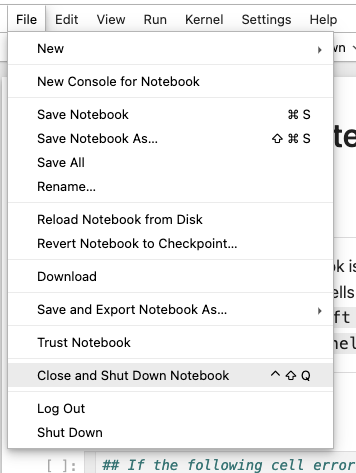

## To Get Help Troubleshooting Your Environment. 

#### Download Troubleshooting Files to Share 

- There are 2 files that you should share with your instructor/TA
    1. A copy of your Environment Tester notebook that error'd.
    2. A copy of "FINAL_REPORT.txt" file that is in the Troubleshooting folder of the repo.

1. To share your notebook with an instructor/TA for help:

    - Click File > Save Notebook

    - Click File > Download

    - Your web browser should save a copy of the notebook to your normal "Downloads" folder.

        ​      

        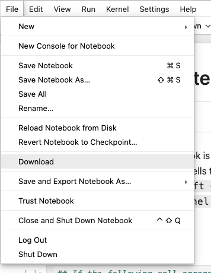

2. To share a copy of your FINAL_REPORT.txt:

    - In the first Files tab that opened when you started jupyter notebook you should see a folder called "Troubleshooting"
    - Click on the Troubleshooting folder.
    - Inside the folder you should have a file called "FINAL_REPORT.txt".
    - Check the checkbox next to the file and click on the "Download" button that appears at the top of the list of files.
    - Your web browser will also save this file to your Downloads folder.

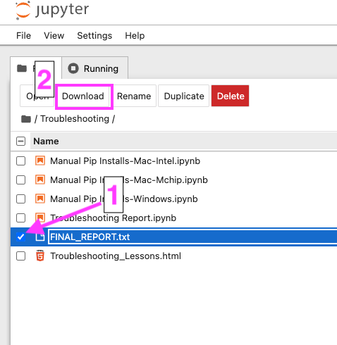


### ASK FOR HELP

- **First, please check the "Troubleshooting" chapter on the learnig platform for a lesson that mentions your problem.** about the problem you are running into. (The Troubleshooting section is the 3rd chapter in this course - see the screenshot below)


​    

- **Second, reach out on the \#[ds-python-installation Discord channel](https://discord.com/channels/738494436467539968/1099094868762042400) with the following info:**
    - A) Which step are you on? (e.g. Step 2.3.3 Confirm the env was created)
    - B) Which OS you are using (e.g. Windows 10, Windows 11, Mac with an mchip, Mac with an Intel processor, etc.)
    - C) Let us know if you've previously installed an older version of Python.
    - D) Attach your copy of the  environment tester notebook and the FINAL_REPORT.txt files.
    - E) Include any additional screenshots of the error/issue you are running into, whenever possible.
    - F) Add any additional details or info you think may be helpful for us to know.
        - For example:
            - "My computer is really old and I think that may be part of the problem."
            - "I share this computer with someone else who also uses python"
            - "This is my work computer and I am not an administrator." etc

- **Third, if you do not receive a response by the end of the day on Discord, please email your instructor with the same information.**
    - An instructor or TA will get back to you within 1 business day with the next steps for you to try.
    - You will most likely need to set up a Zoom call and share your screen for us to help.


# Step 3) Jupyter Notebook Preferences

There are several convenient features in Jupyter Notebook that are not enabled by default. We strongly suggest updating your Jupyter Notebook settings according to the instructions below:

### Quick Settings

- Start from the Jupyter files page,
- Open the Settings Menu on the toolbar. 

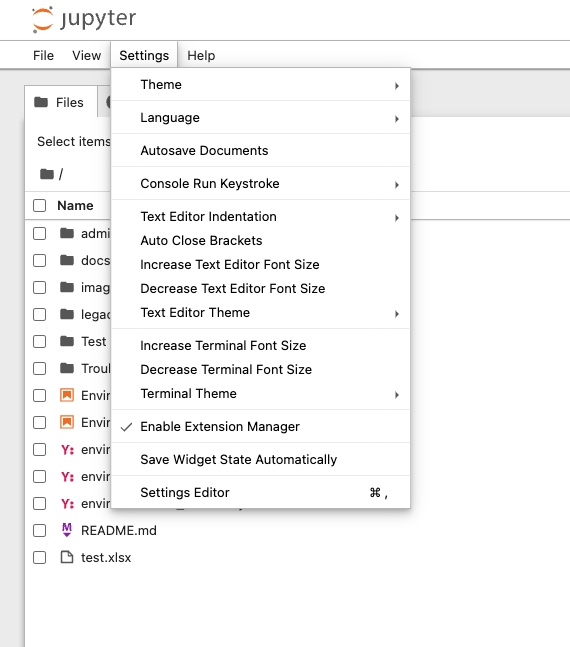

- There are several options that you should select, which are highlighted in the screenshot below.

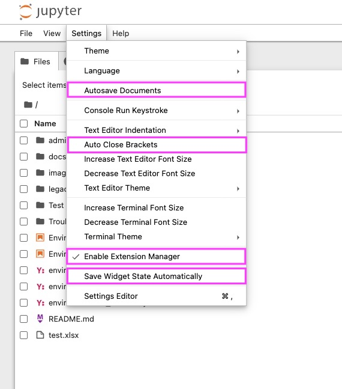


- **Activate the following options:**
    - Autosave Documents
    - Auto Close Brackets
    - Enable Extension Manager
    - Save Widget State Automatically


### In-Depth Settings

- **After selecting these options, click on the Settings Editor at the bottom of the Settings menu.**

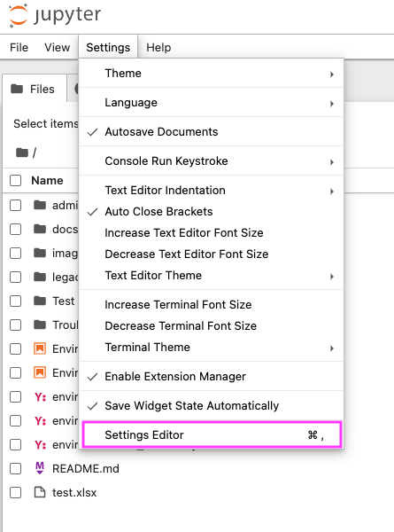

- The large Settings Editor will open and should look like the screenshot below:

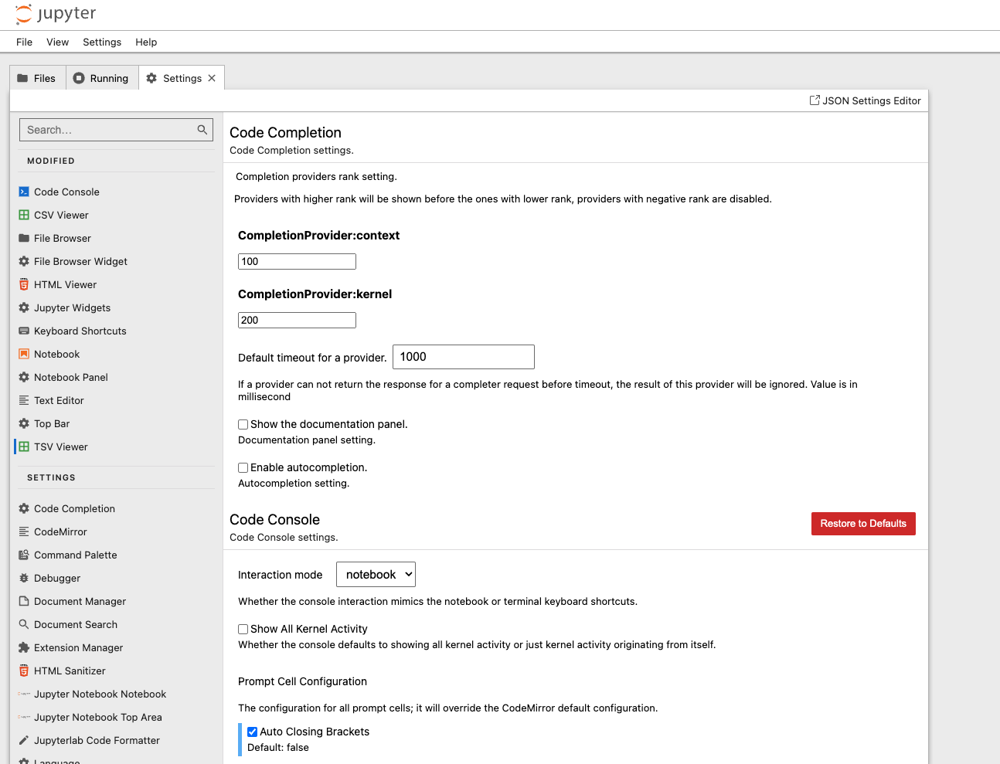


For each of the settings, you will first click on the correct section on the left sidebar to reveal the options. Then change the settings as directed.

Note: you can use the search box at the top of the left side bar to search for the name of settings. 


### Code Completion

- Check the "Show the documentation panel" option.
- Recommended: do not check the "Enable autocompletion" box to turn on code autocompletion.
    - Instead of Autocompletion, press `Tab` when typing to have jupyter complete your command.

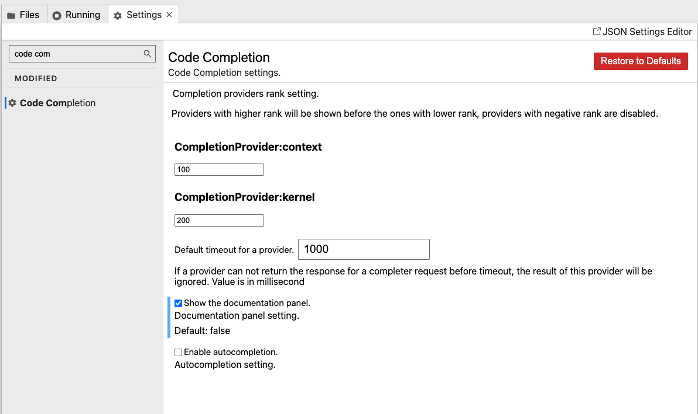


### File Browser

- Find "File Browser" on the sidebar.

- Turn on the following options:
    - Show file size column.
    - Show hidden files
    - Use checkboxes to select items

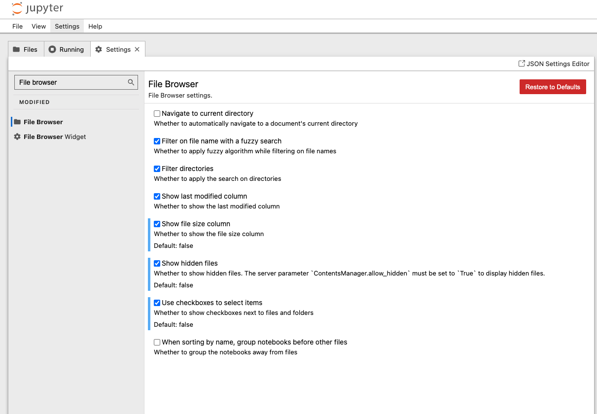

### Notebook

- Open "Notebook" on the sidebar. 

There are many settings on the Notebook settings tab. We have split them into separate steps for clarity:

##### Code Cell Configuration

- **In the "Code Cell Configuration" section, turn on the following options:**
    - Auto Closing Brackets
    - Code Folding
    - Line Numbers
    - Line Wrap
    - Match Brackets
    - Rectangular selection

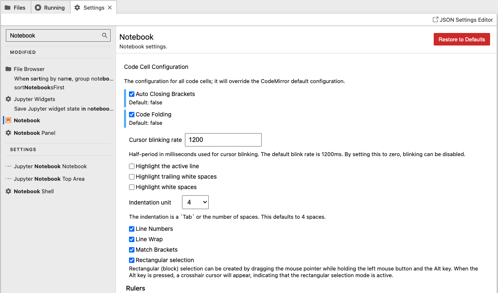`

##### Rulers

Below the check boxes for Code Cell configuration is a Rulers section.

- **Under the Rulers section, click on the "Add" button to add "rulers-0"**
- **Enter 80 in the text field that says ""must be a number"**

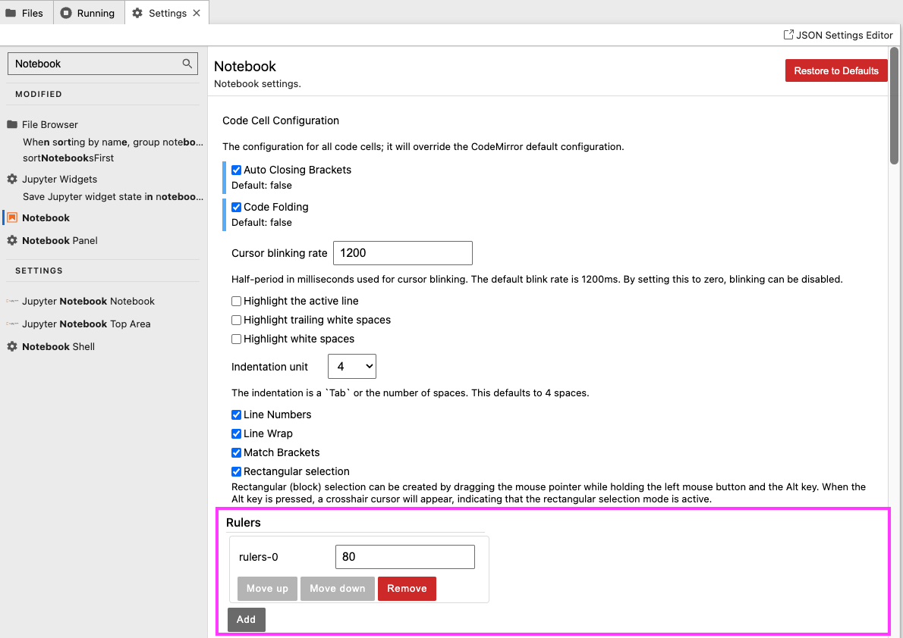

#### Indentation options

- Immediately below the Rulers section, make sure that:
    - Smart indentation is turn on.
    - Tab size is set to 4

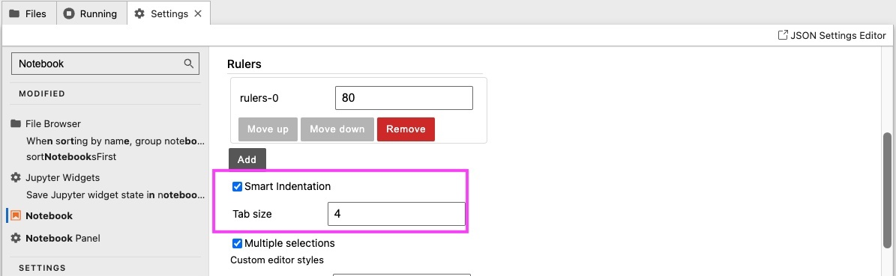

#### Document Manager

- Find and open ""Document Manager" on the left sidebar.
- Make sure that the following options are turned on:
    - Autosave Documents
    - Ask for confirmation to close a document
    - Rename Untitled File on First Save

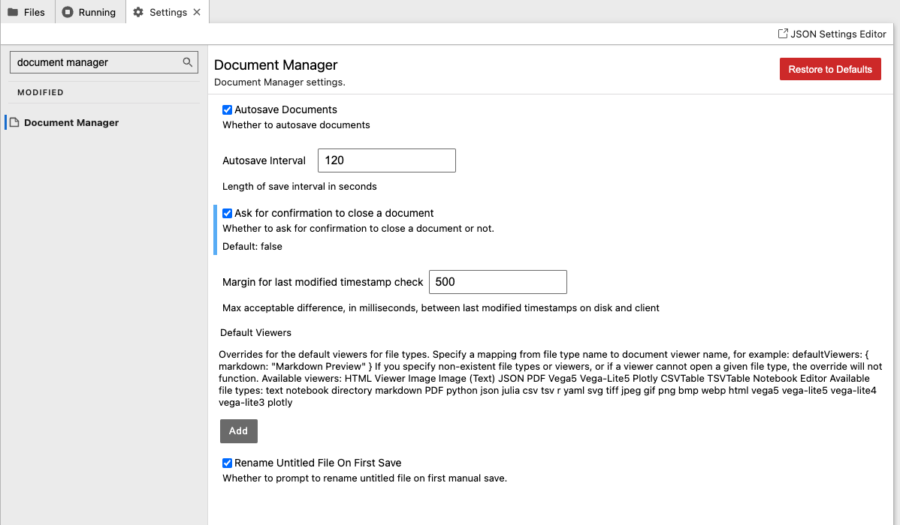 


### Table of Contents

- Find and open "Table of Contents" on the left sidebar.
- Select the following options:
    - Decrease Maximum headings depth from 4 to 3.
    - Turn on Synchronize collapse state.

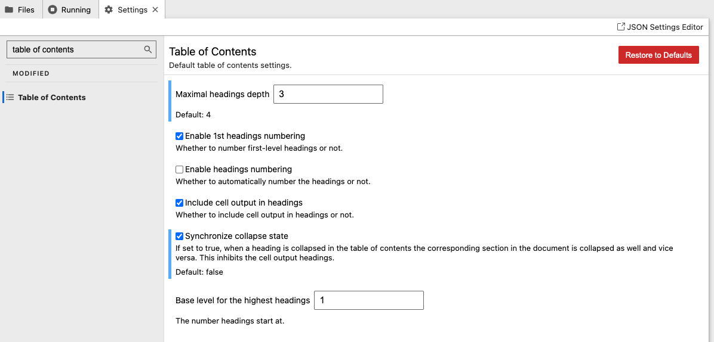`

#### Shut Down Options

To ensure that jupyter shuts down the notebooks and kernels after closing them, make enable the following 2 shut-down options

- In the left sidebar, search for **"shut down kernel".** 
    - Click on the listing for **Notebook> Shut down kernel** that should appear on the left sidebar.
    - Make sure that **"Shut down kernel" is turned on.**

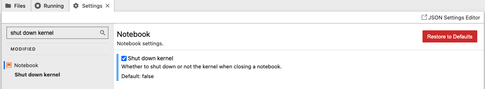

- In the left sidebar, search for **"shut down on close"**
    - Click on the listing for **Terminal > Shut down on close** that should appear on the left sidebar.
    - Make sure that **"Shut down on close" is turned on.**

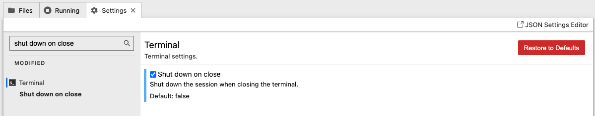


- **When you're finished, close the Settings. The options have been saved to Jupyter's configuration files.**


# Step 4) Install a Code Text Editor

## Visual Studio Code

- **The final tool to install is a text editor that is designed for programmers.**
    - There are several text editors available, but we will be using Visual Studio Code.

- **Visual Studio Code (A.K.A "VS Code")  is a free editor that is highly customizable and supports many languages.**
- It is maintained by Microsoft and has a robust community of extensions and add-ons. It is very popular and is used by many companies (e.g. Facebook/Meta).

- **How will we use VS Code?**
    - We could technically run all of our jupyter notebooks using VS Code, but this is not recommended at this point in your education. 

        - While VS Code is convenient for quickly opening and working with a repository or viewing a notebook, it has some limitations in how notebooks look and some quirks to the interface for notebooks.

    - Instead, we will focus on using jupyter notebook or jupyter lab in the lessons and live class.

        - You are welcome to try VS Code for notebooks, but it is recommended you become comfortable with jupyter first.

- **We will use VS Code for editing simple code files or hidden files.**
    - We can open and edit the settings file for your terminal (e.g.: "`~/.bash_profile"`.or "~/.zshrc"

    - We will use it to create and store credentials for APIs (Stack 4)
    - We can use VS Code to edit your projects' README files while previewing them in real time!
    - Finally, while beyond the scope of the standard curriculum, we can also use VS Code to store functions in external files that we can use just like pandas, matplotlib,


## Step 4.1) Install Visual Studio Code

- Go to https://code.visualstudio.com/

    - It should auto-recognize your OS and have a blue Download button with a version for your OS.

    - Click Download to download the installer.

    - Click on the installer to unzip it.

    - Once the Application is unzipped, drag the icon for Visual Studio Code.app to your applications folder on your sidebar in Finder.

        

- Once Visual Studio Code installation is completed, open it!

    - Windows Users: check your Start Menu.
    - Mac Users: check your Applications folder in Finder.


## Step 4.2) Install Python Extensions

- On the left sidebar, there are several icons for different menus.
- Click on the Extensions sidebar icon (5th down, looks like 4 squares).


- On the Extension sidebar, there will be several sections (INSTALLED/POPULAR/RECOMMENDED).
    - Right now you should have nothing under the INSTALLED menu.
    - You should see "Python" listed under POPULAR.
        - If not, you can enter "Python" in the search box at the top of the sidebar
        - OR you can click on [this link to the extension ](https://marketplace.visualstudio.com/items?itemName=ms-python.python)on the extension marketplace website.
    - Click on the "Install" button for the Python extension.
        
- Note: the Python extension will also install several required extensions. When installation is complete, you should see the following under the "INSTALLED" section:
    - Python, Pylance, Jupyter Notebook renderer, Jupyter, and Jupyter Keymap


## Step 4.3) Setting VS Code to use your `dojo-env` as the default Python installation

- We must teach the Python extension where to find our `dojo-env`'s version of Python.

- On the extension sidebar, click on the Gear icon for the Python extension and select "Extension Settings" 

- You should see a new "Settings" pane open in the main window.

    - Take note of the "Default Interpreter Path".
        - It is currently set to just "python".
            

- We need to change this setting to match the exact filepath for our `dojo-env`'s python.

- In your Terminal:

    - Make sure your dojo-env is activated

    - Run the command:

         

        ```
        which python
        ```

        - It will print out a filepath to your dojo-env.
            

    - Copy and paste that exact file path into the "Default Interpreter Path" field in the Python extension settings.


### Step 4.4) Add the `code` command to your terminal

We want to be able to type the word "code" in our terminal and have that open up VS Code.

1. Open the Command Palette:
    - Either click on View in the menu bar and select "Command Palette"
    - OR use the keyboard shortcut (`Cmd` + `Shift` +`p`)
2. In the small pop-up window, type "install code" and you should see it auto-suggest the option for "Shell Command: Install 'code' command in PATH".
    - Click on this option.


### Step 4.5) Test the `code` command

- Open a new Terminal window.
- Run the command `code` to verify that VS Code opens.
- Note: You can add a specific folder or filename to open, after the word code.
    - To open the current folder `code .`
- If it opens, great!
    - If not, make sure you've opened a new terminal window AFTER installing the code command.

> Congratulations! You are all set up with your local python environment! 

# Final Notes

Congrats! You've got a fully functional professional data science environment on your local machine!

- **Please see the next chapter "Working Locally" for:**
    -  a walkthrough of how to use your new local installation and tools together
    -  a summary of terminal commands
    -  jupyter notebook cheat sheets
    -  how to install additional packages
    -  & more!

- **Please see the "Troubleshooting" chapter for commonly encountered errors and any known solutions. including:**
    - Reinstalling your dojo-env
    
    - "code" command not working
    
        

### References

[Image Source: Anaconda](https://en.wikipedia.org/wiki/Anaconda_(Python_distribution)](https://en.wikipedia.org/wiki/Anaconda_(Python_distribution)) ;

[Image Source: GitHub Desktop](https://commons.wikimedia.org/wiki/File:Github-desktop-logo-symbol.svg) ;

[Image Source: GitBash](https://appuals.com/what-is-git-bash/);

[Image Source: Windows Terminal](https://commons.wikimedia.org/wiki/File:Windows_Terminal_Logo.png)
